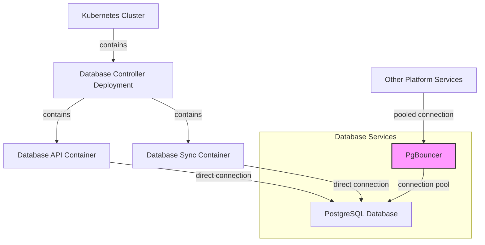

# Database Controller

## Overview

The Database Controller is a critical component of the EDURange Cloud platform that manages database interactions between the Kubernetes cluster and the PostgreSQL database. It consists of two main services that run as containers within the same Kubernetes pod:

1. **Database API**: A Flask-based REST API that provides endpoints for database operations
2. **Database Sync**: A background service that synchronizes the state of challenge instances between Kubernetes and the database

Together, these services ensure data consistency and provide a unified interface for database operations across the platform.

## Architecture



The Database Controller is deployed as a single Kubernetes deployment with two containers sharing the same pod. This design allows both services to access the same environment variables and configuration while maintaining separation of concerns.

### Direct Database Connection

Unlike other services in the EDURange Cloud platform that use PgBouncer for connection pooling, the Database Controller connects directly to the PostgreSQL database. This direct connection approach is intentional for several reasons:

1. **Transaction Consistency**: The Database API and Sync services require consistent transaction isolation for operations that modify database state, which might be affected by connection pooling settings.

2. **Long-Running Operations**: The Database Sync service performs continuous polling and update operations that benefit from persistent connections without the overhead of connection pool management.

3. **Reliability Requirement**: The Database Controller is a core service that must maintain its database connection even during high-demand periods when the connection pool might be fully utilized.

4. **Specialized Access Requirements**: The Database Controller may require specific session configurations or permissions that are better managed through dedicated connections.

5. **Performance Optimization**: Direct connections eliminate an extra network hop and potential bottleneck for this critical system component.

This architecture ensures that other services can benefit from connection pooling's efficiency while the Database Controller maintains its dedicated connection pathway for maximum reliability and consistency.

For more information about how connection pooling works in the EDURange Cloud platform, see the [Connection Pooling](./connection_pooling.md) documentation.

## Internal Kubernetes Access

The Database API is designed to be accessed only from within the Kubernetes cluster for enhanced security. This internal-only access model improves the security posture of the platform.

### Internal DNS Name

The Database API service is accessible within the cluster using the following internal DNS name:

```
http://database-api-service.default.svc.cluster.local
```

### Access Methods

Components within the cluster can access the Database API in two ways:

1. **Direct Internal Access**: Services running in the same Kubernetes namespace (such as the Instance Manager and Database Sync) can directly access the Database API using the internal DNS name.

2. **WebOS Proxy**: For client-side components in the WebOS application, requests are proxied through the `/api/database-proxy` endpoint to avoid mixed content issues and maintain security.

### Security Benefits

This internal-only access model provides several security advantages:

- Prevents unauthorized external access to sensitive database operations
- Reduces the attack surface of the platform
- Ensures that only authenticated and authorized services can perform database operations
- Simplifies the network security model by keeping database traffic within the cluster

## Database API

The Database API is a Flask application that provides RESTful endpoints for interacting with the database. It serves as the primary interface for other components of the EDURange Cloud platform to perform database operations.

### Key Features

- **Activity Logging**: Records user activities and system events
- **Points Management**: Handles awarding, updating, and retrieving points for users
- **Competition Management**: Supports creating and managing competition groups
- **Challenge Management**: Provides endpoints for challenge-related operations
- **Question Tracking**: Manages question completions and attempts
- **Challenge Pack Management**: Handles installation and management of challenge packs

### API Endpoints

#### Core Endpoints

| Endpoint                                     | Method | Description |
|----------------------------------------------|--------|-------------|
| `/activity/log`                              | POST | Records activity events in the system |
| `/add_points`                                | POST | Adds points to a user's score |
| `/set_points`                                | POST | Sets a user's points to a specific value |
| `/get_points`                                | GET | Retrieves a user's current points |
| `/get_challenge_instance`                    | GET | Gets details about a challenge instance |
| `/competition/create`                        | POST | Creates a new competition group |
| `/competition/join`                          | POST | Adds a user to a competition group |
| `/competition/generate-code`                 | POST | Generates an access code for a competition |
| `/competition/add-challenge`                 | POST | Adds a challenge to a competition |
| `/competition/complete-challenge`            | POST | Marks a challenge as completed |
| `/competition/<group_id>/leaderboard`        | GET | Gets the leaderboard for a competition |
| `/competition/<group_id>/progress/<user_id>` | GET | Gets a user's progress in a competition |
| `/question/complete`                         | POST | Marks a question as completed |
| `/question/attempt`                          | POST | Records an attempt to answer a question |
| `/question/completed`                        | GET | Gets a list of completed questions |
| `/question/details`                          | GET | Gets details about a specific question |
| `/challenge/details`                         | GET | Gets details about a specific challenge |
| `/challenge/list`                            | GET | Gets a list of challenges with optional filters |
| `/status`                                    | GET | Simple health check endpoint for Kubernetes liveness and readiness probes |

#### Challenge Pack Endpoints

| Endpoint                                     | Method | Description |
|----------------------------------------------|--------|-------------|
| `/challenge-pack/install`                    | POST | Installs a new challenge pack |
| `/challenge-pack/update`                     | POST | Updates an existing challenge pack |
| `/challenge-pack/uninstall`                  | POST | Uninstalls a challenge pack |
| `/challenge-pack/list`                       | GET | Lists all installed challenge packs |
| `/challenge-pack/details/<pack_id>`          | GET | Gets details about a specific challenge pack |

#### CDF Management Endpoints

| Endpoint                                     | Method | Description |
|----------------------------------------------|--------|-------------|
| `/cdf/validate`                              | POST | Validates a CDF document against the schema |
| `/cdf/import`                                | POST | Imports a challenge from a CDF document |
| `/cdf/export/<challenge_id>`                 | GET | Exports a challenge as a CDF document |
| `/cdf/update/<challenge_id>`                 | POST | Updates a challenge from a CDF document |

### Implementation Details

- Uses Prisma ORM for database interactions
- Implements proper error handling and validations
- Provides consistent JSON responses
- Logs all operations for debugging and auditing
- Supports transaction management for operations that require atomicity

## Database Sync

The Database Sync service is a Python application that runs continuously in the background, synchronizing the state of challenge instances between the Kubernetes cluster and the database.

### Key Functions

- **Synchronization Loop**: Continuously polls for changes in challenge pods
- **Instance Management**: Creates, updates, and removes challenge instances in the database
- **Flag Management**: Retrieves and stores challenge flags securely
- **Status Tracking**: Updates the status of challenge instances based on Kubernetes pod status
- **Error Recovery**: Attempts to recover from failed operations through retry mechanisms

### Enhanced Synchronization Process

1. **Polling**: Every few seconds, the sync service queries the Instance Manager API to get the current list of challenge pods in the Kubernetes cluster
2. **Comparison**: Compares the list of pods with the challenge instances in the database
3. **Status Updates**:
   - Updates challenge instance status (CREATING, ACTIVE, TERMINATING, TERMINATED, ERROR)
   - Tracks status change times and termination attempts
   - Implements finite state machine for lifecycle management
4. **Instance Management**:
   - Adds new challenge instances to the database when new pods are detected
   - Updates existing challenge instances with current status information
   - Marks challenge instances as terminated when pods are deleted
5. **Error Handling**:
   - Implements retry logic for failed operations
   - Tracks termination attempts for graceful cleanup
   - Logs detailed error information for troubleshooting
6. **Activity Logging**: Records relevant events during the synchronization process

### Implementation Details

- Uses asynchronous programming with `asyncio` for efficient database operations
- Implements robust error handling to prevent synchronization failures
- Logs all operations for debugging and troubleshooting
- Uses a finite state machine approach to manage challenge instance lifecycle

## Challenge Definition Format Integration

The Database Controller plays a key role in managing the Challenge Definition Format (CDF) and Challenge Packs:

### CDF Workflow

1. **Validation**: Validates CDF documents against the JSON schema
2. **Import**: Processes and imports CDF documents to create challenges
3. **Storage**: Stores the full CDF content in the database
4. **Export**: Generates CDF documents from existing challenges
5. **Updates**: Handles updates to challenges from updated CDF documents

### Challenge Pack Management

1. **Installation**: Processes challenge packs during installation
2. **Import**: Imports challenges from the pack into the database
3. **Reference**: Maintains references between challenges and their packs
4. **Update**: Handles updates to challenge packs
5. **Uninstall**: Properly removes pack data while preserving challenge data

## Deployment

The Database Controller is deployed as a Kubernetes deployment with two containers:

1. **Database API Container**:
   - Built from the `dockerfile.api` file
   - Runs the Flask API on port 8000
   - Exposed through a Kubernetes Service

2. **Database Sync Container**:
   - Built from the `dockerfile.sync` file
   - Runs continuously in the background
   - Not exposed outside the cluster

Both containers share the same environment variables for database connection:
- `POSTGRES_HOST`: The hostname of the PostgreSQL server
- `POSTGRES_NAME`: The name of the database
- `POSTGRES_USER`: The database username
- `POSTGRES_PASSWORD`: The database password
- `DATABASE_URL`: The complete connection string for Prisma

## Security Considerations

- Database credentials are stored as environment variables in the deployment configuration
- The Database API is only accessible from within the Kubernetes cluster
- The Database Sync service is not directly accessible from outside the cluster
- Both services implement proper input validation to prevent injection attacks
- API endpoints implement authorization checks for sensitive operations

## Monitoring and Maintenance

- The Database Controller's health can be monitored through the system health endpoints
- Logs from both containers can be collected and analyzed for troubleshooting
- The deployment can be updated by rebuilding and pushing new container images
- Database migrations are handled through Prisma migrations

