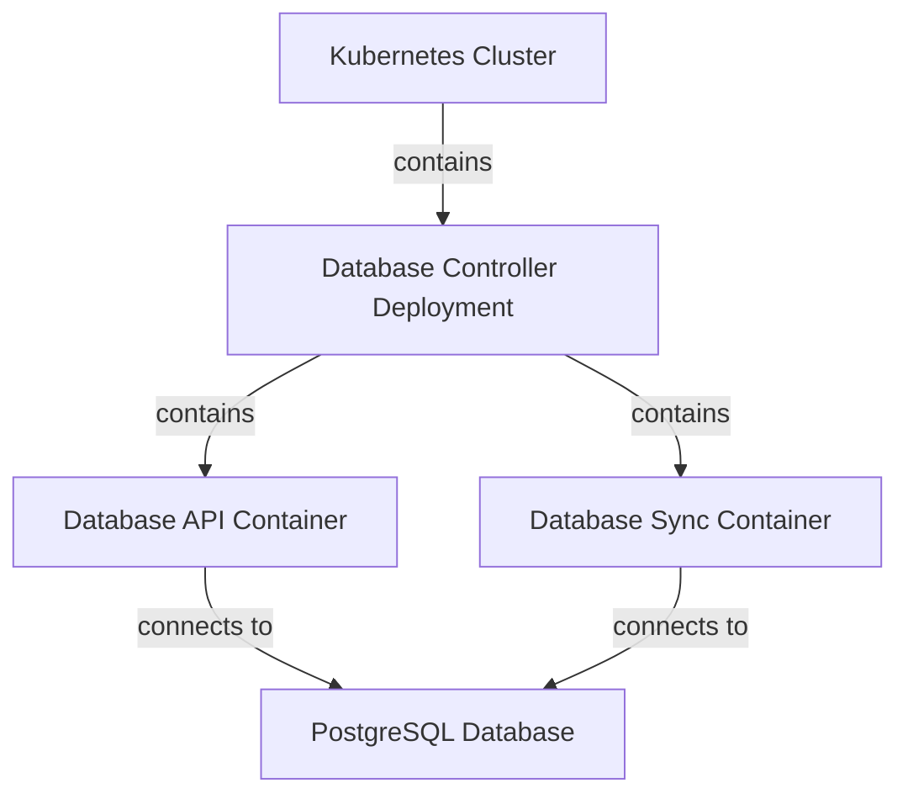

# Database Controller

## Overview

The Database Controller is a critical component of the EDURange Cloud platform that manages database interactions between the Kubernetes cluster and the PostgreSQL database. It consists of two main services that run as containers within the same Kubernetes pod:

1. **Database API**: A Flask-based REST API that provides endpoints for database operations
2. **Database Sync**: A background service that synchronizes the state of challenge instances between Kubernetes and the database

Together, these services ensure data consistency and provide a unified interface for database operations across the platform.

## Architecture

The Database Controller is deployed as a single Kubernetes deployment with two containers sharing the same pod. This design allows both services to access the same environment variables and configuration while maintaining separation of concerns.

## Database API

The Database API is a Flask application that provides RESTful endpoints for interacting with the database. It serves as the primary interface for other components of the EDURange Cloud platform to perform database operations.

### Key Features

- **Activity Logging**: Records user activities and system events
- **Points Management**: Handles awarding, updating, and retrieving points for users
- **Competition Management**: Supports creating and managing competition groups
- **Challenge Management**: Provides endpoints for challenge-related operations
- **Question Tracking**: Manages question completions and attempts

### API Endpoints

| Endpoint | Method | Description |
|----------|--------|-------------|
| `/activity/log` | POST | Records activity events in the system |
| `/add_points` | POST | Adds points to a user's score |
| `/set_points` | POST | Sets a user's points to a specific value |
| `/get_points` | GET | Retrieves a user's current points |
| `/get_challenge_instance` | GET | Gets details about a challenge instance |
| `/competition/create` | POST | Creates a new competition group |
| `/competition/join` | POST | Adds a user to a competition group |
| `/competition/generate-code` | POST | Generates an access code for a competition |
| `/competition/add-challenge` | POST | Adds a challenge to a competition |
| `/competition/complete-challenge` | POST | Marks a challenge as completed |
| `/competition/<group_id>/leaderboard` | GET | Gets the leaderboard for a competition |
| `/competition/<group_id>/progress/<user_id>` | GET | Gets a user's progress in a competition |
| `/question/complete` | POST | Marks a question as completed |
| `/question/completed` | GET | Gets a list of completed questions |
| `/question/details` | GET | Gets details about a specific question |
| `/challenge/details` | GET | Gets details about a specific challenge |

### Implementation Details

- Uses Prisma ORM for database interactions
- Implements proper error handling and validation
- Provides consistent JSON responses
- Logs all operations for debugging and auditing

## Database Sync

The Database Sync service is a Python application that runs continuously in the background, synchronizing the state of challenge instances between the Kubernetes cluster and the database.

### Key Functions

- **Synchronization Loop**: Continuously polls for changes in challenge pods
- **Instance Management**: Creates, updates, and removes challenge instances in the database
- **Flag Management**: Retrieves and stores challenge flags securely
- **Status Tracking**: Updates the status of challenge instances based on Kubernetes pod status

### Synchronization Process

1. **Polling**: Every few seconds, the sync service queries the Instance Manager API to get the current list of challenge pods in the Kubernetes cluster
2. **Comparison**: Compares the list of pods with the challenge instances in the database
3. **Updates**:
   - Adds new challenge instances to the database when new pods are detected
   - Updates existing challenge instances with current status information
   - Removes challenge instances from the database when pods are deleted
4. **Activity Logging**: Records relevant events during the synchronization process

### Implementation Details

- Uses asynchronous programming with `asyncio` for efficient database operations
- Implements robust error handling to prevent synchronization failures
- Logs all operations for debugging and troubleshooting

## Deployment

The Database Controller is deployed as a Kubernetes deployment with two containers:

1. **Database API Container**:
   - Built from the `dockerfile.api` file
   - Runs the Flask API on port 8000
   - Exposed through a Kubernetes Service and Ingress

2. **Database Sync Container**:
   - Built from the `dockerfile.sync` file
   - Runs continuously in the background
   - Not exposed outside the cluster

Both containers share the same environment variables for database connection:
- `POSTGRES_HOST`: The hostname of the PostgreSQL server
- `POSTGRES_NAME`: The name of the database
- `POSTGRES_USER`: The database username
- `POSTGRES_PASSWORD`: The database password
- `DATABASE_URL`: The complete connection string for Prisma

## Security Considerations

- Database credentials are stored as environment variables in the deployment configuration
- The Database API is exposed through a TLS-secured Ingress
- The Database Sync service is not directly accessible from outside the cluster
- Both services implement proper input validation to prevent injection attacks

## Monitoring and Maintenance

- The Database Controller's health can be monitored through the system health endpoints
- Logs from both containers can be collected and analyzed for troubleshooting
- The deployment can be updated by rebuilding and pushing new container images

