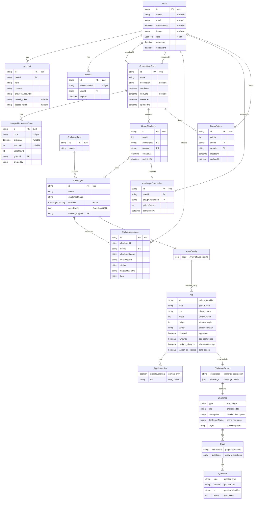

```mermaid
erDiagram
    %% Top Level - Core User and Authentication
    User ||--o{ Account : "has"
    User ||--o{ Session : "has"

    %% Second Level - Competition Organization
    User }o--o{ CompetitionGroup : "memberOf"
    User }o--o{ CompetitionGroup : "instructorOf"
    CompetitionGroup ||--o{ CompetitionAccessCode : "has"

    %% Third Level - Challenge Structure
    ChallengeType ||--o{ Challenges : "contains"
    CompetitionGroup ||--o{ GroupChallenge : "contains"
    GroupChallenge }|--|| Challenges : "uses"

    %% Fourth Level - Challenge Instances and Completions
    User ||--o{ ChallengeInstance : "creates"
    Challenges ||--o{ ChallengeInstance : "instances"
    
    %% Fifth Level - Progress and Points
    User ||--o{ ChallengeCompletion : "completes"
    GroupChallenge ||--o{ ChallengeCompletion : "completed"
    User ||--o{ GroupPoints : "earns"
    CompetitionGroup ||--o{ GroupPoints : "tracks"

    %% AppsConfig JSON Structure
    Challenges ||--|| AppsConfig : "contains"
    AppsConfig ||--o{ App : "contains_array"
    App ||--o{ AppProperties : "has"
    App ||--|| ChallengePrompt : "may_include"
    ChallengePrompt ||--|| Challenge : "contains"
    Challenge ||--o{ Page : "has"
    Page ||--o{ Question : "has"

    %% Core Authentication (Level 1)
    User {
        string id PK "cuid"
        string name "nullable"
        string email "unique"
        datetime emailVerified "nullable"
        string image "nullable"
        UserRole role "enum"
        datetime createdAt
        datetime updatedAt
    }

    Account {
        string id PK "cuid"
        string userId FK
        string type
        string provider
        string providerAccountId
        string refresh_token "nullable"
        string access_token "nullable"
    }

    Session {
        string id PK "cuid"
        string sessionToken "unique"
        string userId FK
        datetime expires
    }

    %% Competition Organization (Level 2)
    CompetitionGroup {
        string id PK "cuid"
        string name
        string description "nullable"
        datetime startDate
        datetime endDate "nullable"
        datetime createdAt
        datetime updatedAt
    }

    CompetitionAccessCode {
        string id PK "cuid"
        string code "unique"
        datetime expiresAt "nullable"
        int maxUses "nullable"
        int usedCount
        string groupId FK
        string createdBy
    }

    %% Challenge Structure (Level 3)
    ChallengeType {
        string id PK "cuid"
        string name
    }

    Challenges {
        string id PK "cuid"
        string name
        string challengeImage
        ChallengeDifficulty difficulty "enum"
        json AppsConfig "Complex JSON ↓"
        string challengeTypeId FK
    }

    GroupChallenge {
        string id PK "cuid"
        int points
        string challengeId FK
        string groupId FK
        datetime createdAt
        datetime updatedAt
    }

    %% Challenge Instances (Level 4)
    ChallengeInstance {
        string id PK "uuid"
        string challengeId
        string userId FK
        string challengeImage
        string challengeUrl
        string status
        string flagSecretName
        string flag
    }

    %% Progress and Points (Level 5)
    ChallengeCompletion {
        string id PK "cuid"
        string userId FK
        string groupChallengeId FK
        int pointsEarned
        datetime completedAt
    }

    GroupPoints {
        string id PK "cuid"
        int points
        string userId FK
        string groupId FK
        datetime createdAt
        datetime updatedAt
    }

    %% AppsConfig Structure Details
    AppsConfig {
        json apps "Array of App objects"
    }

    App {
        string id "unique identifier"
        string icon "path to icon"
        string title "display name"
        int width "window width"
        int height "window height"
        string screen "display function"
        boolean disabled "app state"
        boolean favourite "app preference"
        boolean desktop_shortcut "show on desktop"
        boolean launch_on_startup "auto launch"
    }

    AppProperties {
        boolean disableScrolling "terminal only"
        string url "web_chal only"
    }

    ChallengePrompt {
        string description "challenge description"
        json challenge "challenge details"
    }

    Challenge {
        string type "e.g., 'single'"
        string title "challenge title"
        string description "detailed description"
        string flagSecretName "secret reference"
        array pages "question pages"
    }

    Page {
        string instructions "page instructions"
        array questions "array of questions"
    }

    Question {
        string type "question type"
        string content "question text"
        string id "question identifier"
        int points "point value"
    }

```
