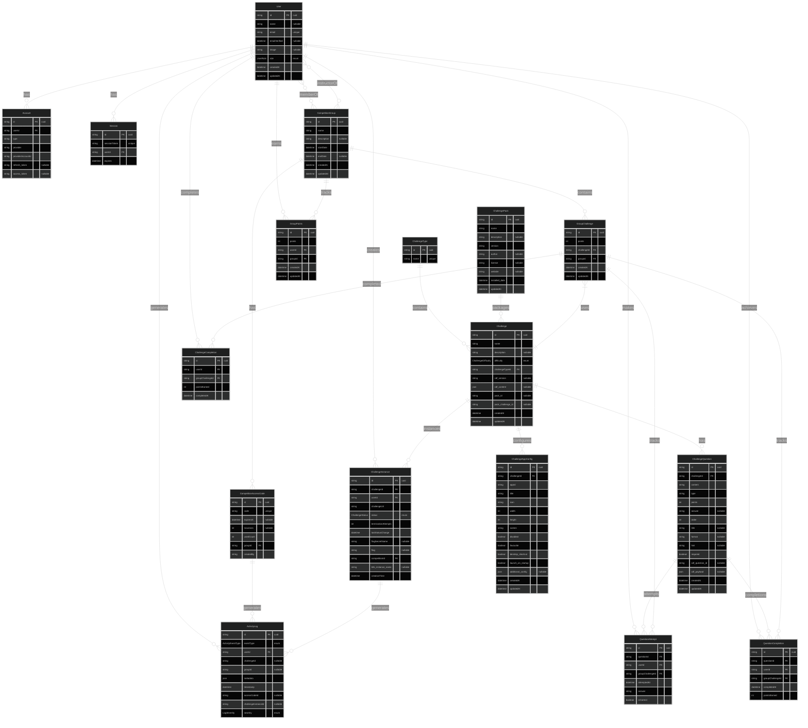

```mermaid
%%{init: {'theme': 'dark', 'themeVariables': { 'fontSize': '8px' }, 'er': {'useMaxWidth': true, 'diagramPadding': 10, 'layoutDirection': 'TB'}, 'securityLevel': 'loose'}}%%
erDiagram
    %% Top Level - Core User and Authentication
    User ||--o{ Account : "has"
    User ||--o{ Session : "has"
    User ||--o{ ActivityLog : "generates"

    %% Second Level - Competition Organization
    User }o--o{ CompetitionGroup : "memberOf"
    User }o--o{ CompetitionGroup : "instructorOf"
    CompetitionGroup ||--o{ CompetitionAccessCode : "has"
    CompetitionAccessCode ||--o{ ActivityLog : "generates"

    %% Third Level - Challenge Structure
    ChallengeType ||--o{ Challenge : "contains"
    ChallengePack ||--o{ Challenge : "packages"
    CompetitionGroup ||--o{ GroupChallenge : "contains"
    GroupChallenge }|--|| Challenge : "uses"

    %% Fourth Level - Challenge Instances and Completions
    User ||--o{ ChallengeInstance : "creates"
    Challenge ||--o{ ChallengeInstance : "instances"
    ChallengeInstance ||--o{ ActivityLog : "generates"
    
    %% Fifth Level - Progress and Points
    User ||--o{ ChallengeCompletion : "completes"
    GroupChallenge ||--o{ ChallengeCompletion : "completed"
    User ||--o{ GroupPoints : "earns"
    CompetitionGroup ||--o{ GroupPoints : "tracks"

    %% Questions and Attempts
    Challenge ||--o{ ChallengeQuestion : "has"
    User ||--o{ QuestionAttempt : "makes"
    User ||--o{ QuestionCompletion : "achieves"
    ChallengeQuestion ||--o{ QuestionAttempt : "attempts"
    ChallengeQuestion ||--o{ QuestionCompletion : "completions"
    GroupChallenge ||--o{ QuestionAttempt : "tracks"
    GroupChallenge ||--o{ QuestionCompletion : "tracks"

    %% App Configuration
    Challenge ||--o{ ChallengeAppConfig : "configures"

    %% Core Authentication (Level 1)
    User {
        string id PK "cuid"
        string name "nullable"
        string email "unique"
        datetime emailVerified "nullable"
        string image "nullable"
        UserRole role "enum"
        datetime createdAt
        datetime updatedAt
    }

    Account {
        string id PK "cuid"
        string userId FK
        string type
        string provider
        string providerAccountId
        string refresh_token "nullable"
        string access_token "nullable"
    }

    Session {
        string id PK "cuid"
        string sessionToken "unique"
        string userId FK
        datetime expires
    }

    %% Competition Organization (Level 2)
    CompetitionGroup {
        string id PK "cuid"
        string name
        string description "nullable"
        datetime startDate
        datetime endDate "nullable"
        datetime createdAt
        datetime updatedAt
    }

    CompetitionAccessCode {
        string id PK "cuid"
        string code "unique"
        datetime expiresAt "nullable"
        int maxUses "nullable"
        int usedCount
        string groupId FK
        string createdBy
    }

    %% Challenge Structure (Level 3)
    ChallengeType {
        string id PK "cuid"
        string name "unique"
    }

    Challenge {
        string id PK "cuid"
        string name
        string description "nullable"
        ChallengeDifficulty difficulty "enum"
        string challengeTypeId FK
        string cdf_version "nullable"
        json cdf_content "nullable"
        string pack_id "nullable"
        string pack_challenge_id "nullable"
        datetime createdAt
        datetime updatedAt
    }

    ChallengePack {
        string id PK "cuid"
        string name
        string description "nullable"
        string version
        string author "nullable"
        string license "nullable"
        string website "nullable"
        datetime installed_date
        datetime updatedAt
    }

    GroupChallenge {
        string id PK "cuid"
        int points
        string challengeId FK
        string groupId FK
        datetime createdAt
        datetime updatedAt
    }

    %% Challenge Instances (Level 4)
    ChallengeInstance {
        string id PK "uuid"
        string challengeId FK
        string userId FK
        string challengeUrl
        ChallengeStatus status "enum"
        int terminationAttempts
        datetime lastStatusChange
        string flagSecretName "nullable"
        string flag "nullable"
        string competitionId FK
        string k8s_instance_name "nullable"
        datetime creationTime
    }

    %% Progress and Points (Level 5)
    ChallengeCompletion {
        string id PK "cuid"
        string userId FK
        string groupChallengeId FK
        int pointsEarned
        datetime completedAt
    }

    GroupPoints {
        string id PK "cuid"
        int points
        string userId FK
        string groupId FK
        datetime createdAt
        datetime updatedAt
    }

    %% Questions and Attempts
    ChallengeQuestion {
        string id PK "cuid"
        string challengeId FK
        string content
        string type
        int points
        string answer "nullable"
        int order
        string title "nullable"
        string format "nullable"
        string hint "nullable"
        boolean required
        string cdf_question_id "nullable"
        json cdf_payload "nullable"
        datetime createdAt
        datetime updatedAt
    }

    QuestionAttempt {
        string id PK "cuid"
        string questionId FK
        string userId FK
        string groupChallengeId FK
        datetime attemptedAt
        string answer
        boolean isCorrect
    }

    QuestionCompletion {
        string id PK "cuid"
        string questionId FK
        string userId FK
        string groupChallengeId FK
        datetime completedAt
        int pointsEarned
    }

    %% App Configuration
    ChallengeAppConfig {
        string id PK "cuid"
        string challengeId FK
        string appId
        string title
        string icon
        int width
        int height
        string screen
        boolean disabled
        boolean favourite
        boolean desktop_shortcut
        boolean launch_on_startup
        json additional_config "nullable"
        datetime createdAt
        datetime updatedAt
    }

    %% Activity Logging
    ActivityLog {
        string id PK "cuid" 
        ActivityEventType eventType "enum"
        string userId FK
        string challengeId "nullable"
        string groupId "nullable"
        json metadata
        datetime timestamp
        string accessCodeId "nullable"
        string challengeInstanceId "nullable"
        LogSeverity severity "enum"
    }

```
