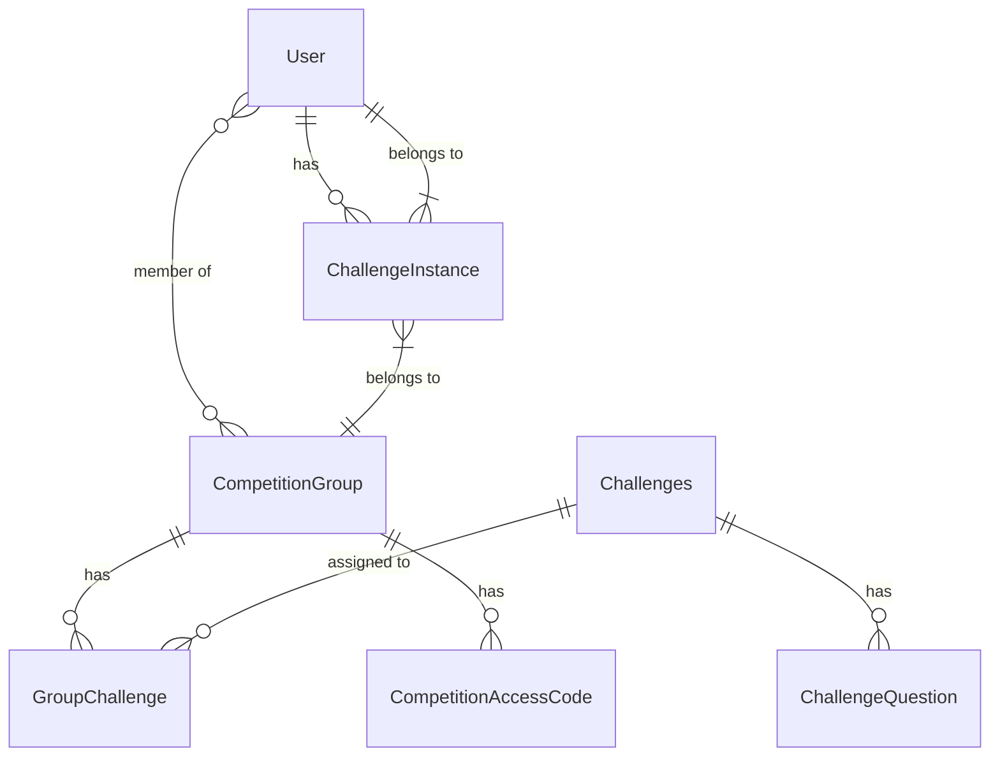

# Database Schema Documentation

## Overview

EDURange Cloud uses a PostgreSQL database with Prisma ORM to manage data. The schema is designed to support the platform's core functionalities, including user management, competition organization, challenge tracking, and activity logging.

## Entity Relationship Diagram

This diagram shows the main entities and their primary relationships. For a more detailed view of all relationships, see the [comprehensive diagram](diagram.md).

### How to Read This Diagram

The diagram uses standard Entity-Relationship (ER) notation with the following symbols:

- **Entities**: Rectangles representing database tables (e.g., `User`, `Challenges`)
- **Relationships**: Lines connecting entities with symbols at each end indicating the type of relationship
- **Relationship Text**: Describes the nature of the relationship (e.g., "has", "belongs to")

**Relationship Symbols:**
- `||--o{` : One-to-many relationship (e.g., one User has many ChallengeInstances)
- `}o--o{` : Many-to-many relationship (e.g., Users can be members of many CompetitionGroups)
- `}|--||` : Many-to-one relationship (e.g., many ChallengeInstances belong to one User)

**Cardinality Notation:**
- `||` : Exactly one
- `}|` : Many (one or more)
- `o{` : Zero or many
- `o|` : Zero or one

## Core Entities

### User

The `User` model represents users of the platform with different roles.

| Field | Type | Description |
|-------|------|-------------|
| id | String | Unique identifier (CUID) |
| name | String? | User's display name |
| email | String | User's email address (unique) |
| emailVerified | DateTime? | When the email was verified |
| image | String? | Profile image URL |
| role | UserRole | User's role (ADMIN, INSTRUCTOR, STUDENT) |
| createdAt | DateTime | When the user was created |
| updatedAt | DateTime | When the user was last updated |

**Relationships:**
- Has many `Account` records (for OAuth providers)
- Has many `Session` records
- Has many `ActivityLog` records
- Has many `ChallengeInstance` records
- Can be an instructor in many `CompetitionGroup` records
- Can be a member of many `CompetitionGroup` records

### CompetitionGroup

Represents a group or class for competitions and challenges.

| Field | Type | Description |
|-------|------|-------------|
| id | String | Unique identifier (CUID) |
| name | String | Group name |
| description | String? | Group description |
| startDate | DateTime | When the competition starts |
| endDate | DateTime? | When the competition ends |
| createdAt | DateTime | When the group was created |
| updatedAt | DateTime | When the group was last updated |

**Relationships:**
- Has many `CompetitionAccessCode` records
- Has many `GroupChallenge` records
- Has many `ChallengeInstance` records
- Has many `ActivityLog` records
- Has many instructors (Users with INSTRUCTOR role)
- Has many members (Users with any role)

### Challenges

Represents a challenge template that can be added to competition groups.

| Field | Type | Description |
|-------|------|-------------|
| id | String | Unique identifier (CUID) |
| name | String | Challenge name |
| challengeImage | String | Docker image for the challenge |
| difficulty | ChallengeDifficulty | Difficulty level (EASY, MEDIUM, HARD, VERY_HARD) |
| challengeTypeId | String | Reference to challenge type |
| description | String? | Challenge description |

**Relationships:**
- Has many `ChallengeQuestion` records
- Has many `ChallengeAppConfig` records
- Has many `GroupChallenge` records
- Has many `ActivityLog` records
- Belongs to a `ChallengeType`

### ChallengeInstance

Represents a running instance of a challenge for a specific user.

| Field | Type | Description |
|-------|------|-------------|
| id | String | Unique identifier (UUID) |
| challengeId | String | Challenge identifier |
| userId | String | User identifier |
| challengeImage | String | Docker image used |
| challengeUrl | String | URL to access the challenge |
| creationTime | DateTime | When the instance was created |
| status | String | Current status of the instance |
| flagSecretName | String | Name of the secret containing the flag |
| flag | String | The challenge flag |
| competitionId | String | Competition group identifier |

**Relationships:**
- Belongs to a `User`
- Belongs to a `CompetitionGroup`
- Has many `ActivityLog` records

## Supporting Entities

### GroupChallenge

Links challenges to competition groups with specific point values.

| Field | Type | Description |
|-------|------|-------------|
| id | String | Unique identifier (CUID) |
| points | Int | Points awarded for completion |
| challengeId | String | Challenge identifier |
| groupId | String | Competition group identifier |
| createdAt | DateTime | When the record was created |
| updatedAt | DateTime | When the record was last updated |

**Relationships:**
- Belongs to a `Challenges`
- Belongs to a `CompetitionGroup`
- Has many `ChallengeCompletion` records
- Has many `QuestionAttempt` records
- Has many `QuestionCompletion` records

### ChallengeQuestion

Represents questions within a challenge.

| Field | Type | Description |
|-------|------|-------------|
| id | String | Unique identifier (CUID) |
| challengeId | String | Challenge identifier |
| content | String | Question content |
| type | String | Question type |
| points | Int | Points awarded for correct answer |
| answer | String | Correct answer |
| order | Int | Display order |
| createdAt | DateTime | When the question was created |
| updatedAt | DateTime | When the question was last updated |

**Relationships:**
- Belongs to a `Challenges`
- Has many `QuestionAttempt` records
- Has many `QuestionCompletion` records

### CompetitionAccessCode

Represents access codes for joining competition groups.

| Field | Type | Description |
|-------|------|-------------|
| id | String | Unique identifier (CUID) |
| code | String | Unique access code |
| expiresAt | DateTime? | When the code expires |
| maxUses | Int? | Maximum number of uses |
| usedCount | Int | Current use count |
| groupId | String | Competition group identifier |
| createdAt | DateTime | When the code was created |
| createdBy | String | User who created the code |

**Relationships:**
- Belongs to a `CompetitionGroup`
- Has many `ActivityLog` records

### ChallengeAppConfig

Configures applications available within a challenge's WebOS environment.

| Field | Type | Description |
|-------|------|-------------|
| id | String | Unique identifier (CUID) |
| challengeId | String | Challenge identifier |
| appId | String | Application identifier |
| title | String | Application title |
| icon | String | Icon path |
| width | Int | Window width |
| height | Int | Window height |
| screen | String | Screen identifier |
| disabled | Boolean | Whether the app is disabled |
| favourite | Boolean | Whether the app is favorited |
| desktop_shortcut | Boolean | Whether to show on desktop |
| launch_on_startup | Boolean | Whether to launch on startup |
| additional_config | Json? | Additional configuration |

**Relationships:**
- Belongs to a `Challenges`

## Tracking Entities

### ChallengeCompletion

Tracks when users complete challenges.

| Field | Type | Description |
|-------|------|-------------|
| id | String | Unique identifier (CUID) |
| userId | String | User identifier |
| groupChallengeId | String | Group challenge identifier |
| pointsEarned | Int | Points earned |
| completedAt | DateTime | When the challenge was completed |

**Relationships:**
- Belongs to a `User`
- Belongs to a `GroupChallenge`

### QuestionCompletion

Tracks when users complete questions.

| Field | Type | Description |
|-------|------|-------------|
| id | String | Unique identifier (CUID) |
| questionId | String | Question identifier |
| userId | String | User identifier |
| groupChallengeId | String | Group challenge identifier |
| completedAt | DateTime | When the question was completed |
| pointsEarned | Int | Points earned |

**Relationships:**
- Belongs to a `User`
- Belongs to a `ChallengeQuestion`
- Belongs to a `GroupChallenge`

### QuestionAttempt

Tracks attempts to answer questions.

| Field | Type | Description |
|-------|------|-------------|
| id | String | Unique identifier (CUID) |
| questionId | String | Question identifier |
| userId | String | User identifier |
| groupChallengeId | String | Group challenge identifier |
| attemptedAt | DateTime | When the attempt was made |
| answer | String | User's answer |
| isCorrect | Boolean | Whether the answer was correct |

**Relationships:**
- Belongs to a `User`
- Belongs to a `ChallengeQuestion`
- Belongs to a `GroupChallenge`

### GroupPoints

Tracks points earned by users in competition groups.

| Field | Type | Description |
|-------|------|-------------|
| id | String | Unique identifier (CUID) |
| points | Int | Total points |
| userId | String | User identifier |
| groupId | String | Competition group identifier |
| createdAt | DateTime | When the record was created |
| updatedAt | DateTime | When the record was last updated |

**Relationships:**
- Belongs to a `User`
- Belongs to a `CompetitionGroup`

### ActivityLog

Comprehensive logging of system events.

| Field | Type | Description |
|-------|------|-------------|
| id | String | Unique identifier (CUID) |
| eventType | ActivityEventType | Type of event |
| userId | String | User identifier |
| challengeId | String? | Challenge identifier |
| groupId | String? | Competition group identifier |
| metadata | Json | Additional event data |
| timestamp | DateTime | When the event occurred |
| accessCodeId | String? | Access code identifier |
| challengeInstanceId | String? | Challenge instance identifier |
| severity | LogSeverity | Event severity (INFO, WARNING, ERROR, CRITICAL) |

**Relationships:**
- Belongs to a `User`
- May belong to a `Challenges`
- May belong to a `CompetitionGroup`
- May belong to a `CompetitionAccessCode`
- May belong to a `ChallengeInstance`

## Authentication Entities

### Account

Links users to OAuth providers.

| Field | Type | Description |
|-------|------|-------------|
| id | String | Unique identifier (CUID) |
| userId | String | User identifier |
| type | String | Account type |
| provider | String | OAuth provider |
| providerAccountId | String | Provider's account ID |
| refresh_token | String? | OAuth refresh token |
| access_token | String? | OAuth access token |
| expires_at | Int? | Token expiration timestamp |
| token_type | String? | OAuth token type |
| scope | String? | OAuth scopes |
| id_token | String? | OAuth ID token |
| session_state | String? | OAuth session state |

**Relationships:**
- Belongs to a `User`

### Session

Manages user sessions.

| Field | Type | Description |
|-------|------|-------------|
| id | String | Unique identifier (CUID) |
| sessionToken | String | Unique session token |
| userId | String | User identifier |
| expires | DateTime | When the session expires |

**Relationships:**
- Belongs to a `User`

### VerificationToken

Used for email verification and password resets.

| Field | Type | Description |
|-------|------|-------------|
| identifier | String | User identifier (typically email) |
| token | String | Unique verification token |
| expires | DateTime | When the token expires |

## Enumerations

### UserRole
- `ADMIN`: System administrators
- `INSTRUCTOR`: Competition organizers and educators
- `STUDENT`: Regular users participating in challenges

### ActivityEventType
- Various event types for system activities (e.g., `USER_REGISTERED`, `CHALLENGE_COMPLETED`)

### LogSeverity
- `INFO`: Informational events
- `WARNING`: Potential issues
- `ERROR`: Errors that don't prevent operation
- `CRITICAL`: Critical errors that may affect system operation

### ChallengeDifficulty
- `EASY`: Beginner-level challenges
- `MEDIUM`: Intermediate challenges
- `HARD`: Advanced challenges
- `VERY_HARD`: Expert-level challenges 
