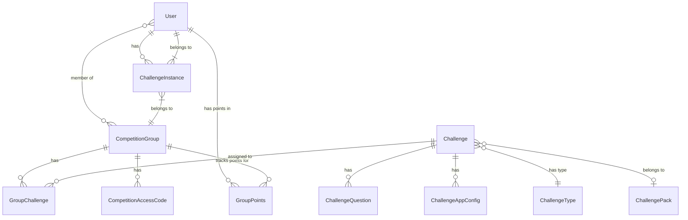

# Database Schema Documentation

## Overview

EDURange Cloud uses a PostgreSQL database with Prisma ORM to manage data. The schema is designed to support the platform's core functionalities, including user management, competition organization, challenge tracking, and activity logging.

## Entity Relationship Diagram

This diagram shows the main entities and their primary relationships. For a more detailed view of all relationships, see the [comprehensive diagram](diagram.md).

### How to Read This Diagram

The diagram uses standard Entity-Relationship (ER) notation with the following symbols:

- **Entities**: Rectangles representing database tables (e.g., `User`, `Challenge`)
- **Relationships**: Lines connecting entities with symbols at each end indicating the type of relationship
- **Relationship Text**: Describes the nature of the relationship (e.g., "has", "belongs to")

**Relationship Symbols:**
- `||--o{` : One-to-many relationship (e.g., one User has many ChallengeInstances)
- `}o--o{` : Many-to-many relationship (e.g., Users can be members of many CompetitionGroups)
- `}|--||` : Many-to-one relationship (e.g., many ChallengeInstances belong to one User)
- `}o--o|` : Many-to-optional one relationship (e.g., Challenges may belong to a ChallengePack)

**Cardinality Notation:**
- `||` : Exactly one
- `}|` : Many (one or more)
- `o{` : Zero or many
- `o|` : Zero or one

## Core Entities

### User

The `User` model represents users of the platform with different roles.

| Field | Type | Description |
|-------|------|-------------|
| id | String | Unique identifier (CUID) |
| name | String? | User's display name |
| email | String | User's email address (unique) |
| emailVerified | DateTime? | When the email was verified |
| image | String? | Profile image URL |
| role | UserRole | User's role (ADMIN, INSTRUCTOR, STUDENT) |
| createdAt | DateTime | When the user was created |
| updatedAt | DateTime | When the user was last updated |

**Relationships:**
- Has many `Account` records (for OAuth providers)
- Has many `Session` records
- Has many `ActivityLog` records
- Has many `ChallengeInstance` records
- Has many `GroupPoints` records
- Can be an instructor in many `CompetitionGroup` records
- Can be a member of many `CompetitionGroup` records
- Has many `ChallengeCompletion` records
- Has many `QuestionCompletion` records
- Has many `QuestionAttempt` records

### CompetitionGroup

Represents a group or class for competitions and challenges.

| Field | Type | Description |
|-------|------|-------------|
| id | String | Unique identifier (CUID) |
| name | String | Group name |
| description | String? | Group description |
| startDate | DateTime | When the competition starts |
| endDate | DateTime? | When the competition ends |
| createdAt | DateTime | When the group was created |
| updatedAt | DateTime | When the group was last updated |

**Relationships:**
- Has many `CompetitionAccessCode` records
- Has many `GroupChallenge` records
- Has many `ChallengeInstance` records
- Has many `ActivityLog` records
- Has many `GroupPoints` records
- Has many instructors (Users with INSTRUCTOR role)
- Has many members (Users with any role)

### Challenge

Represents a challenge template that can be added to competition groups.

| Field | Type | Description |
|-------|------|-------------|
| id | String | Unique identifier (CUID) |
| name | String | Challenge name |
| description | String? | Challenge description |
| difficulty | ChallengeDifficulty? | Difficulty level (EASY, MEDIUM, HARD, VERY_HARD) |
| challengeTypeId | String | Reference to challenge type |
| createdAt | DateTime | When the challenge was created |
| updatedAt | DateTime | When the challenge was last updated |
| cdf_version | String? | Version of the Challenge Definition Format |
| cdf_content | Json? | Full CDF definition as JSON |
| pack_id | String? | Reference to the challenge pack |
| pack_challenge_id | String? | Identifier within the challenge pack |

**Relationships:**
- Has many `ChallengeQuestion` records
- Has many `ChallengeAppConfig` records
- Has many `GroupChallenge` records
- Has many `ActivityLog` records
- Belongs to a `ChallengeType`
- May belong to a `ChallengePack`

### ChallengePack

Represents a collection of related challenges packaged together.

| Field | Type | Description |
|-------|------|-------------|
| id | String | Unique identifier (CUID) |
| name | String | Human-readable name of the pack |
| description | String? | Description of the challenge pack |
| version | String | Version of the challenge pack |
| author | String? | Author of the challenge pack |
| license | String? | License information |
| website | String? | Website URL for the pack |
| installed_date | DateTime | When the pack was installed |
| updatedAt | DateTime | When the pack was last updated |

**Relationships:**
- Has many `Challenge` records

### ChallengeInstance

Represents a running instance of a challenge for a specific user.

| Field | Type | Description |
|-------|------|-------------|
| id | String | Unique identifier (UUID) |
| challengeId | String | Challenge identifier |
| userId | String | User identifier |
| challengeUrl | String | URL to access the challenge |
| creationTime | DateTime | When the instance was created |
| status | ChallengeStatus | Current status (CREATING, ACTIVE, TERMINATING, TERMINATED, ERROR) |
| terminationAttempts | Int | Number of termination attempts |
| lastStatusChange | DateTime | When the status last changed |
| flagSecretName | String? | Name of the secret containing the flag |
| flag | String? | The challenge flag |
| competitionId | String | Competition group identifier |
| k8s_instance_name | String? | Kubernetes instance name |

**Relationships:**
- Belongs to a `User`
- Belongs to a `CompetitionGroup`
- Has many `ActivityLog` records

## Supporting Entities

### GroupChallenge

Links challenges to competition groups with specific point values.

| Field | Type | Description |
|-------|------|-------------|
| id | String | Unique identifier (CUID) |
| points | Int | Points awarded for completion |
| challengeId | String | Challenge identifier |
| groupId | String | Competition group identifier |
| createdAt | DateTime | When the record was created |
| updatedAt | DateTime | When the record was last updated |

**Relationships:**
- Belongs to a `Challenge`
- Belongs to a `CompetitionGroup`
- Has many `ChallengeCompletion` records
- Has many `QuestionAttempt` records
- Has many `QuestionCompletion` records

### ChallengeQuestion

Represents questions within a challenge.

| Field | Type | Description |
|-------|------|-------------|
| id | String | Unique identifier (CUID) |
| challengeId | String | Challenge identifier |
| content | String | Question content |
| type | String | Question type |
| points | Int | Points awarded for correct answer |
| answer | String? | Correct answer |
| order | Int | Display order |
| title | String? | Question title |
| format | String? | Format of the question |
| hint | String? | Hint for the question |
| required | Boolean | Whether the question is required |
| cdf_question_id | String? | ID of the question in the CDF |
| cdf_payload | Json? | Additional CDF data for the question |
| createdAt | DateTime | When the question was created |
| updatedAt | DateTime | When the question was last updated |

**Relationships:**
- Belongs to a `Challenge`
- Has many `QuestionAttempt` records
- Has many `QuestionCompletion` records

### ChallengeAppConfig

Configures applications available within a challenge's [WebOS](../Framework/WebOS/Introduction) environment.

| Field | Type | Description |
|-------|------|-------------|
| id | String | Unique identifier (CUID) |
| challengeId | String | Challenge identifier |
| appId | String | Application identifier |
| title | String | Application title |
| icon | String | Icon path |
| width | Int | Window width |
| height | Int | Window height |
| screen | String | Screen identifier |
| disabled | Boolean | Whether the app is disabled |
| favourite | Boolean | Whether the app is favorited |
| desktop_shortcut | Boolean | Whether to show on desktop |
| launch_on_startup | Boolean | Whether to launch on startup |
| additional_config | Json? | Additional configuration |
| createdAt | DateTime | When the record was created |
| updatedAt | DateTime | When the record was last updated |

**Relationships:**
- Belongs to a `Challenge`

### CompetitionAccessCode

Represents access codes for joining competition groups.

| Field | Type | Description |
|-------|------|-------------|
| id | String | Unique identifier (CUID) |
| code | String | Unique access code |
| expiresAt | DateTime? | When the code expires |
| maxUses | Int? | Maximum number of uses |
| usedCount | Int | Current use count |
| groupId | String | Competition group identifier |
| createdAt | DateTime | When the code was created |
| createdBy | String | User who created the code |

**Relationships:**
- Belongs to a `CompetitionGroup`
- Has many `ActivityLog` records

### GroupPoints

Tracks points earned by users within a specific competition group.

| Field | Type | Description |
|-------|------|-------------|
| id | String | Unique identifier (CUID) |
| userId | String | User identifier |
| groupId | String | Competition group identifier |
| points | Int | Total points earned |
| createdAt | DateTime | When the record was created |
| updatedAt | DateTime | When the record was last updated |

**Relationships:**
- Belongs to a `User`
- Belongs to a `CompetitionGroup`

## Tracking Entities

### ChallengeCompletion

Tracks when users complete challenges.

| Field | Type | Description |
|-------|------|-------------|
| id | String | Unique identifier (CUID) |
| userId | String | User identifier |
| groupChallengeId | String | Group challenge identifier |
| pointsEarned | Int | Points earned |
| completedAt | DateTime | When the challenge was completed |

**Relationships:**
- Belongs to a `User`
- Belongs to a `GroupChallenge`

### QuestionCompletion

Tracks when users complete questions.

| Field | Type | Description |
|-------|------|-------------|
| id | String | Unique identifier (CUID) |
| questionId | String | Question identifier |
| userId | String | User identifier |
| groupChallengeId | String | Group challenge identifier |
| completedAt | DateTime | When the question was completed |
| pointsEarned | Int | Points earned |

**Relationships:**
- Belongs to a `User`
- Belongs to a `GroupChallenge`
- Belongs to a `ChallengeQuestion`

### QuestionAttempt

Tracks attempts made by users to answer questions.

| Field | Type | Description |
|-------|------|-------------|
| id | String | Unique identifier (CUID) |
| questionId | String | Question identifier |
| userId | String | User identifier |
| groupChallengeId | String | Group challenge identifier |
| attemptedAt | DateTime | When the attempt was made |
| answer | String | The submitted answer |
| correct | Boolean | Whether the answer was correct |

**Relationships:**
- Belongs to a `User`
- Belongs to a `GroupChallenge`
- Belongs to a `ChallengeQuestion`

### ActivityLog

Tracks important events in the system.

| Field | Type | Description |
|-------|------|-------------|
| id | String | Unique identifier (CUID) |
| eventType | ActivityEventType | Type of activity event |
| userId | String | User identifier |
| challengeId | String? | Challenge identifier |
| groupId | String? | Competition group identifier |
| metadata | Json | Additional event data |
| timestamp | DateTime | When the event occurred |
| accessCodeId | String? | Access code identifier |
| challengeInstanceId | String? | Challenge instance identifier |
| severity | LogSeverity | Severity level (DEBUG, INFO, WARNING, ERROR, CRITICAL) |

**Relationships:**
- Belongs to a `User`
- May belong to a `Challenge`
- May belong to a `CompetitionGroup`
- May belong to a `CompetitionAccessCode`
- May belong to a `ChallengeInstance`

## Enumerations

### UserRole
- `ADMIN`: System administrator with full access
- `INSTRUCTOR`: Can create and manage competition groups and challenges
- `STUDENT`: Can join competition groups and participate in challenges

### ChallengeStatus
- `CREATING`: Challenge instance is being created
- `ACTIVE`: Challenge instance is running
- `TERMINATING`: Challenge instance is being terminated
- `TERMINATED`: Challenge instance has been terminated
- `ERROR`: An error occurred with the challenge instance

### ChallengeDifficulty
- `EASY`: Beginner-level challenge
- `MEDIUM`: Intermediate-level challenge
- `HARD`: Advanced-level challenge
- `VERY_HARD`: Expert-level challenge

### LogSeverity
- `DEBUG`: Detailed information for debugging
- `INFO`: General information about system operation
- `WARNING`: Potential issues that don't affect system operation
- `ERROR`: Errors that affect specific operations
- `CRITICAL`: Critical errors that affect system operation

### ActivityEventType
Various event types including user registration, login, challenge starts, completions, etc. 
