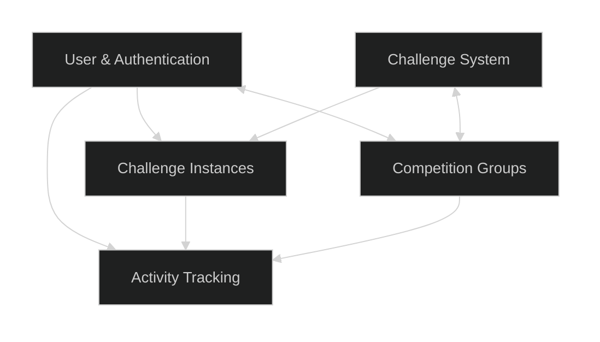

# Database Structure

## Overview

The EDURange Cloud database is a PostgreSQL database that stores all persistent data for the platform. It is designed to support the platform's core features, including user management, challenge configuration, competitions, and activity tracking.

## Database Organization

The database is organized into several logical groups of tables, each serving a specific purpose in the system:

### User Management

Tables related to user accounts, authentication, and sessions.

* **User**: Core user information including name, email, and role
* **Account**: OAuth accounts linked to users
* **Session**: User session information
* **VerificationToken**: Tokens for email verification and password reset

### Challenge Management

Tables related to challenge definition and configuration.

* **Challenge**: Core challenge information including name, description, and difficulty
* **ChallengeType**: Types of challenges (e.g., FullOS, Web, SQL, etc.)
* **ChallengeQuestion**: Questions associated with challenges
* **ChallengeAppConfig**: WebOS application configurations for challenges
* **ChallengePack**: Collections of related challenges packaged together

### Competition Management

Tables related to organizing competitions and managing groups.

* **CompetitionGroup**: Groups or classes for organizing competitions
* **GroupChallenge**: Challenges assigned to competition groups with point values
* **CompetitionAccessCode**: Access codes for joining competition groups
* **GroupPoints**: Points earned by users within competition groups

### Challenge Execution

Tables related to running challenge instances.

* **ChallengeInstance**: Running instances of challenges for specific users

### Activity Tracking

Tables related to tracking user activity and progress.

* **ActivityLog**: Comprehensive event logging
* **ChallengeCompletion**: Records of completed challenges
* **QuestionCompletion**: Records of completed questions
* **QuestionAttempt**: Records of attempts to answer questions

## Challenge Definition Format (CDF) Integration

The database schema includes support for the Challenge Definition Format (CDF), which is a standardized way to define and package challenges.

### CDF-Related Fields

* **Challenge.cdf_version**: Version of the CDF used
* **Challenge.cdf_content**: Complete CDF definition stored as JSON
* **Challenge.pack_id**: Reference to the challenge pack
* **Challenge.pack_challenge_id**: Identifier within the challenge pack
* **ChallengeQuestion.cdf_question_id**: ID of the question in the CDF
* **ChallengeQuestion.cdf_payload**: Additional CDF-specific data for questions

### Challenge Packs

Challenge packs allow for bundling multiple related challenges together. The ChallengePack table stores metadata about these packs:

* **name**: Human-readable name
* **description**: Detailed description
* **version**: Version number
* **author**: Author information
* **license**: License information
* **website**: URL for more information
* **installed_date**: When the pack was installed
* **updatedAt**: When the pack was last updated

## Data Access Patterns

The database is accessed through several patterns depending on the component:

1. **ORM Access**: The Dashboard and Database Controller use Prisma ORM to access the database directly.
2. **API Access**: The Instance Manager and other components access the database through the Database API.
3. **Connection Pooling**: Non-critical components use PgBouncer for connection pooling.
4. **Direct Access**: The Database Controller uses direct connections for critical operations.

## Relationships and Foreign Keys

The database uses foreign keys extensively to maintain referential integrity between related tables. Key relationships include:

* Users belong to competition groups through many-to-many relationships
* Challenges are assigned to competition groups through the GroupChallenge table
* Challenge instances are linked to specific users and competition groups
* Activity logs are linked to relevant users, challenges, and competition groups
* Questions are linked to challenges
* Completions and attempts are linked to users, questions, and group challenges

## Data Migration

Database migrations are managed through Prisma Migrate, which provides:

1. **Version Control**: Migration files are tracked in source control
2. **Schema Evolution**: Controlled changes to the database schema
3. **Data Migration**: Safe migration of data between schema versions
4. **Rollback Support**: Ability to roll back changes when necessary

## Performance Considerations

The database schema is designed with performance in mind:

1. **Indexing**: Foreign keys and frequently queried fields are indexed
2. **Denormalization**: Selected data is denormalized for query performance
3. **JSON Storage**: Complex data is stored in JSON fields for flexibility
4. **Query Optimization**: Common queries are optimized through careful schema design
5. **Connection Management**: Different connection strategies for different access patterns

## Architecture

The database system consists of four main components:

1. **PostgreSQL Database**: The primary data store running as a standalone service
2. **PgBouncer Connection Pooling**: Manages database connections to improve performance and scalability
3. **Database API**: REST API for database interactions
4. **Database Sync**: Background service that synchronizes Kubernetes pod state with the database

These components run in the Kubernetes cluster, with the Database API and Sync services part of the `database-controller` deployment, and PgBouncer running as a separate deployment.

For detailed information about connection pooling and how it's implemented in EDURange Cloud, see the [Connection Pooling documentation](./connection_pooling.md).

## Core Entities

### Users and Authentication

- **User**: Central entity storing user profiles, authentication details, and role information
- **Account**: OAuth provider accounts linked to users
- **Session**: User session data for authentication persistence
- **VerificationToken**: Used for email verification and password resets

### Competition Management

- **CompetitionGroup**: Represents a competition or class with start/end dates and member management
- **CompetitionAccessCode**: Codes that allow users to join competition groups
- **GroupPoints**: Tracks points earned by users within specific competition groups

### Challenge System

- **Challenges**: Defines available cybersecurity challenges with metadata
- **ChallengeType**: Categorizes challenges by type
- **ChallengeInstance**: Represents a running instance of a challenge for a specific user
- **GroupChallenge**: Links challenges to competition groups with point values
- **ChallengeCompletion**: Records when users complete entire challenges

### Question and Assessment

- **ChallengeQuestion**: Individual questions within challenges
- **QuestionAttempt**: Records of user attempts to answer questions
- **QuestionCompletion**: Tracks successfully completed questions

### Activity Tracking

- **ActivityLog**: Comprehensive event logging system for user actions and system events

## Key Relationships

- Users can be members or instructors of multiple competition groups
- Competition groups contain multiple challenges with customized point values
- Challenges contain multiple questions with individual point values
- Challenge instances are linked to specific users and competition groups
- Activity logs track actions across the entire system with references to relevant entities

## Database Management

The database is managed through:

1. **Prisma Schema**: Defines the data model and relationships
2. **Database Controller**: Kubernetes deployment with API and sync services
3. **Health Monitoring**: System health checks track database status and performance

## Synchronization

The database-sync service continuously:

1. Retrieves challenge pod information from Kubernetes
2. Updates the database to reflect the current state of running challenges
3. Removes database entries for terminated challenge instances
4. Ensures consistency between the Kubernetes cluster and database records

## Access Patterns

- The Next.js frontend accesses the database through Prisma Client
- The Instance Manager interacts with the database via the Database API
- System components monitor database health through dedicated endpoints

## Schema Evolution

Database schema changes are managed through Prisma migrations, allowing for:

- Version-controlled schema updates
- Safe application of schema changes
- Rollback capabilities for failed migrations

## Security Considerations

- Role-based access control (ADMIN, INSTRUCTOR, STUDENT)
- Cascading deletes to maintain referential integrity
- Comprehensive activity logging for audit trails 
