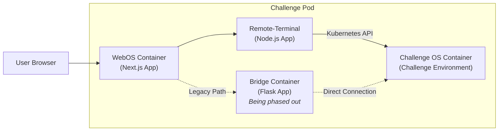

# Overview

The challenge pod is a key component in the [Instance Manager](Instance-Manager) system, responsible for providing an isolated environment where users can interact with and solve challenges. This documentation outlines the structure and functionality of the challenge pod.



The challenge pod is dynamically created and deleted by the [Instance Manager ](Instance-Manager) in a Kubernetes cluster. It consists of four containers:

**1. Challenge OS:** The environment where the actual challenge exists.

**2. WebOS:** A Next.js web app that simulates the look of an operating system. Users interact with the challenge through this interface, specifically using the terminal app.

**3. Bridge:** A Flask app that connects to the Challenge OS container and facilitates command execution from the WebOS to the Challenge OS. This component is being phased out in favor of the Remote-Terminal for direct command execution.

**4. Remote-Terminal:** A Node.js application that provides a web-based terminal interface with direct access to the Challenge OS container via the Kubernetes API.

# Challenge OS

The Challenge OS container is the main environment where the actual challenge runs. This container can run any operating system or software stack depending on the type of challenge. It could be a Debian-based system, a web server, a Python environment, or any other setup required for the challenge. The environment is isolated and secure, ensuring that users can only interact with it through the WebOS terminal.

## Example Use Cases

* **Linux Environment:** A challenge that involves navigating and manipulating files within a Linux filesystem.

* **Web Server:** A challenge where users must interact with a running web server, finding and exploiting vulnerabilities.

* **Python Environment:** A challenge that involves running Python scripts and solving problems within a Python-based environment.


## Two Main Components

**1. Dockerfile:**
* The Dockerfile defines the base image and the software stack needed for the challenge.
* It installs necessary packages and sets up the environment.
* It creates a user and sets up directories and files as needed for the challenge.

**Example dockerfile for simple file-wrangling challenge:**

```dockerfile filename="dockerfile"
FROM debian:bullseye-slim
# Install basic utilities
RUN apt-get update && \
    apt-get install -y --no-install-recommends \
    curl \
    wget \
    vim \
    git \
    sudo && \
    apt-get clean && \
    rm -rf /var/lib/apt/lists/* /tmp/* /var/tmp/*
# Create a user and set up directory structure
RUN useradd -m -s /bin/bash challengeuser && \
    mkdir -p /home/challengeuser/Documents /home/challengeuser/Downloads /home/challengeuser/Pictures
# Copy the entrypoint script
COPY entrypoint.sh /home/challengeuser/entrypoint.sh
RUN chmod +x /home/challengeuser/entrypoint.sh
# Switch to the new user
USER challengeuser
WORKDIR /home/challengeuser
# Set the command to run the entrypoint script
CMD ["/home/challengeuser/entrypoint.sh"]
```
**2. Entrypoint Script**
* The entrypoint script is executed when the container starts.

* It writes the challenge flag to a hidden file within the container. The flag is passed as an environment variable (FLAG) to the container by the Instance Manager.

* After writing the flag, the script unsets the FLAG environment variable to enhance security.

* Finally, the script starts a shell to allow users to interact with the environment.

**Example entrypoint.sh for above simple file-wrangling challenge:**

```shell filename="entrypoint.sh"
#!/bin/bash
# Write the flag to a hidden file
echo "$FLAG" > /home/challengeuser/.hidden_flag.txt
# Unset the FLAG environment variable
unset FLAG
# Start a shell
exec /bin/bash
```

# Bridge

The Bridge container acts as an intermediary between the WebOS and Challenge OS. It is a Python Flask application that maintains a WebSocket connection to receive commands from the WebOS and executes them in the Challenge OS.

**Note:** The Bridge component is being phased out in favor of the Remote-Terminal component for direct command execution. It is still included in the pod for backward compatibility and for specific use cases where direct API access is not preferred.

**Key Functionality:**

* **Command Execution:** Receives commands from the WebOS, executes them in the Challenge OS, and returns the output.

* **WebSocket Communication:** Handles real-time communication between the WebOS and the Challenge OS.

# Remote-Terminal

The Remote-Terminal container is a newer addition to the challenge pod that provides a more direct and secure way for users to interact with the Challenge OS. It is a Node.js application that uses the Kubernetes API to execute commands directly in the Challenge OS container.

**Key Functionality:**

* **Direct Command Execution:** Uses the Kubernetes API to execute commands directly in the Challenge OS container without requiring an intermediary service.

* **WebSocket Communication:** Maintains a WebSocket connection with the browser for real-time command execution and output display.

* **Rich Terminal Experience:** Provides a feature-rich terminal interface with support for copy/paste, font size adjustment, and other terminal features.

* **Secure Access Control:** Uses Kubernetes RBAC (Role-Based Access Control) to ensure secure access to the Challenge OS container.


# WebOS

The WebOS container runs a Next.js application that provides a graphical interface simulating an operating system. Users interact with the challenge through this simulated OS. The WebOS includes a Terminal application that embeds the Remote-Terminal interface, allowing users to interact with the Challenge OS container.

**Key Functionality:**

**Terminal Interaction:** Users access the terminal app in the WebOS, which loads the Remote-Terminal interface. This interface connects directly to the Challenge OS container via the Kubernetes API, providing a seamless command-line experience.

**Graphical Interface:** Simulates an operating system with various applications. This enhances user experience by providing a familiar environment for interacting with the challenges.

>Detailed documentation for the WebOS can be found [here](WebOS)

>Detailed documentation for the Remote-Terminal can be found [here](Terminal)
