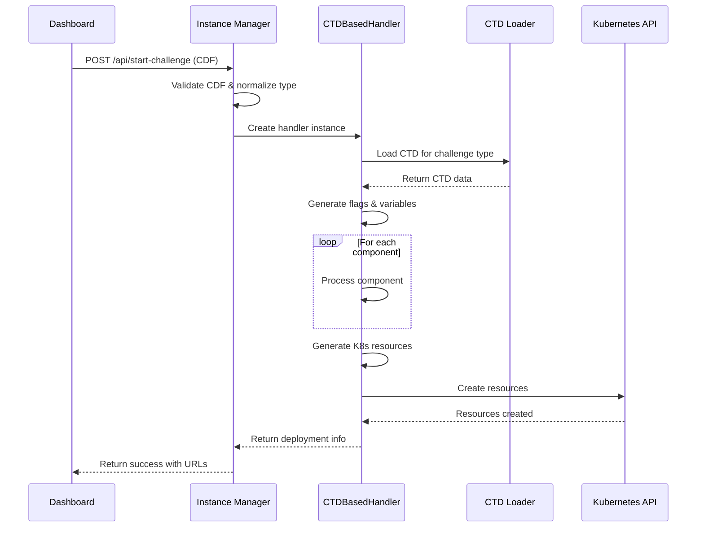
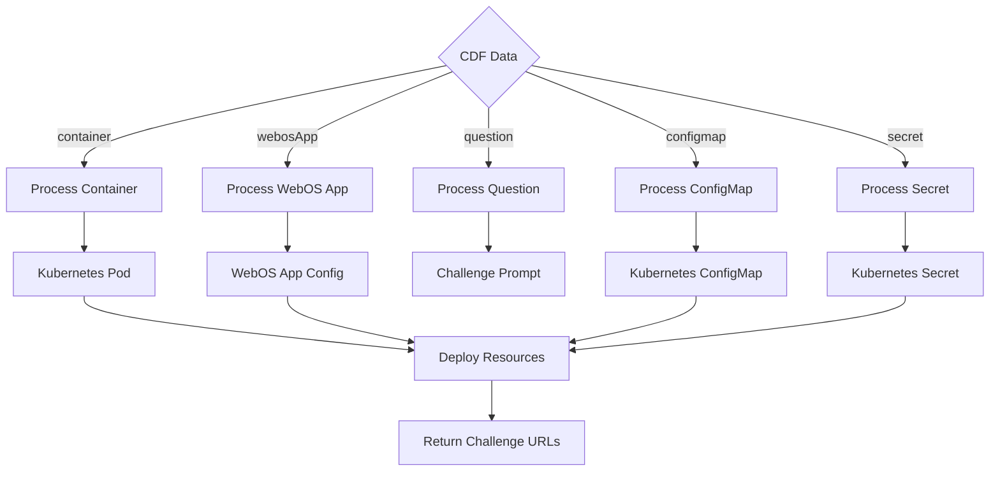

##### The Instance Manager system orchestrates the creation and management of [challenge pods](Challenge-Pod) for users in a Kubernetes cluster. This section overviews the Instance Manager's components and explains how it functions.

> Prerequisites:
> 1. Basic understanding of [Kubernetes](Introduction_to_Kubernetes)
> 2. Familiarity with reading [UML Sequence diagrams ](https://www.geeksforgeeks.org/unified-modeling-language-uml-sequence-diagrams/)(Highly Recommended)


# Overview of Components

**1. Flask API (app.py):**

* Provides RESTful endpoints to manage challenge environments
* Uses the Kubernetes API to create and manage resources in the cluster
* Processes Challenge Definition Format (CDF) data and routes to appropriate handlers

**2. Challenge Handler System:**

* `BaseChallengeHandler`: Abstract base class defining the interface for challenge handlers
* `CTDBasedHandler`: Main handler implementation that deploys challenges based on Challenge Type Definitions
* `CHALLENGE_HANDLERS` registry: Maps challenge types to their handlers

**3. Challenge Type Definitions (CTDs):**

* JSON files in the `challenge_types/` directory that define the structure and resources for each challenge type
* Dynamically discovered and loaded at runtime
* Support template variables for customization

## Internal Kubernetes Access

The Instance Manager is designed to be accessed only from within the Kubernetes cluster for enhanced security. External access is restricted to specific monitoring endpoints.

### Internal DNS Name

The Instance Manager service is accessible within the cluster using the following internal DNS name:

```
http://instance-manager.default.svc.cluster.local/api
```

### Access Methods

Components within the cluster can access the Instance Manager in two ways:

1. **Direct Internal Access**: Services running in the same Kubernetes namespace can directly access the Instance Manager using the internal DNS name.

2. **WebOS Proxy**: For client-side components in the WebOS application, requests are proxied through the `/api/instance-manager-proxy` endpoint to avoid mixed content issues and maintain security.

### Security Benefits

This internal-only access model provides several security advantages:

- Prevents unauthorized external access to the Instance Manager API
- Reduces the attack surface of the platform
- Ensures that only authenticated and authorized services can create or manage challenge instances
- Eliminates the need for complex authentication mechanisms for internal service-to-service communication

## Flask API (```app.py```)
The Flask API provides several endpoints for managing challenge instances, with the two primary ones being `/api/start-challenge` and `/api/end-challenge`.

### Key Endpoints

**1. Start Challenge Endpoint** ```POST /api/start-challenge```

**Request Payload:**

```json
{
  "user_id": "unique_user_identifier",
  "competition_id": "competition_identifier",
  "deployment_name": "unique_instance_name",
  "cdf_content": {
    "metadata": {
      "name": "Challenge Name",
      "description": "Challenge description",
      "challenge_type": "fullOS"
    },
    "typeConfig": {
      // Type-specific configuration
    },
    "components": [
      // Challenge components (containers, webosApps, questions, etc.)
    ]
  }
}
```

**Response:**

* **Success:** Returns deployment information including URLs.
* **Error:** Returns an error message and appropriate status code.

**Functionality:**

* Validates the request parameters
* Normalizes the challenge type
* Selects the appropriate handler from the `CHALLENGE_HANDLERS` registry
* Deploys the challenge using the selected handler
* Returns deployment information for accessing the challenge

**2. End Challenge Endpoint** ```POST /api/end-challenge```

**Request Payload:**

```json
{
  "deployment_name": "name_of_the_deployment"
}
```

**Response:**

* **Success:** Returns a message indicating the challenge has ended.
* **Error:** Returns an error message and status code.

**Functionality:**

* Extracts `deployment_name` from the request payload
* Uses label selectors to find and delete all associated Kubernetes resources
* Returns success or error message

**3. Additional Endpoints:**

* `GET /api/get-pod-status`: Retrieves status information for a specific pod
* `GET /api/list-challenge-pods`: Lists all active challenge pods
* `POST /api/update-challenge`: Updates configuration for an existing challenge
* `GET /api/get-secret`: Securely retrieves secret data (e.g., flags)
* `POST /api/execute-in-pod`: Executes commands within a pod (with security restrictions)
* `GET /api/health`: Basic health check endpoint
* `GET /api/health/detailed`: Detailed health information

## Challenge Handler System

The Instance Manager uses a flexible handler system to deploy different types of challenges:

### BaseChallengeHandler

This abstract base class defines the core interface that all challenge handlers must implement:

```python
class BaseChallengeHandler(ABC):
    def __init__(self, user_id, cdf_data, competition_id, deployment_name):
        # Initialize handler with challenge data
        pass

    @abstractmethod
    def deploy(self):
        """Creates all necessary Kubernetes resources for the challenge."""
        pass

    @abstractmethod
    def cleanup(self):
        """Deletes all Kubernetes resources created by this handler."""
        pass
```

### CTDBasedHandler

The primary handler implementation that deploys challenges based on Challenge Type Definitions:

```python
class CTDBasedHandler(BaseChallengeHandler):
    def __init__(self, user_id, cdf_data, competition_id, deployment_name):
        super().__init__(user_id, cdf_data, competition_id, deployment_name)
        self.challenge_type = cdf_data.get('metadata', {}).get('challenge_type')
        self.ctd_data = None
        # Load the CTD for this challenge type
        self._load_ctd()

    def deploy(self):
        # Core deployment workflow:
        # 1. Generate flags and template variables
        # 2. Process CDF components (containers, webosApps, questions)
        # 3. Generate Kubernetes resources
        # 4. Apply resources to the cluster
        # 5. Return deployment information

    def cleanup(self):
        # Delete all resources associated with this challenge
```

### Handler Registry

The `CHALLENGE_HANDLERS` registry maps challenge types to their handler classes:

```python
# This dictionary is dynamically populated during import
CHALLENGE_HANDLERS = {}

# Register the CTDBasedHandler for all supported challenge types
for challenge_type in get_handler_types():
    CHALLENGE_HANDLERS[challenge_type] = CTDBasedHandler
```

This approach allows:
1. Dynamic registration of handlers for all available types
2. Custom handlers for specific types when needed
3. Plugin architecture for extending the system

## Challenge Type Definitions (CTDs)

Challenge Type Definitions are JSON files in the `challenge_types/` directory that define the structure and configuration for each challenge type:

```
instance-manager/
└── challenge_types/
    ├── fullOS.ctd.json
    ├── web.ctd.json
    ├── metasploit.ctd.json
    └── ...
```

Each CTD file is dynamically discovered and registered with the system at runtime, allowing for extension without code changes.

### CTD Schema

The CTD format follows a standardized JSON schema with the following structure:

```json
{
  "typeId": "fullOS",
  "version": "1.0.0",
  "description": "Full operating system challenge with terminal access",
  "podTemplate": {
    "containers": [
      {
        "name": "challenge-os",
        "image": "registry.edurange.cloud/challenges/ubuntu:latest",
        "ports": [
          {
            "containerPort": 22,
            "name": "ssh"
          }
        ],
        "env": [
          {
            "name": "FLAG",
            "value": "{{FLAG_VALUE}}"
          }
        ]
      },
      {
        "name": "webos",
        "image": "registry.edurange.cloud/edurange/webos:latest",
        "ports": [
          {
            "containerPort": 3000,
            "name": "http"
          }
        ],
        "env": [
          {
            "name": "NEXT_PUBLIC_TERMINAL_URL",
            "value": "https://terminal-{{INSTANCE_NAME}}.{{DOMAIN}}"
          },
          {
            "name": "NEXT_PUBLIC_CHALLENGE_URL",
            "value": "https://{{INSTANCE_NAME}}.{{DOMAIN}}"
          }
        ]
      },
      {
        "name": "terminal",
        "image": "registry.edurange.cloud/edurange/terminal:latest",
        "ports": [
          {
            "containerPort": 3001,
            "name": "http"
          }
        ],
        "env": [
          {
            "name": "CONTAINER_NAME",
            "value": "challenge-os"
          }
        ]
      }
    ],
    "volumes": [],
    "serviceAccount": "terminal-account"
  },
  "services": [
    {
      "name": "challenge-service",
      "ports": [
        {
          "port": 80,
          "targetPort": 3000,
          "name": "webos"
        },
        {
          "port": 3001,
          "targetPort": 3001,
          "name": "terminal"
        }
      ]
    }
  ],
  "ingress": [
    {
      "rules": [
        {
          "host": "{{INSTANCE_NAME}}.{{DOMAIN}}",
          "http": {
            "paths": [
              {
                "path": "/",
                "pathType": "Prefix",
                "service": "challenge-service",
                "port": 80
              }
            ]
          }
        },
        {
          "host": "terminal-{{INSTANCE_NAME}}.{{DOMAIN}}",
          "http": {
            "paths": [
              {
                "path": "/",
                "pathType": "Prefix",
                "service": "challenge-service",
                "port": 3001
              }
            ]
          }
        }
      ]
    }
  ],
  "extensionPoints": {
    "osContainer": {
      "description": "Allows specifying a different OS container image",
      "type": "string",
      "default": "registry.edurange.cloud/challenges/ubuntu:latest"
    },
    "allowPrivilegedMode": {
      "description": "Whether to allow privileged mode for the OS container",
      "type": "boolean",
      "default": false
    }
  }
}
```

### Required Fields

1. **typeId**: Unique identifier for the challenge type (must match filename without `.ctd.json`)
2. **version**: Semantic versioning for the CTD format
3. **description**: Human-readable description of the challenge type
4. **podTemplate**: Kubernetes Pod specification template
5. **services**: Array of Kubernetes Service definitions
6. **ingress**: Array of Kubernetes Ingress rules
7. **extensionPoints**: Customization points that can be overridden by CDF files

### Template Variables

CTDs support template variables that are dynamically substituted during deployment:

- `{{INSTANCE_NAME}}`: Unique identifier for the challenge instance
- `{{DOMAIN}}`: Domain configured for the cluster
- `{{FLAG_VALUE}}`: Dynamically generated flag for the challenge
- `{{USER_ID}}`: ID of the user deploying the challenge
- `{{COMPETITION_ID}}`: ID of the competition the challenge belongs to

### Extension Points

Extension points define customizable aspects of the challenge type that can be overridden in CDF files:

```json
"extensionPoints": {
  "osContainer": {
    "description": "Allows specifying a different OS container image",
    "type": "string",
    "default": "registry.edurange.cloud/challenges/ubuntu:latest"
  }
}
```

A CDF can then override this extension point in its `typeConfig` section:

```json
"typeConfig": {
  "osContainer": "registry.edurange.cloud/challenges/kali:latest"
}
```

### Loading and Processing CTDs

1. CTDs are loaded by the `ctd_loader.py` module when a challenge is deployed
2. The system validates the CTD against a JSON schema
3. The CTD is cached in memory for performance
4. During deployment, template variables are replaced with actual values
5. The CTD is used to generate Kubernetes resources

## Challenge Definition Format (CDF)

The Challenge Definition Format (CDF) defines specific challenge instances that can be deployed using the Instance Manager. While CTDs define the structure for a type of challenge, CDFs define actual challenge content.

### CDF Schema

A CDF file follows this structure:

```json
{
  "metadata": {
    "name": "Finding Hidden Flags",
    "description": "Learn to find hidden flags in a Linux environment",
    "challenge_type": "fullOS",
    "difficulty": "beginner",
    "estimated_time": 30,
    "author": "EDURange Team",
    "tags": ["linux", "reconnaissance", "file-system"]
  },
  "typeConfig": {
    "osContainer": "registry.edurange.cloud/challenges/ubuntu-flags:latest",
    "allowPrivilegedMode": false
  },
  "components": [
    {
      "type": "container",
      "id": "challenge-container",
      "config": {
        "image": "registry.edurange.cloud/challenges/ubuntu-flags:latest",
        "env": [
          {
            "name": "DIFFICULTY",
            "value": "easy"
          }
        ],
        "resources": {
          "limits": {
            "cpu": "0.5",
            "memory": "512Mi"
          }
        }
      }
    },
    {
      "type": "webosApp",
      "id": "terminal",
      "config": {
        "title": "Terminal",
        "icon": "./icons/terminal.svg",
        "width": 800,
        "height": 600,
        "screen": "terminal",
        "favourite": true,
        "desktop_shortcut": true,
        "launch_on_startup": true
      }
    },
    {
      "type": "webosApp",
      "id": "challenge-prompt",
      "config": {
        "title": "Challenge: Finding Hidden Flags",
        "icon": "./icons/prompt.svg",
        "width": 600,
        "height": 800,
        "screen": "displayChallengePrompt",
        "favourite": true,
        "desktop_shortcut": true,
        "launch_on_startup": true,
        "challenge": {
          "type": "single",
          "title": "Finding Hidden Flags",
          "description": "In this challenge, you'll learn to search for hidden flags in a Linux environment.",
          "instructions": "Your task is to find all the hidden flags in the system. Flags are in the format FLAG{...}. Use Linux commands like ls, cat, find, and grep to discover them."
        }
      }
    },
    {
      "type": "question",
      "id": "first-flag",
      "config": {
        "type": "flag",
        "prompt": "Find the flag hidden in the user's home directory.",
        "points": 10
      }
    },
    {
      "type": "question",
      "id": "second-flag",
      "config": {
        "type": "flag",
        "prompt": "Find the flag hidden in system configuration files.",
        "points": 15
      }
    },
    {
      "type": "question",
      "id": "file-concept",
      "config": {
        "type": "text",
        "prompt": "What command would you use to find all files modified in the last 24 hours?",
        "answer": "find / -mtime -1",
        "points": 5
      }
    },
    {
      "type": "configmap",
      "id": "hints-configmap",
      "config": {
        "data": {
          "hint1.txt": "Check hidden files in your home directory",
          "hint2.txt": "System configuration files are usually in /etc"
        }
      }
    },
    {
      "type": "secret",
      "id": "credentials-secret",
      "config": {
        "data": {
          "username": "student",
          "password": "base64:cGFzc3dvcmQxMjM="
        }
      }
    }
  ]
}
```

### CDF Sections

#### Metadata

Contains basic information about the challenge:

```json
"metadata": {
  "name": "Finding Hidden Flags",
  "description": "Learn to find hidden flags in a Linux environment",
  "challenge_type": "fullOS",
  "difficulty": "beginner",
  "estimated_time": 30,
  "author": "EDURange Team",
  "tags": ["linux", "reconnaissance", "file-system"]
}
```

Fields:
- **name**: Display name for the challenge
- **description**: Brief description of the challenge
- **challenge_type**: Type of challenge (must match a valid CTD)
- **difficulty**: Suggested difficulty level
- **estimated_time**: Expected completion time in minutes
- **author**: Creator of the challenge
- **tags**: Categorization keywords

#### Type Configuration

Overrides extension points defined in the CTD:

```json
"typeConfig": {
  "osContainer": "registry.edurange.cloud/challenges/ubuntu-flags:latest",
  "allowPrivilegedMode": false
}
```

Fields must match extension points defined in the corresponding CTD.

#### Components

The components section is an array of challenge components with different types:

1. **container**: Defines a container in the challenge pod
   ```json
   {
     "type": "container",
     "id": "challenge-container",
     "config": {
       "image": "registry.edurange.cloud/challenges/ubuntu-flags:latest",
       "env": [
         {
           "name": "DIFFICULTY",
           "value": "easy"
         }
       ]
     }
   }
   ```

2. **webosApp**: Defines a WebOS application
   ```json
   {
     "type": "webosApp",
     "id": "terminal",
     "config": {
       "title": "Terminal",
       "icon": "./icons/terminal.svg",
       "width": 800,
       "height": 600,
       "screen": "terminal",
       "favourite": true
     }
   }
   ```

3. **question**: Defines an assessment question
   ```json
   {
     "type": "question",
     "id": "first-flag",
     "config": {
       "type": "flag",
       "prompt": "Find the flag hidden in the user's home directory.",
       "points": 10
     }
   }
   ```

4. **configmap**: Creates a Kubernetes ConfigMap
   ```json
   {
     "type": "configmap",
     "id": "hints-configmap",
     "config": {
       "data": {
         "hint1.txt": "Check hidden files in your home directory"
       }
     }
   }
   ```

5. **secret**: Creates a Kubernetes Secret
   ```json
   {
     "type": "secret",
     "id": "credentials-secret",
     "config": {
       "data": {
         "username": "student",
         "password": "base64:cGFzc3dvcmQxMjM="
       }
     }
   }
   ```

### CDF Processing Flow

When a CDF is received by the Instance Manager:

1. The CDF is validated against a JSON schema
2. The challenge type is extracted and normalized
3. The appropriate challenge handler is selected
4. Template variables are generated (flags, instance name, etc.)
5. Each component is processed based on its type
6. Kubernetes resources are generated
7. Resources are applied to the cluster
8. Deployment information is returned



### Relationship Between CDF and CTD

- **CTD**: Defines the structure and capabilities of a challenge type
- **CDF**: Defines a specific challenge instance using a challenge type

The relationship works as follows:

1. The CDF specifies a `challenge_type` in its metadata
2. This type is used to load the corresponding CTD
3. The CTD provides the base Kubernetes configuration
4. The CDF's `typeConfig` section can override CTD extension points
5. The CDF's components add specific configuration for the challenge
6. The CTDBasedHandler merges and processes both to create the final resources

### Component Processing

The Instance Manager processes different component types from the Challenge Definition Format:

1. **container**: Creates Kubernetes Pod containers with appropriate configuration
2. **webosApp**: Configures applications for the WebOS interface
3. **question**: Sets up assessment questions for the challenge
4. **configmap**: Creates Kubernetes ConfigMaps for configuration data
5. **secret**: Creates Kubernetes Secrets for sensitive information



### WebOS App Configuration

When processing `webosApp` components, the system:
1. Extracts the app configuration from the component
2. Applies default values for missing fields
3. Formats the configuration for WebOS consumption
4. Adds the app to the environment variables for the WebOS container

The WebOS app configuration is passed as the `NEXT_PUBLIC_APPS_CONFIG` environment variable.

### Challenge Questions

When processing `question` components, the system:
1. Extracts question details from the component
2. Formats questions for the challenge prompt app
3. Generates flag values for flag-type questions
4. Creates a flag secret containing all flag values
5. Associates the flag secret with the challenge prompt app

### CDF Validation

The Instance Manager validates CDFs using JSON Schema validation to ensure:
1. Required fields are present
2. Field types are correct
3. Component structure is valid
4. References to challenge types are valid

## URL Handling System

The Instance Manager implements an automatic URL extraction system that standardizes how challenge-specific URLs are defined and accessed:

### URL Naming Conventions

1. **Environment Variables**: Prefix with `NEXT_PUBLIC_`, end with `_URL`, use snake_case
   ```
   NEXT_PUBLIC_WEB_CHALLENGE_URL=https://web-{{INSTANCE_NAME}}.{{DOMAIN}}
   ```

2. **Template Variables**:
   - `{{INSTANCE_NAME}}`: Replaced with the unique instance ID
   - `{{DOMAIN}}`: Replaced with the configured domain

3. **Transformation**: Environment variables are automatically transformed to camelCase in API responses
   ```
   NEXT_PUBLIC_WEB_CHALLENGE_URL → webChallengeUrl
   ```

This system allows challenge type authors to define custom URLs without requiring code changes to the Instance Manager.

## Remote Terminal Integration

The Instance Manager integrates with the Remote Terminal component to provide secure terminal access to challenge containers:

1. **Container Configuration**: The Terminal container is configured with necessary environment variables to connect to the target container
2. **Kubernetes API Access**: Uses a service account with appropriate permissions
3. **WebOS Integration**: WebOS Terminal app connects to the Terminal container via URL
4. **Security**: Secure access with proper isolation and authentication

## Adding a New Challenge Type

To add a new challenge type:

1. Create a CTD file in `challenge_types/{type_name}.ctd.json`
2. Define the necessary Kubernetes resources
3. Use template variables for dynamic values
4. The system will automatically discover and register the new type

For more complex challenge types requiring custom logic:

1. Create a specialized handler that extends `BaseChallengeHandler`
2. Register it explicitly in the handler registry


