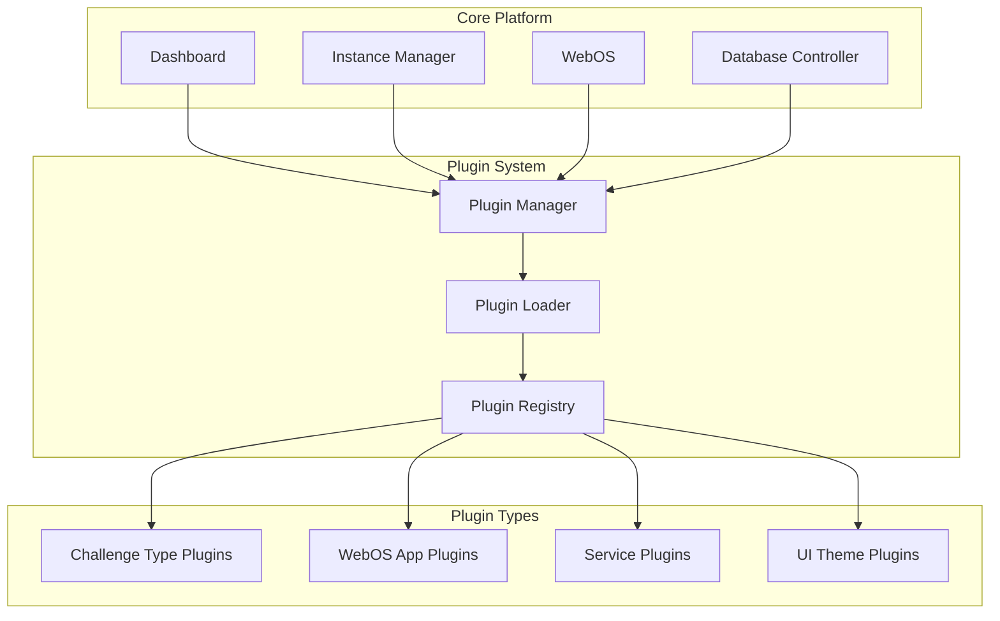

# EDURange Cloud Plugin System

> **Note**: The EDURange Cloud Plugin System is currently under development. Currently, only the Challenge Definition Format (CDF) and Challenge Type Definition (CTD) components have been implemented. The full plugin system with dynamic loading and extension capabilities is planned for future releases.

## Overview

The EDURange Cloud platform is designed with extensibility in mind. The plugin system allows users to extend and customize the platform's functionality without modifying the core components. This documentation outlines the current state of the plugin system, implemented components, and future development plans.

## Current Implementation Status

### Implemented Components

1. **Challenge Definition Format (CDF)**
   - Standardized JSON format for defining cybersecurity challenges
   - Support for containerized environments, questions, and WebOS configuration
   - Validation through JSON Schema
   - Implemented in the Instance Manager and Dashboard

2. **Challenge Type Definitions (CTDs)**
   - Framework for defining new challenge types
   - Extends the Instance Manager with specialized deployment patterns
   - Currently supports FullOS, Web, Metasploit, and SQL Injection challenge types
   - Implemented as Python classes in the Instance Manager

### In Development

The full plugin system is currently in development and will include:

1. **Dynamic Plugin Loading**
   - Runtime discovery and loading of plugins
   - Version compatibility checking
   - Dependency management

2. **WebOS Application Plugins**
   - Custom applications for the WebOS environment
   - UI components and integration points
   - Configuration schema for application behavior

3. **Service Plugins**
   - Backend services for extended functionality
   - API integration with existing components
   - Authentication and authorization hooks

## Plugin Architecture

The planned plugin architecture follows a modular design that allows for different types of extensions:



### Types of Plugins

1. **Challenge Type Plugins**
   - Define new types of cybersecurity challenges
   - Specify deployment patterns and resources
   - Define required and optional WebOS applications
   - Include evaluation and grading logic

2. **WebOS Application Plugins**
   - Add new applications to the WebOS interface
   - Provide specialized tools for specific tasks
   - Integrate with challenge environments
   - Extend the user interface for specific educational purposes

3. **Service Plugins**
   - Provide additional backend services
   - Implement new APIs for extended functionality
   - Add monitoring and logging capabilities
   - Integrate with external systems

4. **UI Theme Plugins**
   - Customize the appearance of the WebOS and Dashboard
   - Provide institutional branding options
   - Implement accessibility features
   - Create specialized themes for different contexts

## Current Capabilities

### Challenge Definition Format (CDF)

The Challenge Definition Format enables the definition of cybersecurity challenges in a standardized JSON format. A CDF file includes:

```json
{
  "metadata": {
    "name": "Web Security Basics",
    "description": "Learn the fundamentals of web security",
    "version": "1.0.0",
    "author": "EDURange Team",
    "difficulty": "Beginner",
    "estimated_time": "2 hours"
  },
  "components": [
    {
      "type": "container",
      "id": "web-server",
      "image": "edurange/web-security-basics:latest",
      "env": {
        "DIFFICULTY": "easy"
      }
    },
    {
      "type": "webosApp",
      "id": "browser",
      "config": {
        "title": "Web Browser",
        "icon": "./icons/browser.svg",
        "screen": "displayChrome",
        "favourite": true,
        "desktop_shortcut": true,
        "params": {
          "default_url": "{{webChallengeUrl}}"
        }
      }
    },
    {
      "type": "question",
      "id": "q1",
      "text": "What is the password found in the source code?",
      "points": 10,
      "answer": "supersecret123"
    }
  ]
}
```

### Challenge Type Definitions (CTDs)

Challenge Type Definitions extend the Instance Manager to support different types of challenges. Currently implemented challenge types include:

1. **FullOS Challenges**
   - Provide a command-line environment
   - Focus on Linux/Unix skills and system security
   - Include a virtual machine with shell access

2. **Web Challenges**
   - Focus on web security concepts
   - Provide vulnerable web applications
   - Include browser-based interaction

3. **Metasploit Challenges**
   - Include attack and defense scenarios
   - Provide penetration testing tools
   - Focus on exploitation techniques

4. **SQL Injection Challenges**
   - Focus on database security
   - Provide vulnerable database applications
   - Teach SQL injection techniques

## Currently Available Tools

### WebOS Applications

Although not yet implemented as fully modular plugins, the following applications are available in the WebOS:

1. **Terminal**
   - Provides command-line access to challenge environments
   - Integrates with the Remote Terminal component
   - Supports various terminal features (history, auto-completion, etc.)

2. **Browser**
   - Provides a web browser interface for web-based challenges
   - Supports navigation to challenge URLs
   - Includes developer tools for web security analysis

3. **Challenge Prompt**
   - Displays challenge instructions and questions
   - Provides submission forms for answers
   - Shows progress and points earned

4. **File Browser**
   - Allows browsing and managing files in the challenge environment
   - Supports file upload/download
   - Provides a graphical interface for file operations

## Future Development Roadmap

The plugin system development roadmap includes:

### Phase 1: Foundation (Current)
- Complete CDF implementation and tools
- Implement CTD framework in Instance Manager
- Document extension points for future plugins

### Phase 2: Plugin Infrastructure (Next)
- Develop plugin discovery and loading mechanism
- Create plugin manifest format
- Implement version compatibility checking
- Build plugin management UI in Dashboard

### Phase 3: WebOS App Plugins
- Create component registry for dynamic app loading
- Develop sandbox for WebOS applications
- Implement communication channels between apps
- Provide API documentation for app developers

### Phase 4: Service Plugins
- Design service plugin interface
- Implement service discovery mechanism
- Create service communication protocol
- Develop monitoring for service plugins

### Phase 5: Marketplace and Distribution
- Create plugin repository
- Implement plugin installation workflow
- Develop review and rating system
- Build community contribution guidelines

## Creating Custom CTDs (Current Approach)

While the full plugin system is in development, users can already extend the platform by creating custom Challenge Type Definitions (CTDs). Here's a simplified example:

```python
# instance-manager/challenges.py
from .base_challenge import BaseChallenge

class CustomChallenge(BaseChallenge):
    def __init__(self, name, **kwargs):
        super().__init__(name, **kwargs)
        self.challenge_type = "custom"

    def prepare_kube_resources(self):
        # Define Kubernetes resources for this challenge type
        resources = []

        # Add pod definition
        pod = {
            "apiVersion": "v1",
            "kind": "Pod",
            "metadata": {
                "name": f"{self.name}-pod"
            },
            "spec": {
                "containers": [
                    {
                        "name": "custom-container",
                        "image": "custom/image:latest",
                        "ports": [{"containerPort": 80}]
                    }
                ]
            }
        }
        resources.append(pod)

        # Add service definition
        service = {
            "apiVersion": "v1",
            "kind": "Service",
            "metadata": {
                "name": f"{self.name}-service"
            },
            "spec": {
                "selector": {
                    "app": f"{self.name}-pod"
                },
                "ports": [
                    {
                        "port": 80,
                        "targetPort": 80
                    }
                ]
            }
        }
        resources.append(service)

        return resources
```

## Conclusion

The EDURange Cloud Plugin System is a work in progress, with the foundational components (CDF and CTD) already implemented. The full plugin system will provide a comprehensive framework for extending the platform with new challenge types, WebOS applications, and services. This will enable educators and developers to create custom learning experiences tailored to their specific needs and objectives.

As development continues, this documentation will be updated to reflect the latest features and capabilities of the plugin system.

For updates on the plugin system development, please refer to the project's [GitHub repository](https://github.com/Rydersel/EDUrange_Cloud) or join the EDURange community discussions.
