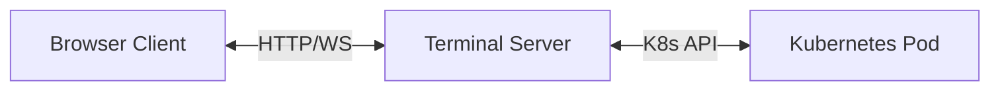
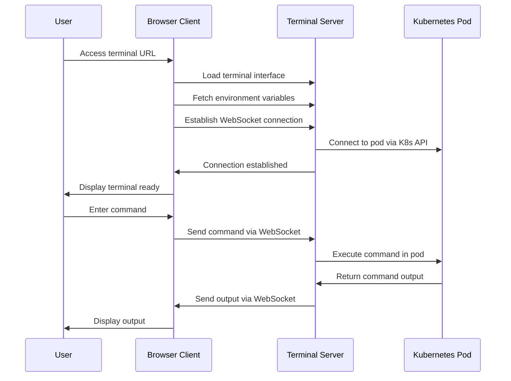

# EDURange Remote Terminal

## Overview

The EDURange Remote Terminal is a web-based terminal interface that provides secure access to Kubernetes pod containers. It enables users to interact with challenge environments through a browser-based terminal without requiring direct SSH access or installing additional software.

## Architecture

The remote terminal system consists of two main components:

1. **Backend Server**: A Node.js Express server that handles WebSocket connections and proxies terminal commands to Kubernetes pods
2. **Frontend Client**: A browser-based terminal interface built with xterm.js that provides a rich terminal experience

### System Flow



1. User accesses the terminal through a web browser
2. Browser establishes a WebSocket connection to the terminal server
3. Terminal server connects to the specified Kubernetes pod using the Kubernetes API
4. Commands and responses are proxied between the browser and the pod

## Backend Server

The backend server is built with Node.js and Express, handling the following responsibilities:

- Serving the static frontend assets
- Providing environment variables to the client
- Managing WebSocket connections for terminal sessions
- Proxying terminal commands to Kubernetes pods
- Handling reconnection and error scenarios

### Key Components

- **Express Server**: Handles HTTP requests and serves static assets
- **WebSocket Server**: Manages real-time bidirectional communication
- **Kubernetes Client**: Interfaces with the Kubernetes API to execute commands in pods

## Frontend Client

The frontend client is a browser-based terminal interface built with xterm.js, providing a rich terminal experience with features like:

- WebGL-accelerated rendering (with canvas fallback)
- Copy/paste functionality
- Font size controls
- Connection status indicators
- Command counting
- Terminal size display
- Automatic reconnection

### Key Components

#### Terminal Configuration

The terminal is configured with specific options for optimal user experience:

```javascript
const TERMINAL_OPTIONS = {
  cursorBlink: true,
  cursorStyle: 'block',
  fontSize: TERMINAL_CONFIG.FONT.DEFAULT_SIZE,
  fontFamily: TERMINAL_CONFIG.FONT.FAMILY,
  theme: DEFAULT_THEME,
  allowTransparency: true,
  scrollback: TERMINAL_CONFIG.SCROLLBACK,
  cols: TERMINAL_CONFIG.DIMENSIONS.DEFAULT_COLS,
  rows: TERMINAL_CONFIG.DIMENSIONS.DEFAULT_ROWS,
  allowProposedApi: true,
  convertEol: true,
  rightClickSelectsWord: true,
  drawBoldTextInBrightColors: true
};
```

#### Terminal Addons

The terminal utilizes several xterm.js addons to enhance functionality:

- **FitAddon**: Automatically resizes the terminal to fit its container
- **WebLinksAddon**: Makes URLs in the terminal clickable
- **SearchAddon**: Enables searching within terminal content (Ctrl+Shift+F)
- **Unicode11Addon**: Provides support for Unicode characters
- **SerializeAddon**: Enables serialization of terminal content
- **WebglAddon**: Accelerates rendering using WebGL (with canvas fallback)

#### Connection Management

The terminal implements robust connection management:

- **Initial Connection**: Establishes WebSocket connection to the server
- **Reconnection**: Automatically attempts to reconnect if connection is lost
- **Visibility Change**: Reconnects when tab becomes visible after being inactive
- **Status Indicators**: Provides visual feedback on connection status

## Connection Flow



1. **Initialization**:
   - Client loads and initializes the terminal interface
   - Terminal displays the EDURange logo and connecting message
   - Client fetches environment variables from the server

2. **Connection Establishment**:
   - Client establishes WebSocket connection to the server
   - Server connects to the specified Kubernetes pod
   - Terminal displays connection success message
   - Terminal clears and is ready for input

3. **Command Execution**:
   - User enters commands in the terminal
   - Commands are sent to the server via WebSocket
   - Server executes commands in the pod and returns output
   - Output is displayed in the terminal

4. **Disconnection Handling**:
   - If connection is lost, terminal displays disconnection message
   - Client attempts to reconnect automatically
   - Visual indicators show reconnection attempts
   - Upon successful reconnection, terminal is cleared and ready for use

## Error Handling

The system implements comprehensive error handling:

- **WebSocket Errors**: Displayed in the terminal with error details
- **Connection Failures**: Shown with specific error messages
- **Reconnection Limits**: After maximum attempts, user is prompted to refresh
- **WebGL Fallback**: Automatically falls back to canvas rendering if WebGL fails

## User Interface

### Status Bar

The status bar provides important information about the terminal session:

- **Connection Status**: Shows if the terminal is connected, connecting, or disconnected
- **Renderer Type**: Indicates whether WebGL or Canvas rendering is being used
- **Command Count**: Tracks the number of commands executed
- **Terminal Size**: Displays the current dimensions of the terminal (cols × rows)
- **Font Size Controls**: Buttons to increase or decrease font size

### Visual Feedback

The terminal provides visual feedback through:

- **Color-coded Messages**: Success (green), Error (red), Info (cyan)
- **Status Indicators**: Connected (green), Disconnected (red)
- **ASCII Art**: EDURange logo and connection status robot

## Security Considerations

- **WebSocket Security**: Connections use the same protocol as the page (WSS for HTTPS)
- **No Persistent Credentials**: The terminal doesn't store credentials
- **Kubernetes RBAC**: Access is controlled by Kubernetes role-based access control
- **Isolated Environments**: Each terminal session is isolated to a specific pod

## Browser Compatibility

The terminal is compatible with modern browsers that support:

- WebSockets
- Canvas/WebGL rendering
- ES6 JavaScript features

## Deployment

The terminal server is containerized for easy deployment in Kubernetes:

```
# Build and push the container
docker buildx build --platform linux/amd64 -t registry.example.com/terminal . --push
```

The container uses a multi-stage build process to minimize size and improve security.

## Development

### Prerequisites

- Node.js 20 or later
- npm or yarn

### Setup

```bash
# Install dependencies
npm install

# Run in development mode
npm run dev

# Build for production
npm run build
```

### Project Structure

```
remote-terminal/
├── frontend/           # Frontend JavaScript code
│   ├── main.js         # Main terminal implementation
│   └── themes.js       # Terminal themes
├── public/             # Static assets
│   ├── index.html      # Main HTML file
│   └── static/         # Compiled JavaScript
├── server/             # Backend server code
│   └── index.js        # Express server implementation
├── Dockerfile          # Container definition
├── package.json        # Project dependencies
└── webpack.config.js   # Build configuration
```

## Conclusion

The EDURange Remote Terminal provides a secure, feature-rich terminal experience in the browser, enabling users to interact with Kubernetes pods without requiring direct access. Its robust connection handling, visual feedback, and performance optimizations create a seamless experience for educational cybersecurity challenges.

## Integration with EDURange Cloud

The Remote Terminal is a critical component in the EDURange Cloud ecosystem, serving as the bridge between users and the challenge environments. This section provides a brief overview of how the Remote Terminal integrates with other key components of the platform.

### Challenge Pod Integration

The Remote Terminal is one of four containers in the Challenge Pod architecture:

1. **Challenge Container**: The actual environment where the challenge runs
2. **WebOS Container**: A Next.js web application that simulates an operating system interface
3. **Bridge Container**: Being phased out in favor of the Remote Terminal
4. **Terminal Container**: Hosts the Remote Terminal server

For detailed information about the Challenge Pod architecture and how these components interact, see the [Challenge Pod documentation](Challenge_Pod).

### Instance Manager Integration

The Instance Manager is responsible for creating and configuring the Remote Terminal container when deploying challenge pods. It:

- Injects Kubernetes API credentials via environment variables
- Configures the container to connect to the Challenge Container
- Sets up the necessary service account permissions

For detailed information about how the Instance Manager creates and manages challenge pods, including the Remote Terminal configuration, see the [Instance Manager documentation](Instance_Manager).

### WebOS Integration

The WebOS includes a Terminal application that embeds the Remote Terminal interface using an iframe. This provides users with a seamless terminal experience within the simulated operating system environment.

For detailed information about how the WebOS integrates with the Remote Terminal, see the [WebOS documentation](WebOS#terminal-application-integration).

### Security Boundaries

The architecture establishes several security boundaries:

1. **Network Isolation**: Challenge Containers are isolated from direct internet access
2. **Container Separation**: Each component runs in its own container with specific permissions
3. **RBAC Controls**: Kubernetes role-based access control limits what the Terminal Container can do
4. **Service Account Restrictions**: The Terminal Container uses a service account with minimal permissions

This multi-layered approach ensures that users can interact with challenges in a controlled environment while maintaining security isolation.
