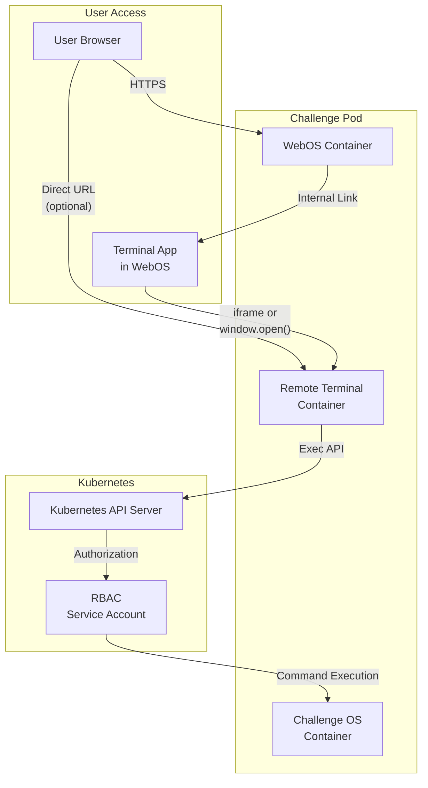
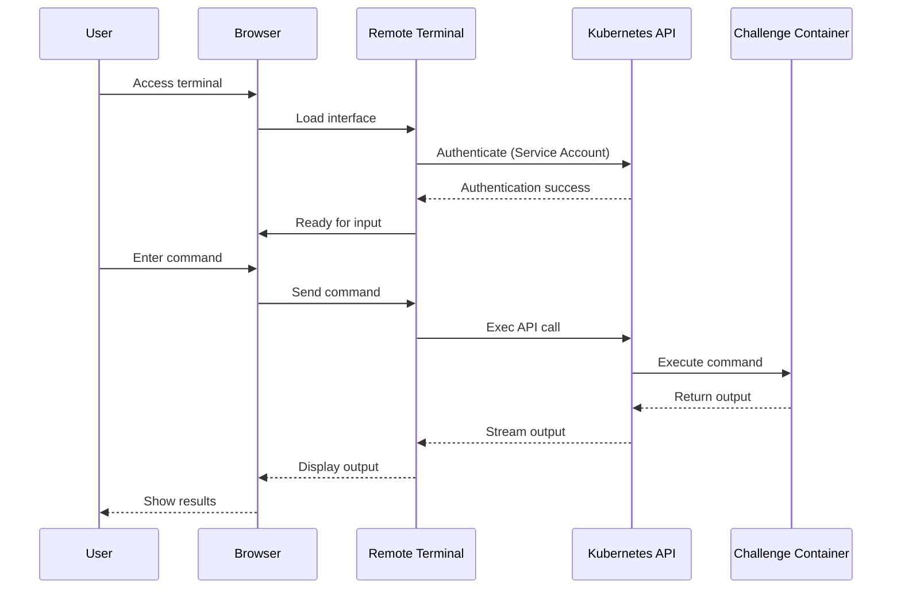
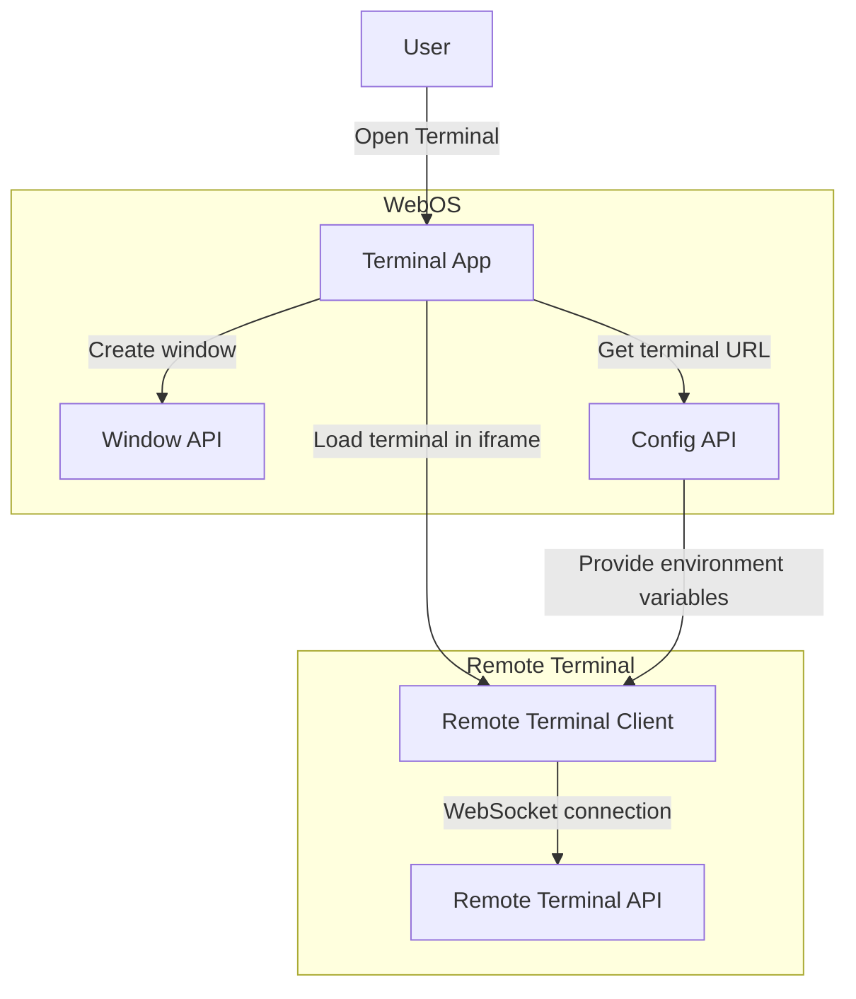

# EDURange Remote Terminal

## Overview

The EDURange Remote Terminal is a web-based terminal interface that provides secure access to Kubernetes pod containers. It enables users to interact with challenge environments through a browser-based terminal without requiring direct SSH access or installing additional software. The Remote Terminal is a key component in the EDURange Cloud platform, serving as the primary interface for command-line interaction with challenge environments.

## Integration with Challenge Pods

The Remote Terminal is tightly integrated with the [Challenge Pod](Challenge_Pod) architecture and the [Instance Manager](Instance_Manager) deployment system:



### Challenge Type Integration

Different challenge types integrate with the Remote Terminal in specific ways:

1. **FullOS Challenges**:
   - Primary interaction method is through the Remote Terminal
   - Terminal connects to the main challenge container
   - All commands are executed in the challenge environment
   - WebOS provides the Terminal app as the main interface

2. **Web Challenges**:
   - Terminal serves as a secondary interaction method
   - Primary interaction occurs through the Browser app
   - Terminal can access backend services or debugging tools
   - Often used for exploring server-side components

3. **Metasploit Challenges**:
   - Requires multiple terminal instances
   - Attack terminal connects to the attack container
   - Target terminal connects to the vulnerable target
   - WebOS manages terminal windows for both environments

### Deployment Flow

When a challenge is deployed, the Instance Manager:

1. Creates the Challenge Pod with appropriate containers
2. Sets up a service account with specific RBAC permissions
3. Configures the Remote Terminal container with target information
4. Provides URLs to the Dashboard for user access
5. Establishes connectivity between WebOS and Remote Terminal

## Architecture

The remote terminal system consists of two main components:

1. **Backend Server**: A Node.js Express server that integrates with the Kubernetes API to execute commands in pod containers
2. **Frontend Client**: A browser-based terminal interface built with xterm.js that provides a rich terminal experience

### System Flow



## Kubernetes Integration

The Remote Terminal uses the Kubernetes API for direct container access:

### Authorization Model

1. **Service Account**: Each challenge pod is assigned a dedicated service account
2. **RBAC Rules**: Role-based access control limits permissions to specific pods
3. **Authorization Flow**:
   - Remote Terminal authenticates using the service account token
   - Kubernetes validates token and applies RBAC policies
   - Only permitted operations on specific pods are allowed

### API Interaction

The terminal uses the Kubernetes Exec API:

```javascript
const exec = new k8s.Exec(kc);
const execOptions = {
  command: ['/bin/sh', '-c', command],
  container: targetContainer,
  stderr: true,
  stdout: true,
  stdin: true,
};

const stream = await exec.exec(
  targetNamespace,
  targetPod,
  targetContainer,
  execOptions
);
```

Key features of this approach:
- Streams data bidirectionally (stdin/stdout/stderr)
- Handles window resize events for proper terminal sizing
- Manages connection lifecycle with proper cleanup
- Works with any container that has a shell available

## Backend Server

The backend server is built with Node.js and Express, handling the following responsibilities:

- Serving the static frontend assets
- Providing environment variables to the client
- Managing terminal sessions via WebSockets
- Proxying terminal commands to Kubernetes pods through the Exec API
- Sanitizing and validating all user input
- Applying rate limiting and security headers
- Tracking suspicious activity for security monitoring
- Handling reconnection and error scenarios

### Key Components

- **Express Server**: Handles HTTP requests and serves static assets
- **WebSocket Server**: Provides bidirectional real-time communication
- **Security Module**: Provides input sanitization, validation, rate limiting, and security headers
- **Kubernetes Client**: Interfaces with the Kubernetes API to execute commands in pods
- **Session Manager**: Tracks and manages active terminal sessions
- **Metrics Collector**: Gathers performance and usage metrics

### Security Features

The terminal server includes comprehensive security features:

1. **Input Sanitization**:
   - Filters dangerous escape sequences that could be used for terminal attacks
   - Prevents terminal manipulation, command execution, and UI deception attacks
   - Preserves safe terminal sequences while removing potentially harmful ones

2. **Rate Limiting**:
   - General rate limiting for all endpoints (100 requests per minute)
   - Stricter rate limiting for terminal creation (5 requests per minute)
   - Adaptive rate limiting for terminal input (120 requests per minute)
   - Configurable blocking durations for exceeded limits

3. **Input Validation**:
   - Validates pod and container names with strict regex patterns
   - Ensures terminal resize parameters are within safe ranges
   - Validates input data length and type
   - Prevents injection attacks through parameter validation

4. **Security Headers**:
   - Implements robust HTTP security headers:
     - X-Frame-Options to prevent clickjacking attacks
     - X-XSS-Protection to enable browser XSS filtering
     - X-Content-Type-Options to prevent MIME type sniffing
     - Content-Security-Policy with strict rules for resource loading
     - Cache-Control headers to prevent caching of sensitive data
     - HTTP Strict Transport Security for HTTPS enforcement
     - Referrer-Policy to enhance privacy
     - Permissions-Policy to restrict browser feature access

5. **Kubernetes RBAC**:
   - Each terminal instance uses a service account with limited permissions
   - RBAC policies restrict access to specific pods and containers
   - No access to host system or other challenge pods
   - Separate permissions for different challenge types

6. **Security Tracking**:
   - Monitors suspicious activities by client identifier
   - Implements configurable thresholds for warnings and blocking
   - Records details of potential attack attempts
   - Provides methods to query security records for auditing

## Frontend Client

The frontend client is a browser-based terminal interface built with xterm.js, providing a rich terminal experience with features like:

- WebGL-accelerated rendering (with canvas fallback)
- Copy/paste functionality
- Font size controls
- Connection status indicators
- Command counting
- Terminal size display
- Automatic reconnection
- WebSocket-based communication with fallback mechanisms

### Key Components

#### Terminal Configuration

The terminal is configured with specific options for optimal user experience:

```javascript
const TERMINAL_OPTIONS = {
  cursorBlink: true,
  cursorStyle: 'block',
  fontSize: TERMINAL_CONFIG.FONT.DEFAULT_SIZE,
  fontFamily: TERMINAL_CONFIG.FONT.FAMILY,
  theme: DEFAULT_THEME,
  allowTransparency: true,
  scrollback: TERMINAL_CONFIG.SCROLLBACK,
  cols: TERMINAL_CONFIG.DIMENSIONS.DEFAULT_COLS,
  rows: TERMINAL_CONFIG.DIMENSIONS.DEFAULT_ROWS,
  allowProposedApi: true,
  convertEol: true,
  rightClickSelectsWord: true,
  drawBoldTextInBrightColors: true
};
```

#### Terminal Addons

The terminal utilizes several xterm.js addons to enhance functionality:

- **FitAddon**: Automatically resizes the terminal to fit its container
- **WebLinksAddon**: Makes URLs in the terminal clickable
- **SearchAddon**: Enables searching within terminal content (Ctrl+Shift+F)
- **Unicode11Addon**: Provides support for Unicode characters
- **SerializeAddon**: Enables serialization of terminal content
- **WebglAddon**: Accelerates rendering using WebGL (with canvas fallback)
- **AttachAddon**: Connects to WebSocket for bidirectional communication

#### Connection Management

The terminal implements robust connection management:

- **Initial Connection**: Creates a terminal session via WebSocket
- **Bidirectional Communication**: Uses WebSockets for real-time input/output
- **Reconnection**: Automatically attempts to reconnect if the WebSocket connection is lost
- **Visibility Change**: Reconnects when tab becomes visible after being inactive
- **Status Indicators**: Provides visual feedback on connection status
- **HTTP Fallback**: Automatically falls back to HTTP communication if WebSockets are unavailable

## WebOS Integration

The Remote Terminal is integrated with the WebOS environment through the Terminal app:



The integration flow works as follows:

1. User opens the Terminal app in WebOS
2. Terminal app fetches configuration from the WebOS Config API
3. Terminal app creates a window using the Window API
4. Terminal app loads the Remote Terminal client in an iframe
5. Remote Terminal client connects to the Remote Terminal API
6. Remote Terminal API connects to the Kubernetes API
7. User can interact with the challenge environment through the terminal

### Environment Variables

The WebOS passes essential environment variables to the Remote Terminal:

```
NEXT_PUBLIC_POD_NAME=fullOS-123abc
NEXT_PUBLIC_CONTAINER_NAME=challenge
NEXT_PUBLIC_NAMESPACE=challenges
NEXT_PUBLIC_SERVICE_ACCOUNT=terminal-sa-123abc
```

These variables are used to establish the correct connection to the target container.

## User Interface

### Status Bar

The status bar provides important information about the terminal session:

- **Connection Status**: Shows if the terminal is connected, connecting, or disconnected
- **Renderer Type**: Indicates whether WebGL or Canvas rendering is being used
- **Command Count**: Tracks the number of commands executed
- **Terminal Size**: Displays the current dimensions of the terminal (cols × rows)
- **Font Size Controls**: Buttons to increase or decrease font size

### Visual Feedback

The terminal provides visual feedback through:

- **Color-coded Messages**: Success (green), Error (red), Info (cyan)
- **Status Indicators**: Connected (green), Disconnected (red)
- **Connection Messages**: Appears briefly after connection and automatically clears

## Metrics and Monitoring

The Remote Terminal includes a monitoring system that tracks:

- Active terminal sessions
- Command frequency and types
- Connection success/failure rates
- Resource usage (memory, CPU)
- Error rates and types
- Security events

These metrics are exposed via a `/metrics` endpoint for integration with Prometheus and the EDURange [Monitoring Service](Monitoring_Service).

## Customization by Challenge Type

Different challenge types can customize the Remote Terminal experience:

### FullOS Challenges

```json
{
  "type": "webosApp",
  "id": "terminal",
  "config": {
    "title": "Terminal",
    "icon": "./icons/terminal.svg",
    "width": 800,
    "height": 600,
    "screen": "terminal",
    "favourite": true,
    "desktop_shortcut": true,
    "launch_on_startup": true,
    "params": {
      "welcome_message": "Welcome to the Linux challenge environment!",
      "initial_command": "ls -la",
      "prompt_color": "green"
    }
  }
}
```

### Metasploit Challenges

```json
{
  "type": "webosApp",
  "id": "attack-terminal",
  "config": {
    "title": "Attack Terminal",
    "icon": "./icons/terminal-red.svg",
    "width": 800,
    "height": 600,
    "screen": "terminal",
    "favourite": true,
    "desktop_shortcut": true,
    "params": {
      "target_container": "attack",
      "welcome_message": "Metasploit Framework - Kali Linux",
      "theme": "dark-red"
    }
  }
}
```

## Security Considerations

- **HTTP Security**: All communications use HTTPS in production
- **Input Sanitization**: Dangerous escape sequences are filtered out
- **Input Validation**: All parameters are strictly validated
- **Rate Limiting**: Prevents abuse through configurable rate limits
- **No Persistent Credentials**: The terminal doesn't store credentials
- **Kubernetes RBAC**: Access is controlled by Kubernetes role-based access control
- **Isolated Environments**: Each terminal session is isolated to a specific pod
- **Security Headers**: Comprehensive HTTP security headers prevent common web vulnerabilities
- **Suspicious Activity Monitoring**: Tracks and logs potential security threats

## Browser Compatibility

The terminal is compatible with modern browsers that support:

- WebSockets (with HTTP fallback)
- Canvas/WebGL rendering
- ES6 JavaScript features
- iframe integration

For more information on the challenge environment that the Remote Terminal connects to, see the [Challenge Pod](Challenge_Pod) documentation.

## Development

### Prerequisites

- Node.js 20 or later
- npm or yarn

### Setup

```bash
# Install dependencies
npm install

# Run in development mode
npm run dev

# Build for production
npm run build
```

### Project Structure

```
remote-terminal/
├── frontend/             # Frontend JavaScript code
│   └── main.js           # Main terminal implementation
├── public/               # Static assets
│   ├── index.html        # Main HTML file
│   └── static/           # Compiled JavaScript
├── server/               # Backend server code
│   ├── index.js          # Express server implementation
│   └── security/         # Security modules
│       ├── index.js      # Unified security interface
│       ├── inputSanitizer.js  # Escape sequence filtering
│       ├── inputValidator.js  # Input validation
│       ├── rateLimiter.js     # Rate limiting
│       ├── securityHeaders.js # HTTP security headers
│       ├── securityTracker.js # Suspicious activity monitoring
│       ├── test-sanitizer.js  # Security testing utilities
│       └── README.md          # Security documentation
├── Dockerfile            # Container definition
├── package.json          # Project dependencies
└── webpack.config.js     # Build configuration
```

## Conclusion

The EDURange Remote Terminal provides a secure, feature-rich terminal experience in the browser, enabling users to interact with Kubernetes pods without requiring direct access. Its robust security features, including input sanitization, validation, rate limiting, and suspicious activity monitoring, protect against common attack vectors while maintaining a seamless experience for educational cybersecurity challenges.

## Integration with EDURange Cloud

The Remote Terminal is a critical component in the EDURange Cloud ecosystem, serving as the bridge between users and the challenge environments. This section provides a brief overview of how the Remote Terminal integrates with other key components of the platform.

### Challenge Pod Integration

The Remote Terminal is one of three containers in the Challenge Pod architecture:

1. **Challenge Container**: The actual environment where the challenge runs
2. **WebOS Container**: A Next.js web application that simulates an operating system interface
3. **Terminal Container**: Hosts the Remote Terminal server

For detailed information about the Challenge Pod architecture and how these components interact, see the [Challenge Pod documentation](Challenge-Pod).

### Instance Manager Integration

The Instance Manager is responsible for creating and configuring the Remote Terminal container when deploying challenge pods. It:

- Injects Kubernetes API credentials via environment variables
- Configures the container to connect to the Challenge Container
- Sets up the necessary service account permissions
- Creates the terminal-account service account with appropriate RBAC permissions
- Provisions the terminal-account-token Secret for secure API access

For detailed information about how the Instance Manager creates and manages challenge pods, including the Remote Terminal configuration, see the [Instance Manager documentation](Instance-Manager#remote-terminal-integration).

### WebOS Integration

The WebOS includes a Terminal application that embeds the Remote Terminal interface using an iframe. This provides users with a seamless terminal experience within the simulated operating system environment.

For detailed information about how the WebOS integrates with the Remote Terminal, see the [WebOS documentation](WebOS#terminal-application-integration).

### Security Boundaries

The architecture establishes several security boundaries:

1. **Network Isolation**: Challenge Containers are isolated from direct internet access
2. **Container Separation**: Each component runs in its own container with specific permissions
3. **RBAC Controls**: Kubernetes role-based access control limits what the Terminal Container can do
4. **Service Account Restrictions**: The Terminal Container uses a service account with minimal permissions
5. **Input Sanitization**: All terminal inputs are sanitized to prevent escape sequence attacks
6. **Rate Limiting**: Prevents abuse through configurable request limits
7. **Input Validation**: Validates all parameters to prevent injection attacks
8. **Security Headers**: Comprehensive HTTP security headers prevent common web vulnerabilities

This multi-layered approach ensures that users can interact with challenges in a controlled environment while maintaining security isolation.
