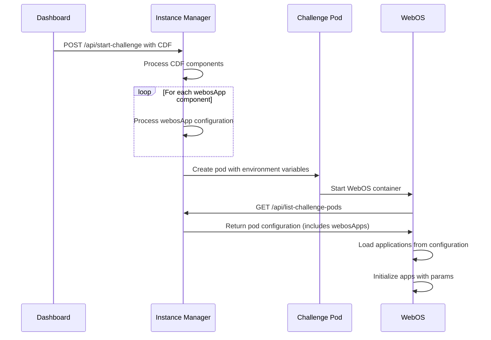

# WebOS Applications and Configuration

This document provides detailed information about WebOS applications, their configuration through the Challenge Definition Format (CDF), and challenge type-specific setups.

## Integration with Challenge Definition Format (CDF)

WebOS integrates with the Challenge Definition Format (CDF) to provide application configuration:



### WebOS App Components in CDF

WebOS applications are defined as `webosApp` components in the CDF:

```json
{
  "type": "webosApp",
  "id": "terminal",
  "config": {
    "title": "Terminal",
    "icon": "./icons/terminal.svg",
    "width": 800,
    "height": 600,
    "screen": "terminal",
    "favourite": true,
    "desktop_shortcut": true,
    "launch_on_startup": true,
    "params": {
      "welcome_message": "Welcome to EDURange!",
      "target_container": "challenge",
      "theme": "dark"
    }
  }
}
```

Each component starts with its type and a unique identifier.

The configuration section contains key properties for the application:
- `title`: The display name shown in the window title bar
- `icon`: Path to the application's icon image
- `width` and `height`: Default window dimensions
- `screen`: The component identifier to render (maps to a React component)

Behavior-related properties control how the app appears within WebOS:
- Whether the app appears in the favorites dock
- Whether a desktop shortcut is created
- Whether the app launches automatically on WebOS startup

The optional params object provides application-specific configuration, such as:
- Custom messages
- Target containers for terminals
- Theme preferences
- Default URLs for browsers
- Any other app-specific settings

### Loading Applications from Configuration

WebOS loads applications based on the configuration provided by the Instance Manager:

```javascript
// utils/useWebOSApps.js
import { useState, useEffect } from 'react';
import { useWebOSConfig } from '@/utils/useWebOSConfig';

export function useWebOSApps() {
  const { apps, isLoading, error } = useWebOSConfig();
  const [loadedApps, setLoadedApps] = useState([]);

  useEffect(() => {
    if (!isLoading && !error && apps) {
      // Process app configurations
      const processedApps = apps.map(app => ({
        id: app.id,
        title: app.config.title,
        icon: app.config.icon,
        width: app.config.width || 800,
        height: app.config.height || 600,
        component: app.config.screen,
        isFavourite: app.config.favourite || false,
        desktopShortcut: app.config.desktop_shortcut || false,
        launchOnStartup: app.config.launch_on_startup || false,
        params: app.config.params || {}
      }));

      setLoadedApps(processedApps);
    }
  }, [apps, isLoading, error]);

  return {
    apps: loadedApps,
    isLoading,
    error
  };
}
```

This hook is used throughout WebOS to access application configurations:
- The Desktop component uses it to create shortcuts
- The Dock component uses it to display favorite apps
- The AppManager uses it to launch applications with the correct parameters

## Challenge Type-Specific Apps

Different challenge types require different WebOS applications to provide the appropriate environment for learning. Each challenge type has a distinct set of applications optimized for its specific educational goals.

### FullOS Challenges

FullOS challenges focus on command-line interaction and are designed to teach Linux commands, system configuration, and security concepts:

```json
[
  {
    "type": "webosApp",
    "id": "terminal",
    "config": {
      "title": "Terminal",
      "icon": "./icons/terminal.svg",
      "screen": "terminal",
      "favourite": true,
      "desktop_shortcut": true,
      "launch_on_startup": true
    }
  },
  {
    "type": "webosApp",
    "id": "challenge-prompt",
    "config": {
      "title": "Challenge Instructions",
      "icon": "./icons/document.svg",
      "screen": "displayChallengePrompt",
      "favourite": true,
      "desktop_shortcut": true
    }
  }
]
```

The Terminal app is the primary interface for FullOS challenges:
- It provides command-line access to the challenge container
- It's configured to launch automatically on startup
- It appears in the favorites dock for quick access

The Challenge Prompt app:
- Displays the challenge instructions and objectives
- Provides a way to submit answers for verification
- Tracks progress through multi-stage challenges

### Web Challenges

Web challenges focus on web application security, teaching concepts like XSS, CSRF, SQL injection, and other web vulnerabilities:

```json
[
  {
    "type": "webosApp",
    "id": "browser",
    "config": {
      "title": "Browser",
      "icon": "./icons/globe.svg",
      "screen": "displayChrome",
      "favourite": true,
      "desktop_shortcut": true,
      "launch_on_startup": true,
      "params": {
        "default_url": "{{webChallengeUrl}}"
      }
    }
  },
  {
    "type": "webosApp",
    "id": "challenge-prompt",
    "config": {
      "title": "Challenge Instructions",
      "icon": "./icons/document.svg",
      "screen": "displayChallengePrompt",
      "favourite": true,
      "desktop_shortcut": true
    }
  }
]
```

The Browser app is the primary interface for Web challenges:
- It provides a sandboxed browser environment for interacting with vulnerable web applications
- It loads the challenge URL automatically on startup
- The `{{webChallengeUrl}}` template variable is dynamically replaced with the actual challenge URL

This configuration enables students to:
- View instructions and objectives in one window
- Interact with the vulnerable web application in another window
- Submit answers as they discover vulnerabilities

### SQL Injection Challenges

SQL Injection challenges focus specifically on database security, teaching SQL syntax and database exploitation techniques:

```json
[
  {
    "type": "webosApp",
    "id": "browser",
    "config": {
      "title": "SQL App",
      "icon": "./icons/database.svg",
      "screen": "displayChrome",
      "favourite": true,
      "desktop_shortcut": true,
      "launch_on_startup": true,
      "params": {
        "default_url": "{{sqlAppUrl}}"
      }
    }
  },
  {
    "type": "webosApp",
    "id": "challenge-prompt",
    "config": {
      "title": "Challenge Instructions",
      "icon": "./icons/document.svg",
      "screen": "displayChallengePrompt",
      "favourite": true,
      "desktop_shortcut": true
    }
  }
]
```

The Browser app is the primary interface for SQL Injection challenges:
- Loads a specialized web interface for interacting with vulnerable databases
- Uses a database icon for visual identification
- Opens automatically to the SQL application URL
- Provides a sandbox for trying different SQL injection techniques

This configuration enables students to:
- View step-by-step instructions for the SQL injection challenge
- Interact with web forms, search boxes, and login fields that are vulnerable to SQL injection
- Test different injection techniques through the web interface
- Submit answers as they successfully exploit vulnerabilities

Some advanced SQL challenges may also include a code editor app for crafting complex SQL queries or analyzing application code that interacts with the database.

## Core Application Types

### Terminal Application

The Terminal application provides command-line access to challenge containers:

```javascript
// components/apps/terminal.js
import { useState, useEffect } from 'react';
import { useWebOSConfig } from '@/utils/useWebOSConfig';

export default function Terminal({ params = {} }) {
  const { urls, isLoading, error } = useWebOSConfig();
  const [terminalUrl, setTerminalUrl] = useState('');

  useEffect(() => {
    if (!isLoading && !error && urls) {
      setTerminalUrl(urls.terminal || '');
    }
  }, [urls, isLoading, error]);

  if (isLoading) return <div>Loading terminal...</div>;
  if (error) return <div>Error loading terminal: {error}</div>;
  if (!terminalUrl) return <div>Terminal URL not available</div>;

  return (
    <iframe
      src={terminalUrl}
      className="w-full h-full border-0 bg-black"
      title="Terminal"
    />
  );
}
```

### Browser Application

The Browser application provides web browsing capabilities within the WebOS:

```javascript
// components/apps/browser.js
import { useState, useEffect } from 'react';

export default function Browser({ params = {} }) {
  const [url, setUrl] = useState(params.default_url || 'about:blank');
  const [loading, setLoading] = useState(false);

  const handleNavigate = (e) => {
    e.preventDefault();
    const newUrl = e.target.url.value;
    if (newUrl) {
      setLoading(true);
      setUrl(newUrl);
    }
  };

  return (
    <div className="flex flex-col h-full">
      <div className="flex items-center p-2 border-b border-gray-200">
        <form onSubmit={handleNavigate} className="flex-1 flex">
          <input
            name="url"
            type="text"
            className="flex-1 px-2 py-1 border rounded-l"
            defaultValue={url}
          />
          <button
            type="submit"
            className="px-3 py-1 bg-blue-500 text-white rounded-r"
          >
            Go
          </button>
        </form>
      </div>

      <div className="flex-1 relative">
        {loading && (
          <div className="absolute inset-0 flex items-center justify-center bg-white bg-opacity-75 z-10">
            Loading...
          </div>
        )}
        <iframe
          src={url}
          className="w-full h-full border-0"
          title="Browser"
          onLoad={() => setLoading(false)}
        />
      </div>
    </div>
  );
}
```

### Challenge Prompt Application

The Challenge Prompt application displays challenge instructions and handles answer submissions:

```javascript
// components/apps/challenge-prompt.js
import { useState, useEffect } from 'react';
import { useWebOSConfig } from '@/utils/useWebOSConfig';

export default function ChallengePrompt() {
  const { challenge, isLoading, error } = useWebOSConfig();
  const [questions, setQuestions] = useState([]);
  const [answers, setAnswers] = useState({});
  const [feedback, setFeedback] = useState({});

  useEffect(() => {
    if (!isLoading && !error && challenge) {
      setQuestions(challenge.questions || []);
    }
  }, [challenge, isLoading, error]);

  const handleAnswerChange = (questionId, value) => {
    setAnswers(prev => ({
      ...prev,
      [questionId]: value
    }));
  };

  const handleSubmit = async (questionId) => {
    try {
      const response = await fetch('/api/verify-answer', {
        method: 'POST',
        headers: {
          'Content-Type': 'application/json'
        },
        body: JSON.stringify({
          questionId,
          answer: answers[questionId],
          instanceId: challenge.instanceId
        })
      });

      const result = await response.json();

      setFeedback(prev => ({
        ...prev,
        [questionId]: {
          correct: result.correct,
          message: result.message
        }
      }));
    } catch (error) {
      console.error('Error submitting answer:', error);
      setFeedback(prev => ({
        ...prev,
        [questionId]: {
          correct: false,
          message: 'Error submitting answer'
        }
      }));
    }
  };

  if (isLoading) return <div>Loading challenge...</div>;
  if (error) return <div>Error loading challenge: {error}</div>;

  return (
    <div className="p-4 overflow-auto h-full">
      <h2 className="text-xl font-bold mb-4">Challenge Instructions</h2>

      <div className="prose max-w-none mb-6">
        {challenge.description && (
          <div dangerouslySetInnerHTML={{ __html: challenge.description }} />
        )}
      </div>

      {questions.map(question => (
        <div key={question.id} className="mb-6 p-4 border rounded-lg bg-gray-50">
          <h3 className="text-lg font-semibold mb-2">{question.text}</h3>

          {question.hint && (
            <div className="text-sm text-gray-600 mb-2">
              <strong>Hint:</strong> {question.hint}
            </div>
          )}

          <div className="mb-2">
            <input
              type="text"
              className="w-full px-3 py-2 border rounded"
              value={answers[question.id] || ''}
              onChange={e => handleAnswerChange(question.id, e.target.value)}
              placeholder="Your answer"
            />
          </div>

          <button
            className="px-4 py-2 bg-blue-500 text-white rounded hover:bg-blue-600"
            onClick={() => handleSubmit(question.id)}
          >
            Submit
          </button>

          {feedback[question.id] && (
            <div className={`mt-2 p-2 rounded ${feedback[question.id].correct ? 'bg-green-100 text-green-800' : 'bg-red-100 text-red-800'}`}>
              {feedback[question.id].message}
            </div>
          )}
        </div>
      ))}
    </div>
  );
}
```

## Future Development

The WebOS application framework is designed for extensibility. Future development will include:

1. **Dynamic Plugin Loading**: Applications will be loadable as plugins without requiring WebOS redeployment
2. **Enhanced Inter-App Communication**: A message bus for secure communication between applications
3. **Advanced Theming Support**: Customizable themes for applications and the WebOS interface
4. **Accessibility Improvements**: Enhanced keyboard navigation and screen reader support
5. **Mobile Support**: Responsive design for tablet and mobile devices

These improvements will further enhance the flexibility and usability of the WebOS platform for cybersecurity education.
