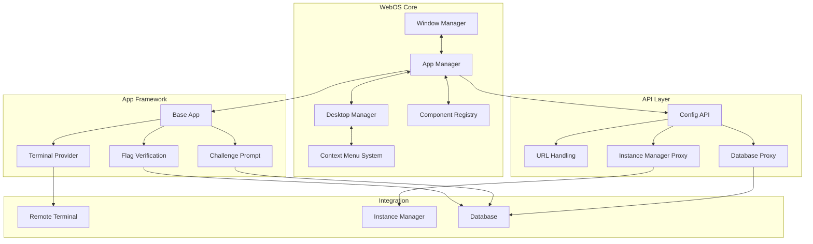
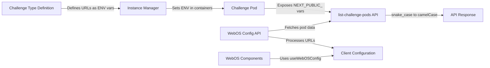
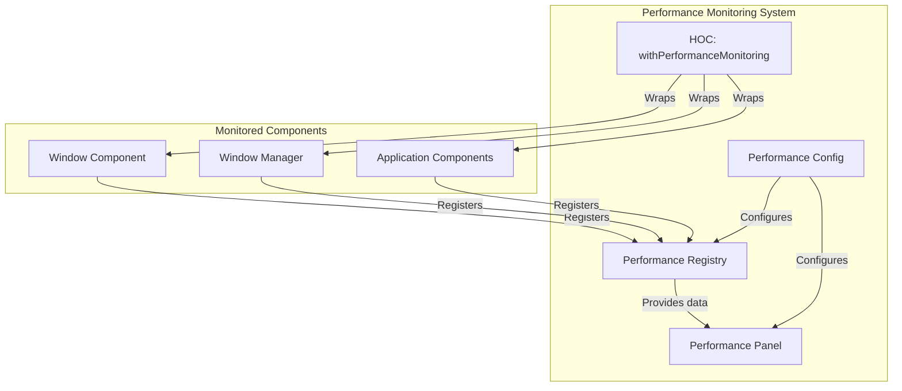
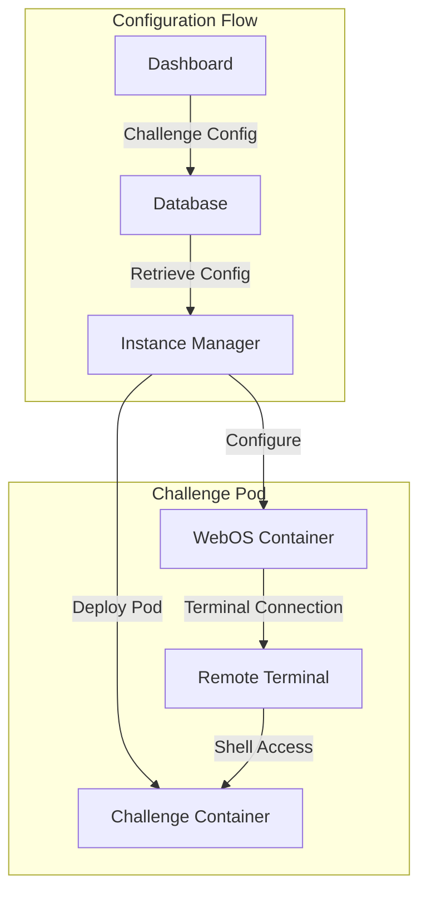

# WebOS Architecture and Components

This document provides detailed information about the architecture and core components of the EDURange WebOS system.

## Architecture Overview

WebOS follows a component-based architecture with several key systems:



### Core Components

1. **Window Manager**: Controls window creation, positioning, focus, and lifecycle
2. **App Manager**: Manages application instances, startup, and configuration
3. **Desktop Manager**: Handles desktop layout, shortcuts, and wallpaper
4. **Context Menu System**: Provides right-click menus throughout the interface
5. **Component Registry**: Maps application identifiers to React components

### API Layer

1. **Config API**: Provides consolidated configuration data to client components
2. **URL Handling**: Manages challenge-specific URLs with multiple fallback mechanisms
3. **Database Proxy**: Securely proxies requests to the Database Controller
4. **Instance Manager Proxy**: Securely proxies requests to the Instance Manager

### App Framework

1. **Base App**: Provides standard functionality for all WebOS applications
2. **Terminal Provider**: Connects to the Remote Terminal for command-line access
3. **Flag Verification**: Handles secure answer submission with rate limiting
4. **Challenge Prompt**: Displays challenge questions and accepts answers

## URL Handling System

The WebOS implements an advanced URL handling system that automatically detects and makes available all challenge-specific URLs:



### Environment Variable Convention

URLs in challenge containers follow a standardized naming convention:
- Prefix: `NEXT_PUBLIC_`
- Suffix: `_URL`
- Format: Snake case (`NEXT_PUBLIC_WEB_CHALLENGE_URL`)
- API Response: Camel case (`webChallengeUrl`)

### URL Access in Components

Components can access all challenge URLs through the `useWebOSConfig` hook:

```javascript
import { useWebOSConfig } from '@/utils/useWebOSConfig';

function MyComponent() {
  const { urls, isLoading, error } = useWebOSConfig();

  if (isLoading) return <p>Loading configuration...</p>;
  if (error) return <p>Error loading configuration: {error}</p>;

  return (
    <div>
      <p>Terminal URL: {urls.terminal}</p>
      <p>Web Challenge URL: {urls.webChallengeUrl}</p>
      {/* Any URL from NEXT_PUBLIC_*_URL will be available here */}
    </div>
  );
}
```

## Performance Monitoring System

WebOS includes a comprehensive performance monitoring system for development environments:



### Key Features

- **Non-invasive Monitoring**: Components are monitored without modifying their code
- **Advanced Metrics**: Tracks render counts, component lifetimes, props changes, and performance metrics
- **Visual Dashboard**: Interactive panel toggled with Alt+P
- **Zero Production Impact**: Only enabled in development mode

### Implementation

The performance monitoring system uses a Higher-Order Component (HOC) approach to wrap and monitor components:

```javascript
// Example of monitoring a component
import { withPerformanceMonitoring } from '@/utils/performance-monitor';

const MyComponent = (props) => {
  // Component implementation
};

// Export the monitored version only in development
export default process.env.NODE_ENV === 'development'
  ? withPerformanceMonitoring(MyComponent, 'MyComponent')
  : MyComponent;
```

## UI Components

### Window Controls

Modern macOS-style window controls with improved hover effects and visual consistency:

```javascript
// components/base/WindowControls.js
export default function WindowControls({ onClose, onMinimize, onMaximize }) {
  return (
    <div className="flex items-center space-x-1.5 ml-1.5">
      {/* Close button */}
      <button
        onClick={onClose}
        className="w-3 h-3 bg-red-500 rounded-full flex items-center justify-center group hover:bg-red-600 transition-colors"
        aria-label="Close"
      >
        <svg className="w-2 h-2 opacity-0 group-hover:opacity-100 transition-opacity" viewBox="0 0 24 24">
          <path d="M18 6L6 18M6 6l12 12" stroke="white" strokeWidth="2" strokeLinecap="round" />
        </svg>
      </button>

      {/* Minimize button */}
      <button
        onClick={onMinimize}
        className="w-3 h-3 bg-yellow-500 rounded-full flex items-center justify-center group hover:bg-yellow-600 transition-colors"
        aria-label="Minimize"
      >
        <svg className="w-2 h-2 opacity-0 group-hover:opacity-100 transition-opacity" viewBox="0 0 24 24">
          <path d="M5 12h14" stroke="white" strokeWidth="2" strokeLinecap="round" />
        </svg>
      </button>

      {/* Maximize button */}
      <button
        onClick={onMaximize}
        className="w-3 h-3 bg-green-500 rounded-full flex items-center justify-center group hover:bg-green-600 transition-colors"
        aria-label="Maximize"
      >
        <svg className="w-2 h-2 opacity-0 group-hover:opacity-100 transition-opacity" viewBox="0 0 24 24">
          <path d="M8 16H6a2 2 0 01-2-2V6a2 2 0 012-2h10a2 2 0 012 2v2m-2 4h2a2 2 0 012 2v8a2 2 0 01-2 2H8a2 2 0 01-2-2v-2" stroke="white" strokeWidth="2" strokeLinecap="round" />
        </svg>
      </button>
    </div>
  );
}
```

### Window Title Bar

Modernized with semi-transparent dark gray background and backdrop blur:

```javascript
// components/base/WindowTitleBar.js
export default function WindowTitleBar({ title, icon, controls, onDragStart }) {
  return (
    <div
      className="flex items-center h-8 px-2 bg-gray-800/90 backdrop-blur-md border-b border-gray-700/50 rounded-t-lg"
      onMouseDown={onDragStart}
    >
      {controls}

      {icon && (
        <div className="mr-2">
          
        </div>
      )}

      <div className="flex-1 text-sm font-medium text-white truncate">
        {title}
      </div>

      <div className="flex items-center space-x-1">
        {/* Additional window actions can go here */}
      </div>
    </div>
  );
}
```

### Context Menu

Completely redesigned with modern styling and animations:

```javascript
// components/context-menus/ContextMenu.js
import { useEffect, useRef } from 'react';
import { createPortal } from 'react-dom';
import { motion } from 'framer-motion';

export default function ContextMenu({ x, y, items, onClose }) {
  const menuRef = useRef(null);

  useEffect(() => {
    const handleClickOutside = (e) => {
      if (menuRef.current && !menuRef.current.contains(e.target)) {
        onClose();
      }
    };

    document.addEventListener('mousedown', handleClickOutside);
    return () => document.removeEventListener('mousedown', handleClickOutside);
  }, [onClose]);

  return createPortal(
    <motion.div
      ref={menuRef}
      className="absolute bg-gray-800/90 backdrop-blur-md border border-gray-700/50 rounded-lg shadow-lg overflow-hidden z-50"
      style={{ left: x, top: y }}
      initial={{ opacity: 0, scale: 0.95 }}
      animate={{ opacity: 1, scale: 1 }}
      exit={{ opacity: 0, scale: 0.95 }}
      transition={{ duration: 0.1 }}
    >
      <div className="py-1">
        {items.map((item, index) => (
          <div key={index}>
            {item.separator ? (
              <div className="my-1 border-t border-gray-700/50" />
            ) : (
              <button
                className="w-full px-4 py-1.5 text-sm text-left text-white hover:bg-blue-600 transition-colors flex items-center"
                onClick={() => {
                  item.onClick();
                  onClose();
                }}
                disabled={item.disabled}
              >
                {item.icon && (
                  <span className="mr-2">{item.icon}</span>
                )}
                {item.label}
              </button>
            )}
          </div>
        ))}
      </div>
    </motion.div>,
    document.body
  );
}
```

## Integration with Challenge Pod System

The WebOS is designed to operate within the broader Challenge Pod ecosystem:



The WebOS container depends on several key pieces of configuration:
- Challenge-specific WebOS applications from the CDF
- Environment variables including URLs and container names
- Authentication and authorization settings
- Challenge questions and assessment information
