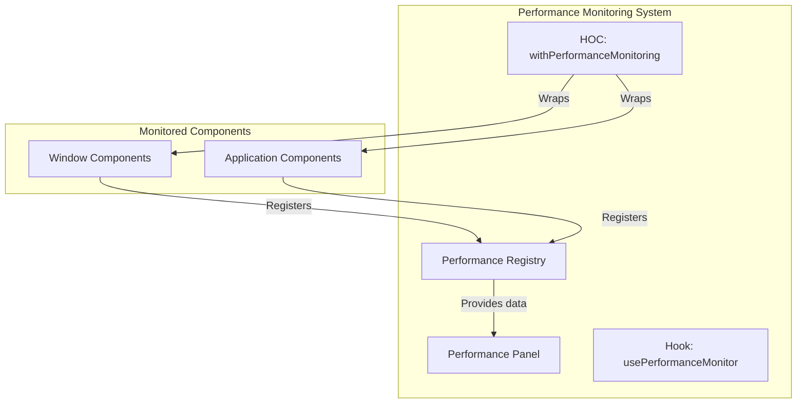

# WebOS Performance Monitoring

This document provides information about the performance monitoring system built into the WebOS platform.

## Overview

The WebOS Performance Monitoring system is a development tool that tracks, analyzes, and optimizes application performance in real-time. It helps identify performance bottlenecks without modifying component behavior.



## Key Features

- **Non-invasive Monitoring**: Monitors components without modifying their code
- **Advanced Metrics**: Tracks render counts, component lifetimes, and render time
- **Visual Dashboard**: Interactive panel toggled with Alt+P
- **Zero Production Impact**: Automatically disabled in production environments

## Adding Monitoring to Components

### Using the HOC Pattern

The Higher-Order Component (HOC) pattern is ideal for class components or when you want to monitor all instances of a component:

```javascript
// components/window.js
import React from 'react';
import { withPerformanceMonitoring } from '@/utils/performance-monitor';

function Window({ title, children, onClose }) {
  return (
    <div className="window">
      <div className="window-header">
        <div className="window-title">{title}</div>
        <button onClick={onClose}>×</button>
      </div>
      <div className="window-content">{children}</div>
    </div>
  );
}

// Only apply in development
export default process.env.NODE_ENV === 'development'
  ? withPerformanceMonitoring(Window, 'Window')
  : Window;
```

### Using the Hook Pattern

The hook pattern is more flexible for functional components:

```javascript
// components/desktop.js
import React from 'react';
import { usePerformanceMonitor } from '@/utils/performance-monitor';

export default function Desktop({ icons, background }) {
  // Only monitor in development
  if (process.env.NODE_ENV === 'development') {
    usePerformanceMonitor('Desktop');
  }
  
  return (
    <div 
      className="desktop" 
      style={{ backgroundImage: `url(${background})` }}
    >
      {icons.map(icon => (
        <DesktopIcon key={icon.id} icon={icon} />
      ))}
    </div>
  );
}
```

## Performance Panel

The Performance Panel displays real-time metrics for all monitored components:

- **Component Name**: Identifier for the monitored component
- **Render Count**: Number of times the component rendered
- **Last Render Time**: Duration of the most recent render
- **Average Render Time**: Average duration across all renders
- **Component Status**: Whether the component is currently mounted

The panel can be toggled with Alt+P (customizable) and allows filtering components by name.

## Performance Optimization Tips

The monitoring system can help identify several common performance issues:

1. **Excessive Re-renders**:
   - Components with high render counts may need memoization with `React.memo`
   - Use `useCallback` for event handlers passed to child components
   - Apply `useMemo` to expensive calculations

2. **Slow Render Times**:
   - Break down large components into smaller, focused components
   - Delay expensive calculations with `useEffect`
   - Consider virtualization for long lists

3. **Component Lifecycle Issues**:
   - Components that mount and unmount frequently may indicate inefficient design
   - Evaluate the component hierarchy to minimize remounts
   - Use keys appropriately to preserve component state

## Configuration Options

The Performance Monitoring system can be configured with the following options:

- Enable/disable the entire system (default: enabled in development only)
- Set panel toggle shortcut (default: 'alt+p')
- Configure render warning threshold (default: 16ms)
- Set maximum render history to keep per component
- Define component ignore patterns
- Enable/disable console warnings for performance issues

Example configuration:

```javascript
// config/performance-config.js
export const performanceConfig = {
  enabled: process.env.NODE_ENV === 'development',
  toggleShortcut: 'alt+p',
  renderWarningThreshold: 16, // ms
  maxRenderHistory: 50
};
```

## Future Enhancements

Planned enhancements to the monitoring system include:

1. **Timeline View**: Visual representation of component rendering over time
2. **Dependency Tracking**: Identify unnecessary re-renders by tracking prop changes
3. **Bundle Size Analysis**: Integration with webpack analysis
4. **Interaction Tracing**: Track performance from user interaction to final render
5. **Network Performance**: Monitor API calls and their impact on rendering 
