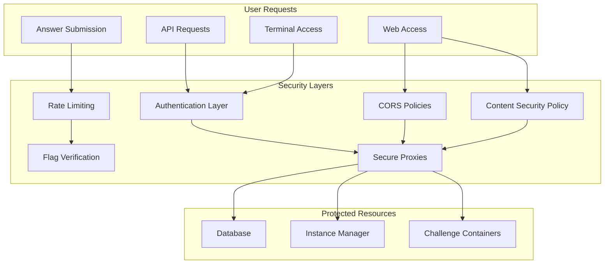

# WebOS Security and Performance

This document provides detailed information about WebOS security features, rate limiting, and performance optimization techniques.

## Security Architecture

The WebOS platform implements a multi-layered security approach to protect both users and the underlying challenge infrastructure:



### Authentication and Authorization

WebOS integrates with the system-wide authentication using JWTs (JSON Web Tokens):

1. **Token Acquisition**:
   - Users authenticate through the EDURange dashboard
   - JWT tokens are issued with appropriate role and challenge claims
   - Tokens are passed to WebOS during challenge initialization

2. **Token Validation**:
   - All API requests include the JWT in the Authorization header
   - Tokens are validated for expiration and signature
   - Claims are verified against the requested resources

3. **Authorization Checks**:
   - User roles are extracted from JWT claims
   - Access to challenge resources is restricted based on enrollment
   - Admin-only endpoints are protected with role-based checks

Example authentication middleware:

```javascript
// middleware/auth.js
import { verify } from 'jsonwebtoken';

export default function authMiddleware(req, res, next) {
  try {
    // Extract token from Authorization header
    const authHeader = req.headers.authorization;
    if (!authHeader || !authHeader.startsWith('Bearer ')) {
      return res.status(401).json({ error: 'Unauthorized: No token provided' });
    }

    const token = authHeader.split(' ')[1];

    // Verify token
    const decoded = verify(token, process.env.JWT_SECRET);

    // Add user info to request object
    req.user = {
      id: decoded.sub,
      role: decoded.role,
      challengeId: decoded.challengeId,
      instanceId: decoded.instanceId
    };

    next();
  } catch (error) {
    console.error('Authentication error:', error);
    return res.status(401).json({ error: 'Unauthorized: Invalid token' });
  }
}
```

### Rate Limiting

To prevent abuse and brute force attacks, WebOS implements rate limiting on critical endpoints:

1. **Answer Submission Limiting**:
   - Prevents brute force attempts on challenge flags
   - Sliding window algorithm with IP-based and user-based tracking
   - Customizable thresholds based on challenge difficulty

2. **Terminal Command Limiting**:
   - Prevents resource-intensive command abuse
   - Token bucket algorithm with per-user buckets
   - Automatic blocking of known dangerous commands

3. **API Request Limiting**:
   - Prevents denial of service attacks
   - Fixed window counter with Redis backend
   - Graduated response (warning, temporary block, extended block)

Example rate limiting middleware:

```javascript
// middleware/rate-limit.js
import Redis from 'ioredis';
import { RateLimiterRedis } from 'rate-limiter-flexible';

const redis = new Redis(process.env.REDIS_URL);

// Create different rate limiters for different endpoints
const answerSubmissionLimiter = new RateLimiterRedis({
  storeClient: redis,
  keyPrefix: 'ratelimit_answer_submission',
  points: 5, // 5 submissions
  duration: 60, // per 60 seconds
});

const apiLimiter = new RateLimiterRedis({
  storeClient: redis,
  keyPrefix: 'ratelimit_api',
  points: 100, // 100 requests
  duration: 60, // per 60 seconds
});

export const answerSubmissionRateLimit = async (req, res, next) => {
  try {
    // Rate limit based on user ID and IP address combination
    const userId = req.user?.id || 'anonymous';
    const ip = req.ip;
    const key = `${userId}_${ip}`;

    await answerSubmissionLimiter.consume(key);
    next();
  } catch (error) {
    if (error.msBeforeNext) {
      res.set('Retry-After', Math.ceil(error.msBeforeNext / 1000));
    }
    res.status(429).json({
      error: 'Too many answer submissions. Please try again later.',
      retryAfter: Math.ceil((error.msBeforeNext || 60000) / 1000)
    });
  }
};

export const apiRateLimit = async (req, res, next) => {
  try {
    const key = req.ip;
    await apiLimiter.consume(key);
    next();
  } catch (error) {
    if (error.msBeforeNext) {
      res.set('Retry-After', Math.ceil(error.msBeforeNext / 1000));
    }
    res.status(429).json({
      error: 'Too many requests. Please try again later.',
      retryAfter: Math.ceil((error.msBeforeNext || 60000) / 1000)
    });
  }
};
```

### Content Security Policy

WebOS implements a strict Content Security Policy to prevent XSS and other injection attacks:

1. **Base Policy**:
   - Restricts script sources to same origin and specific CDNs
   - Disables unsafe inline scripts and eval
   - Implements nonce-based script authorization for dynamic content

2. **Frame Policies**:
   - Controls iframe sources and prevents clickjacking
   - Enables isolated sandboxed contexts for challenge content
   - Implements feature policy restrictions

3. **Asset Restrictions**:
   - Limits media, font, and style sources
   - Implements subresource integrity for external dependencies
   - Restricts form actions to known endpoints

Example CSP implementation:

```javascript
// middleware/csp.js
import crypto from 'crypto';

export default function cspMiddleware(req, res, next) {
  // Generate nonce for script tags
  const nonce = crypto.randomBytes(16).toString('base64');
  res.locals.cspNonce = nonce;

  // Build CSP policy
  const policy = [
    `default-src 'self'`,
    `script-src 'self' 'nonce-${nonce}' https://cdn.jsdelivr.net https://unpkg.com`,
    `style-src 'self' 'unsafe-inline' https://cdn.jsdelivr.net https://fonts.googleapis.com`,
    `img-src 'self' data: https://raw.githubusercontent.com`,
    `font-src 'self' https://fonts.gstatic.com`,
    `connect-src 'self' https://api.edurange.org`,
    `frame-src 'self' https://*.edurange.org`,
    `object-src 'none'`,
    `base-uri 'self'`,
    `form-action 'self'`,
    `frame-ancestors 'self'`,
    `upgrade-insecure-requests`
  ].join('; ');

  // Set CSP header
  res.setHeader('Content-Security-Policy', policy);

  // Set additional security headers
  res.setHeader('X-Content-Type-Options', 'nosniff');
  res.setHeader('X-Frame-Options', 'SAMEORIGIN');
  res.setHeader('X-XSS-Protection', '1; mode=block');
  res.setHeader('Referrer-Policy', 'strict-origin-when-cross-origin');
  res.setHeader('Permissions-Policy', 'camera=(), microphone=(), geolocation=()');

  next();
}
```

### Secure Proxies

WebOS implements secure proxying to protect backend services:

1. **API Gateway Pattern**:
   - All requests to backend services flow through the WebOS API gateway
   - Authentication and authorization occur at the gateway level
   - Requests are sanitized and normalized before forwarding

2. **Request Transformation**:
   - User credentials are replaced with service credentials
   - Request parameters are validated and sanitized
   - Rate limits and quotas are enforced

3. **Response Filtering**:
   - Sensitive information is redacted from responses
   - Responses are normalized to consistent formats
   - Error messages are sanitized to prevent information leakage

Example secure proxy implementation:

```javascript
// pages/api/proxy/[service].js
import { createProxyMiddleware } from 'http-proxy-middleware';
import authMiddleware from '@/middleware/auth';
import { apiRateLimit } from '@/middleware/rate-limit';

// Allowed services and their configurations
const PROXY_CONFIG = {
  'instance-manager': {
    target: process.env.INSTANCE_MANAGER_URL,
    requiredRole: 'any',
    allowedPaths: ['/list-pods', '/pod-status']
  },
  'database': {
    target: process.env.DATABASE_URL,
    requiredRole: 'any',
    allowedPaths: ['/challenge-data', '/verify-answer']
  },
  'admin': {
    target: process.env.ADMIN_API_URL,
    requiredRole: 'admin',
    allowedPaths: ['*']
  }
};

// Middleware chain
const handler = (req, res) => {
  // Extract service from path
  const { service } = req.query;

  // Check if service is allowed
  if (!PROXY_CONFIG[service]) {
    return res.status(404).json({ error: 'Service not found' });
  }

  const config = PROXY_CONFIG[service];

  // Check user role
  if (config.requiredRole !== 'any' && req.user.role !== config.requiredRole) {
    return res.status(403).json({ error: 'Forbidden: Insufficient permissions' });
  }

  // Check if path is allowed
  const path = req.url.replace(`/api/proxy/${service}`, '');
  if (config.allowedPaths !== '*' && !config.allowedPaths.includes(path)) {
    return res.status(403).json({ error: 'Forbidden: Path access denied' });
  }

  // Create and apply proxy
  const proxy = createProxyMiddleware({
    target: config.target,
    pathRewrite: { [`^/api/proxy/${service}`]: '' },
    changeOrigin: true,
    onProxyReq: (proxyReq, req, res) => {
      // Add service credentials
      proxyReq.setHeader('X-Service-Key', process.env.SERVICE_KEY);

      // Add original user ID for audit logging
      proxyReq.setHeader('X-Original-User', req.user.id);

      // Remove user-provided authorization
      proxyReq.removeHeader('authorization');
    },
    onProxyRes: (proxyRes, req, res) => {
      // Sanitize headers
      proxyRes.headers['server'] = 'EDURange WebOS';
      delete proxyRes.headers['x-powered-by'];

      // Add security headers
      proxyRes.headers['content-security-policy'] = "default-src 'self'";
      proxyRes.headers['x-content-type-options'] = 'nosniff';
    }
  });

  proxy(req, res);
};

// Apply middleware chain
export default apiRateLimit(authMiddleware(handler));
```

## Performance Optimization

The WebOS platform implements several performance optimization techniques:

### Client-Side Optimizations

1. **Component Memoization**:
   - React.memo for functional components
   - useMemo for computed values
   - useCallback for event handlers

2. **Code Splitting**:
   - Dynamic imports for app components
   - Routes-based code splitting
   - Lazy loading for non-critical components

3. **Asset Optimization**:
   - Image optimization with next/image
   - Font optimization with next/font
   - CSS minification and purging

Example component memoization:

```javascript
// components/window.js
import { memo, useCallback } from 'react';

const Window = memo(function Window({ id, title, children, onClose, onMinimize, onMaximize }) {
  const handleClose = useCallback(() => {
    onClose(id);
  }, [id, onClose]);

  const handleMinimize = useCallback(() => {
    onMinimize(id);
  }, [id, onMinimize]);

  const handleMaximize = useCallback(() => {
    onMaximize(id);
  }, [id, onMaximize]);

  return (
    <div className="window">
      <div className="window-header">
        <div className="window-title">{title}</div>
        <div className="window-controls">
          <button onClick={handleMinimize}>_</button>
          <button onClick={handleMaximize}>□</button>
          <button onClick={handleClose}>×</button>
        </div>
      </div>
      <div className="window-content">{children}</div>
    </div>
  );
});

export default Window;
```

### Server-Side Optimizations

1. **API Caching**:
   - Redis-based response caching
   - Stale-while-revalidate pattern
   - Cache invalidation on challenge updates

2. **Edge Function Deployment**:
   - Deploy static content to the edge
   - Regional API deployments
   - Edge caching for public assets

3. **Backend Optimizations**:
   - Connection pooling for database and service connections
   - Batch processing for high-volume operations
   - Background job processing for non-interactive tasks

Example API route with caching:

```javascript
// pages/api/challenge-config/[id].js
import Redis from 'ioredis';
import authMiddleware from '@/middleware/auth';
import { apiRateLimit } from '@/middleware/rate-limit';

const redis = new Redis(process.env.REDIS_URL);
const CACHE_TTL = 60 * 5; // 5 minutes

async function handler(req, res) {
  const { id } = req.query;

  // Verify user has access to this challenge
  if (req.user.challengeId !== id) {
    return res.status(403).json({ error: 'Forbidden: Not enrolled in this challenge' });
  }

  // Try to get from cache
  const cacheKey = `challenge:${id}:config`;
  const cachedData = await redis.get(cacheKey);

  if (cachedData) {
    return res.status(200).json(JSON.parse(cachedData));
  }

  try {
    // Fetch from database
    const response = await fetch(`${process.env.DATABASE_URL}/challenge/${id}`, {
      headers: {
        'X-Service-Key': process.env.SERVICE_KEY
      }
    });

    if (!response.ok) {
      throw new Error(`Database error: ${response.status}`);
    }

    const data = await response.json();

    // Store in cache
    await redis.set(cacheKey, JSON.stringify(data), 'EX', CACHE_TTL);

    return res.status(200).json(data);
  } catch (error) {
    console.error('Error fetching challenge config:', error);
    return res.status(500).json({ error: 'Internal server error' });
  }
}

export default apiRateLimit(authMiddleware(handler));
```

### Monitoring and Analytics

WebOS includes comprehensive monitoring and analytics:

1. **Performance Monitoring**:
   - React component rendering statistics
   - API response times
   - Resource utilization tracking

2. **Usage Analytics**:
   - Feature usage tracking
   - Session duration analysis
   - Challenge completion rates

3. **Error Tracking**:
   - Centralized error logging
   - Stack trace aggregation
   - User impact assessment

Example client-side monitoring:

```javascript
// utils/performance-monitor.js
import { useEffect } from 'react';

export function usePerformanceMonitor(componentName) {
  useEffect(() => {
    const startTime = performance.now();

    return () => {
      const endTime = performance.now();
      const duration = endTime - startTime;

      // Log only in development
      if (process.env.NODE_ENV === 'development') {
        console.log(`Component ${componentName} was mounted for ${duration.toFixed(2)}ms`);
      }

      // In production, send to analytics service
      if (process.env.NODE_ENV === 'production') {
        fetch('/api/analytics/component-timing', {
          method: 'POST',
          headers: {
            'Content-Type': 'application/json'
          },
          body: JSON.stringify({
            component: componentName,
            duration,
            timestamp: new Date().toISOString()
          }),
          // Use beacon API to ensure data is sent even on page unload
          keepalive: true
        }).catch(error => {
          console.error('Failed to send analytics:', error);
        });
      }
    };
  }, [componentName]);
}

// HOC for monitoring component performance
export function withPerformanceMonitoring(Component, displayName) {
  function MonitoredComponent(props) {
    usePerformanceMonitor(displayName || Component.displayName || Component.name);
    return <Component {...props} />;
  }

  MonitoredComponent.displayName = `Monitored(${displayName || Component.displayName || Component.name})`;

  return MonitoredComponent;
}
```

## Future Security Enhancements

The WebOS security roadmap includes several planned enhancements:

1. **WebAssembly Sandboxing**:
   - Implement WASM sandboxes for running untrusted code
   - Memory isolation between applications
   - Fine-grained permission controls

2. **Enhanced Authentication**:
   - Multi-factor authentication for sensitive operations
   - Device fingerprinting for continuous authentication
   - Secure credential storage with hardware-backed keys

3. **Automated Security Testing**:
   - Continuous vulnerability scanning
   - Penetration testing in CI/CD pipeline
   - Fuzzing of API endpoints

These enhancements will further strengthen the security posture of the WebOS platform and provide a safe environment for cybersecurity education.
