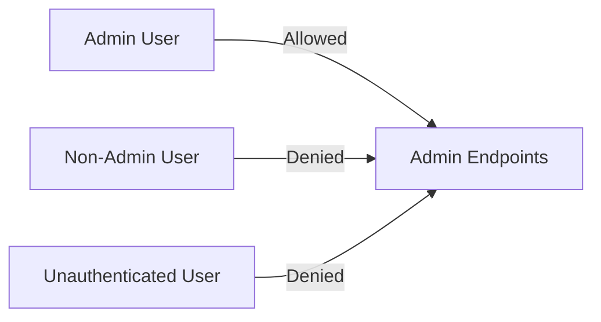
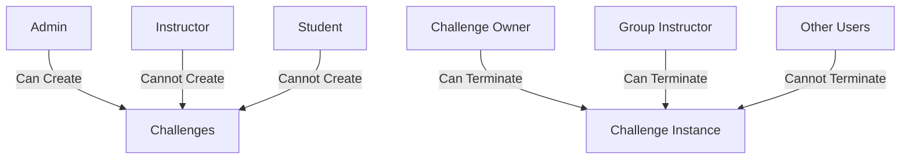
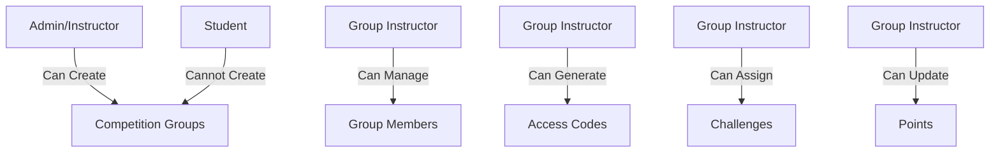

# API Access Control Tests

These tests focus on verifying that API endpoints enforce proper access control based on user roles and permissions.

## Admin Endpoint Tests

**File:** `api/api-access-control/admin/admin-endpoints.test.ts`

**What it tests:**
- Admin-only API endpoints access control
- Verification that non-admin users cannot access admin endpoints
- Proper functioning of admin features like challenge installation

**Mocked vs. Live Data:**
- **Mocked:**
  - Authentication sessions
  - Prisma database operations
  - ActivityLogger
- **Live:**
  - API route handlers
  - Validation logic

## Challenge Endpoint Tests

**File:** `api/api-access-control/challenge/challenge-endpoints.test.ts`

**What it tests:**
- Challenge creation, starting, and termination permissions
- Challenge type access permissions
- Challenge completion tracking
- User-specific challenge instance isolation

**Mocked vs. Live Data:**
- **Mocked:**
  - Authentication sessions
  - Prisma database operations
  - Instance manager API calls
  - ActivityLogger
- **Live:**
  - API route handlers
  - Access control logic
  - Validation logic

## Competition Endpoint Tests

**File:** `api/api-access-control/competition/competition-endpoints.test.ts`

**What it tests:**
- Competition group creation and management permissions
- Access code generation and validation
- Group membership controls
- Points management and leaderboard access
- Competition challenge assignment

**Mocked vs. Live Data:**
- **Mocked:**
  - Authentication sessions
  - Prisma database operations including SQL queries
  - ActivityLogger
- **Live:**
  - API route handlers
  - Access control logic
  - Validation logic

## System Endpoint Tests

**File:** `api/api-access-control/system/system-endpoints.test.ts`

**What it tests:**
- System-level API endpoint access control
- System status and health check endpoints
- System configuration endpoints

**Mocked vs. Live Data:**
- **Mocked:**
  - Authentication sessions
  - Prisma database operations
  - System configuration
- **Live:**
  - API route handlers
  - Access control logic

## User Endpoint Tests

**File:** `api/api-access-control/user/user-endpoints.test.ts`

**What it tests:**
- User profile access and update permissions
- Role-based access to user management features
- User registration and authentication flows

**Mocked vs. Live Data:**
- **Mocked:**
  - Authentication sessions
  - Prisma database operations
  - Email services
- **Live:**
  - API route handlers
  - Access control logic
  - Validation logic 