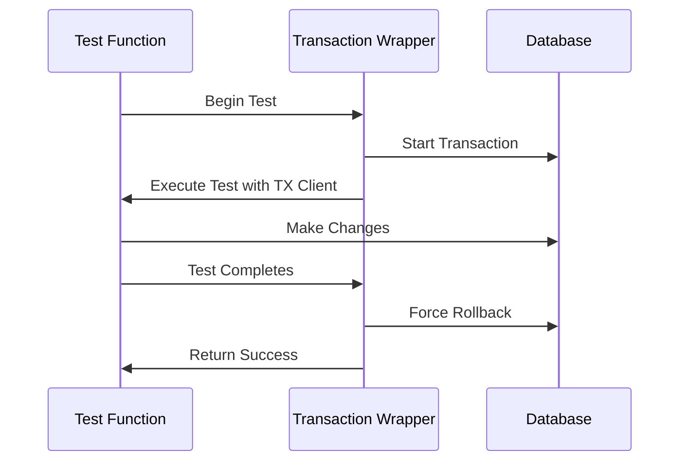

import { FileTree } from 'nextra/components'

# EDURange Cloud Testing Documentation
[](https://github.com/jestjs/jest)

## Overview
EDURange Cloud uses Jest as its primary testing framework, with a comprehensive test suite that covers API endpoints, access control, unit tests, integration tests, and end-to-end tests. Our testing approach ensures data isolation, proper cleanup, and thorough coverage of core functionality.

## Test Coverage Summary

| Category | Areas Tested | Details |
|----------|--------------|---------|
| **API Access Control** | Authentication, Authorization, Role-based permissions | [API Access Control Tests](/Frontend/Testing/API-Access-Control-Tests) |
| **Admin Endpoints** | Admin-only features, Challenge installation | [Admin Endpoint Tests](/Frontend/Testing/API-Access-Control-Tests#admin-endpoint-tests) |
| **Challenge Endpoints** | Challenge creation, permissions, isolation | [Challenge Endpoint Tests](/Frontend/Testing/API-Access-Control-Tests#challenge-endpoint-tests) |
| **Competition Endpoints** | Group management, access codes, user management | [Competition Endpoint Tests](/Frontend/Testing/API-Access-Control-Tests#competition-endpoint-tests) |
| **System Endpoints** | System status, health checks, configuration | [System Endpoint Tests](/Frontend/Testing/API-Access-Control-Tests#system-endpoint-tests) |
| **User Endpoints** | Profile management, authentication flows | [User Endpoint Tests](/Frontend/Testing/API-Access-Control-Tests#user-endpoint-tests) |
| **Integration** | Database interactions, business logic | [Integration Tests](/Frontend/Testing/Integration-Tests) |
| **Challenge Management** | Challenge creation, configuration, assignment | [Challenge Management](/Frontend/Testing/Integration-Tests#challenge-management) |
| **Group Management** | Competition groups, membership, access codes | [Group Management](/Frontend/Testing/Integration-Tests#group-management) |
| **Event Logging** | User, group, challenge event tracking | [Event Logging](/Frontend/Testing/Integration-Tests#event-logging) |
| **Competition Isolation** | Data isolation between competitions | [Competition Isolation](/Frontend/Testing/Integration-Tests#competition-isolation) |
| **Challenge Submission** | Flag validation, points, completion tracking | [Challenge Submission](/Frontend/Testing/Integration-Tests#challenge-submission) |
| **Unit Tests** | Individual modules without integration | [Unit Tests](/Frontend/Testing/Unit-Tests) |
| **Input Validation** | Data sanitization, schema validation | [Input Validation](/Frontend/Testing/Unit-Tests#input-validation) |
| **Rate Limiting** | Request throttling, IP-based tracking | [Rate Limiting](/Frontend/Testing/Unit-Tests#rate-limiting) |
| **Authentication** | User management, sessions, role control | [Authentication](/Frontend/Testing/Unit-Tests#authentication) |
| **End-to-End (E2E)** | User flows, UI interactions, browser testing | [E2E Tests](/Frontend/Testing/E2E-Tests) |
| **Middleware Protection** | Route protection, security headers | [Middleware Testing](/Frontend/Testing/E2E-Tests#middleware-testing) |
| **Authentication Flows** | Login, logout, session expiry | [Authentication Testing](/Frontend/Testing/E2E-Tests#authentication-testing) |
| **Unauthenticated Access** | Public routes, protected route redirects | [Unauthenticated User Access](/Frontend/Testing/E2E-Tests#unauthenticated-user-access) |
| **Student Access** | Student-specific routes, permission boundaries | [Student User Access](/Frontend/Testing/E2E-Tests#student-user-access) |
| **Admin Access** | Admin-only routes, admin capabilities | [Admin User Access](/Frontend/Testing/E2E-Tests#admin-user-access) |
| **Competition Management** | Creating competitions, managing access codes, challenges | [Competition Management Testing](/Frontend/Testing/E2E-Tests#competition-management-testing) |

## Test Directory Structure

We've organized our tests into a structured hierarchy to improve maintainability and clarity:

```
dashboard/tests/
├── api/                          (API-related tests)
│   ├── api-access-control/       (Access control tests for API endpoints)
│   │   ├── admin/                (Admin endpoint access control)
│   │   ├── challenge/            (Challenge endpoint access control)
│   │   ├── competition/          (Competition endpoint access control)
│   │   ├── system/               (System endpoint access control)
│   │   ├── user/                 (User endpoint access control)
│   │   └── base-test.ts          (Shared test utilities for access control tests)
│   └── security/                 (API security tests)
│
├── integration/                  (Integration tests with database)
│   ├── challenges.test.ts        (Challenge management)
│   ├── groups.test.ts            (Group management)
│   ├── events.test.ts            (Event logging)
│   ├── competition-isolation.test.ts (Competition isolation)
│   └── challenge-submission.test.ts  (Challenge submission)
│
├── e2e/                          (End-to-End tests with Puppeteer)
│   ├── setup.ts                  (E2E test setup and helper functions)
│   ├── middleware.test.ts        (Tests for middleware protection)
│   ├── auth-middleware.test.ts   (Tests for authentication middleware)
│   └── competition-management.test.ts (Tests for competition management)
│
├── unit/                         (Unit tests for individual modules)
│   ├── input-validation.test.ts  (Validation module tests)
│   ├── rate-limit.test.ts        (Rate limiting module tests)
│   └── auth.test.ts              (Auth module tests)
│
├── utils/                        (Test utilities)
│   ├── test-helpers.ts           (Test helper functions)
│   └── prisma-test-client.ts     (Prisma test client)
│
└── setup/                        (Test setup and teardown)
    ├── global-setup.ts           (Global setup)
    └── global-teardown.ts        (Global teardown)
```

## E2E Testing Approach

[](https://pptr.dev/)

Our E2E tests use Puppeteer to simulate real user interactions with the application. Key features include:

- **JWT Authentication**: Properly signed JWT tokens for session simulation
- **Role-Based Testing**: Tests for different user roles (unauthenticated, student, admin)
- **Real Database Operations**: Tests use real database operations with cleanup
- **Comprehensive Screenshots**: Screenshots at key points for visual debugging
- **Detailed Logging**: Console, network, and element state logging
- **Robust Error Handling**: Clear error messages and explicit test failures

E2E tests cover critical user flows:

1. **Authentication**: Login, logout, session expiry
2. **Middleware Protection**: Route protection, security headers
3. **Competition Management**: Creating, joining, and managing competitions
4. **Challenge Interaction**: Viewing and interacting with challenges

## Transaction-Based Testing

EDURange Cloud implements a transaction-based testing approach that provides complete isolation between tests and eliminates the need for manual cleanup. This approach offers several advantages:

1. **Automatic Rollback**: All database changes made during a test are automatically rolled back after the test completes
2. **Test Isolation**: Each test runs in its own transaction, preventing interference between tests
3. **No Manual Cleanup**: No need to write cleanup code in tests, reducing boilerplate and potential errors
4. **Faster Execution**: Tests run faster without the overhead of manual cleanup
5. **Simplified Test Code**: Tests are more focused on the actual functionality being tested



### How Transaction-Based Testing Works

The core of our transaction-based testing approach is the `withTestTransaction` function in `dashboard/tests/utils/test-helpers.ts`. Let's break down how it works:

#### 1. Transaction Setup

```typescript
export const withTestTransaction = async (testFn: (tx: any) => Promise<void>): Promise<void> => {
  // Add a small delay between transactions to reduce deadlock probability
  await new Promise(resolve => setTimeout(resolve, Math.random() * 100));

  // Create a transaction with a specific isolation level
  const options = {
    timeout: 30000, // 30 second timeout for the transaction
    maxWait: 5000,  // Maximum time to wait for the transaction to start
    isolationLevel: Prisma.TransactionIsolationLevel.ReadCommitted // Use a less strict isolation level to avoid deadlocks
  };
```

This initial part sets up the transaction environment:
- A small random delay helps prevent transaction deadlocks when multiple tests run concurrently
- Transaction options define timeout limits and the isolation level (ReadCommitted provides a good balance between isolation and performance)

#### 2. Executing the Test in a Transaction

```typescript
  try {
    // Use a simpler approach - just run the test in a transaction and force a rollback
    await prisma.$transaction(async (txClient) => {
      // Execute the test function
      await testFn(txClient);

      // Always throw an error to force rollback
      throw new Error('FORCE_ROLLBACK');
    }, options);
```

This is the core mechanism:
- The test function runs inside a Prisma transaction
- After the test completes successfully, we deliberately throw a special error
- This error forces Prisma to roll back the transaction, undoing all database changes

#### 3. Handling the Forced Rollback

```typescript
  } catch (error: any) {
    // Ignore our intentional rollback error
    if (error.message === 'FORCE_ROLLBACK') {
      return;
    }
```

This part handles our intentional rollback:
- We catch the error thrown to force the rollback
- If it's our special 'FORCE_ROLLBACK' error, we ignore it and return normally
- This prevents the test from failing due to our intentional rollback

#### 4. Handling Deadlocks with Retry Logic

```typescript
    // Handle deadlock errors by retrying once
    if (error.code === 'P2034') { // Transaction deadlock error
      console.warn('Transaction deadlock detected, retrying...');
      // Wait a bit longer before retrying
      await new Promise(resolve => setTimeout(resolve, 500 + Math.random() * 500));

      // Retry the transaction once
      try {
        await prisma.$transaction(async (txClient) => {
          await testFn(txClient);
          // Always throw an error to force rollback
          throw new Error('FORCE_ROLLBACK');
        }, options);
      } catch (retryError: any) {
        // Ignore our intentional rollback error
        if (retryError.message === 'FORCE_ROLLBACK') {
          return;
        }
        throw retryError;
      }
    } else {
      // Rethrow any other errors
      throw error;
    }
  }
};
```

This final part handles deadlock situations:
- If a deadlock is detected (Prisma error code P2034), we retry the transaction
- We wait a longer random delay before retrying to reduce the chance of another deadlock
- The retry follows the same pattern: run the test, force a rollback, handle the rollback error
- Any other errors (not deadlocks or intentional rollbacks) are rethrown to fail the test

## Mock Implementation

For API access control tests, we use extensive mocking to isolate the tests from external dependencies and focus on testing the access control logic. Here's an overview of our mock implementation:

### Authentication Mocking

We mock the NextAuth session to simulate different user roles:

```typescript
// Mock user session with different roles
function mockUserSession(user: any) {
  (getServerSession as jest.Mock).mockResolvedValue({
    user: {
      id: user.id,
      name: user.name,
      email: user.email,
      role: user.role,
    }
  });
}
```

### Database Mocking

We mock the Prisma client to avoid actual database operations:

```typescript
jest.mock('@/lib/prisma', () => ({
  prisma: {
    user: {
      findUnique: jest.fn(),
      findMany: jest.fn(),
    },
    challenges: {
      findMany: jest.fn().mockResolvedValue([]),
      findUnique: jest.fn().mockImplementation((args) => {
        // Mock implementation
      }),
      create: jest.fn().mockImplementation((data) => {
        // Mock implementation
      }),
    },
    // Other models and operations
  },
}));
```

### Activity Logger Mocking

We mock the ActivityLogger to avoid actual logging:

```typescript
jest.mock('@/lib/activity-logger', () => ({
  ActivityLogger: {
    logChallengeEvent: jest.fn().mockResolvedValue({}),
    logEvent: jest.fn().mockResolvedValue({}),
    logActivity: jest.fn().mockResolvedValue({}),
  },
  ActivityEventType: {
    CHALLENGE_CREATED: 'CHALLENGE_CREATED',
    CHALLENGE_UPDATED: 'CHALLENGE_UPDATED',
    // Other event types
  },
}));
```

### External API Mocking

We mock external API calls, such as the instance manager:

```typescript
// Mock the fetch function for instance manager API calls
global.fetch = jest.fn().mockImplementation(() =>
  Promise.resolve({
    ok: true,
    json: () => Promise.resolve({
      deployment_name: 'test-deployment',
      challenge_url: 'http://test-url.com',
      flag_secret_name: 'test-flag-secret'
    }),
    text: () => Promise.resolve(''),
  })
);
```

## Test Helper Functions

To support our testing approach, we've implemented several helper functions that generate unique test data and help identify test entities.

### ID Generation

```typescript
// Generate a unique test ID with a prefix
export function generateTestId(prefix: string): string {
  return `test-${prefix}-${Date.now()}-${Math.random().toString(36).substring(2, 9)}`;
}
```

### Email Generation

```typescript
// Generate a unique email for test users
export function generateTestEmail(prefix: string): string {
  return `${prefix}-${Date.now()}-${Math.random().toString(36).substring(2, 9)}@test.edurange.org`;
}
```

### Name Generation

```typescript
// Generate a unique name for test entities
export function generateTestName(prefix: string): string {
  return `${prefix} Test ${Date.now().toString().slice(-4)}`;
}
```

## Running Tests

To run the tests, use the following commands:

```bash
# Run all tests
npm test

# Run specific test file
npm test path/to/test-file.test.ts

# Run tests with coverage report
npm test -- --coverage

# Run tests in watch mode
npm test -- --watch
```

## Best Practices for Writing Tests

1. **Use Transaction-Based Testing**: Wrap database tests in `withTestTransaction` to ensure isolation and automatic cleanup.

2. **Generate Unique Test Data**: Use the helper functions to generate unique IDs, emails, and names for test entities.

3. **Mock External Dependencies**: Mock external services and APIs to avoid side effects and ensure deterministic test results.

4. **Test Access Control**: Verify that endpoints enforce proper access control based on user roles and permissions.

5. **Test Error Handling**: Verify that endpoints handle errors gracefully and return appropriate status codes.

6. **Test Validation**: Verify that input validation works correctly and prevents invalid data.

7. **Test Business Logic**: Verify that business logic functions correctly under various scenarios.

8. **Organize Tests Logically**: Group related tests together and use descriptive test names.

9. **Use Shared Mocks**: Use shared mock implementations for common dependencies to reduce duplication.

10. **Keep Tests Independent**: Ensure that tests don't depend on the state created by other tests.

## Conclusion

EDURange Cloud's testing approach ensures comprehensive coverage of the application's functionality, with a focus on access control, API endpoints, and integration testing. By using transaction-based testing and extensive mocking, we achieve test isolation, deterministic results, and automatic cleanup, making the test suite reliable and maintainable.
