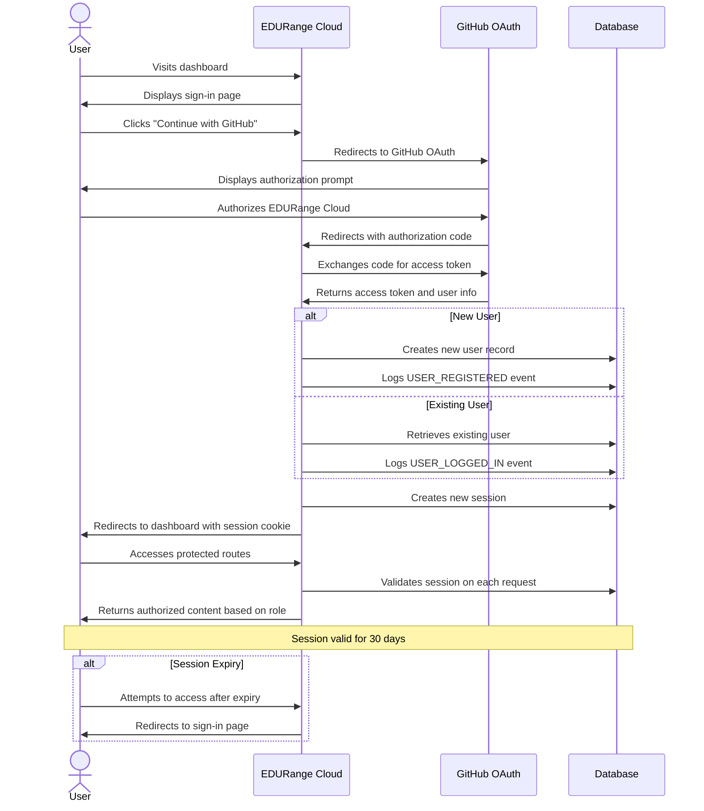

# Authentication System

## Overview

The EDUrange Cloud dashboard uses [NextAuth.js](https://next-auth.js.org/) (now known as Auth.js) as its authentication library. NextAuth.js is a complete open-source authentication solution for Next.js applications that supports various authentication methods including OAuth providers, email/password, and more.

The authentication system in EDUrange Cloud provides:

- Secure user authentication with GitHub OAuth
- Session management using database strategy
- Role-based access control (STUDENT, INSTRUCTOR, ADMIN)
- Integration with the [Prisma database adapter](../Database/database_controller.md)
- [Activity logging](./activity_logging.mdx) for authentication events

While the platform currently only supports GitHub OAuth, there are plans to add additional OAuth providers in the future to give users more sign-in options.

## Authentication Strategy

EDUrange Cloud exclusively uses OAuth providers for authentication rather than traditional email/password authentication. This strategic decision was made for several important reasons:

1. **Security**: By using OAuth, we avoid the security risks associated with storing and managing password information. This eliminates concerns about password hashing, storage, and potential data breaches.

2. **Reduced Development Overhead**: OAuth providers handle the complex security aspects of authentication, allowing our team to focus on building core platform features.

3. **Modern User Experience**: OAuth provides a streamlined sign-in experience that many users are already familiar with.

4. **Account Verification**: OAuth providers have already verified user emails and identities, eliminating the need for additional verification steps.

5. **Maintenance**: We don't need to implement and maintain password reset flows, account recovery, or other password-related features.


## User Authentication Flow

The following sequence diagram illustrates the authentication flow from a user's perspective, showing the interactions between the user, EDURange Cloud, and GitHub OAuth:



This diagram shows the complete authentication journey, including:

1. Initial sign-in process
2. OAuth authorization with GitHub
3. User creation or retrieval
4. Session management
5. Access to protected resources
6. Session expiration handling

### Detailed Authentication Flow Explanation

#### Initial Authentication

1. **User Visits Dashboard**: When a user navigates to the EDURange Cloud dashboard, the application checks if they have a valid session.

2. **Sign-in Page Display**: If no valid session exists, the user is redirected to the sign-in page located at `dashboard/app/(auth)/(signin)/page.tsx`.

3. **GitHub Authentication Initiation**: When the user clicks "Continue with GitHub", the application calls `signIn('github')` from NextAuth.js, which initiates the OAuth flow.

4. **Redirection to GitHub**: The user is redirected to GitHub's authorization page with EDURange Cloud's client ID and requested scopes.

#### OAuth Authorization Process

5. **Authorization Prompt**: GitHub displays a permission prompt asking the user to authorize EDURange Cloud to access their basic profile information.

6. **User Authorization**: When the user approves the request, GitHub generates an authorization code.

7. **Code Return**: GitHub redirects back to EDURange Cloud's callback URL (`/api/auth/callback/github`) with the authorization code.

8. **Token Exchange**: EDURange Cloud's server exchanges this code for an access token by making a server-to-server request to GitHub.

9. **User Information**: GitHub returns the access token along with basic user information (name, email, profile picture).

#### User Processing

10. **User Determination**: NextAuth.js checks if the user already exists in the database by looking for matching OAuth account records.

11. **New User Creation**: For first-time users, a new user record is created in the database with default role 'STUDENT', and a USER_REGISTERED event is logged.
12. **Existing User Retrieval**: For returning users, their existing record is retrieved, and a USER_LOGGED_IN event is logged.

#### Session Management

13. **Session Creation**: A new session record is created in the database with the user's ID, expiration time, and a session token.

14. **Cookie Setting**: The session token is stored in an HTTP-only cookie in the user's browser.

15. **Protected Route Access**: When the user accesses protected routes, the session token from the cookie is used to identify them.

16. **Session Validation**: On each request to a protected route, NextAuth.js validates the session token against the database.

17. **Role-Based Content**: Content is served based on the user's role (STUDENT, INSTRUCTOR, or ADMIN) as stored in the session.

#### Session Lifecycle

18. **Session Duration**: Sessions remain valid for 30 days from creation, as configured in `auth.config.ts`.

19. **Session Expiry**: When a session expires, any attempt to access protected routes will fail validation.

20. **Re-authentication**: Users with expired sessions are redirected back to the sign-in page to authenticate again.

This authentication flow leverages NextAuth.js and GitHub OAuth to provide a secure, streamlined authentication experience while maintaining detailed user records and session information in the database.

## Configuration

The authentication configuration is defined in `dashboard/auth.config.ts` and used in `dashboard/auth.ts`. The API routes are defined in `dashboard/app/api/auth/[...nextauth]/route.ts`, which imports and exports the handler from `auth.ts`.

### Basic Configuration

```typescript
// dashboard/auth.config.ts
import type { AuthOptions } from 'next-auth';
import GithubProvider from 'next-auth/providers/github';
import { PrismaAdapter } from '@auth/prisma-adapter';
import { PrismaClient, UserRole } from '@prisma/client';
import { ActivityLogger, ActivityEventType } from './lib/activity-logger';

const prisma = new PrismaClient();

const authConfig: AuthOptions = {
  adapter: PrismaAdapter(prisma) as Adapter,
  session: {
    strategy: "database",
    maxAge: 30 * 24 * 60 * 60, // 30 days
  },
  providers: [
    GithubProvider({
      clientId: process.env.AUTH_GITHUB_ID ?? '',
      clientSecret: process.env.AUTH_GITHUB_SECRET ?? '',
    }),
    // Additional OAuth providers will be added here in the future
  ],
  pages: {
    signIn: '/' // Sign-in page
  },
  callbacks: {
    // Custom callbacks for redirect, session, and signIn
  }
};

export default authConfig;
```

```typescript
// dashboard/auth.ts
import NextAuth from "next-auth";
import authConfig from '@/auth.config';

const handler = NextAuth(authConfig);

export { handler as GET, handler as POST };
```

## Authentication Providers

EDUrange Cloud currently supports GitHub OAuth for authentication:

### GitHub OAuth

The GitHub provider is configured in `auth.config.ts`:

```typescript
GithubProvider({
  clientId: process.env.AUTH_GITHUB_ID ?? '',
  clientSecret: process.env.AUTH_GITHUB_SECRET ?? '',
}),
```

This allows users to sign in with their GitHub accounts. The implementation uses environment variables to store the GitHub OAuth credentials.

### Future OAuth Providers

The platform is designed to easily accommodate additional OAuth providers. Planned future integrations include:

- Google OAuth
- Microsoft OAuth (for educational institutions)
- Apple OAuth

Adding these providers will require minimal changes to the existing authentication system, as NextAuth.js supports multiple providers out of the box.

## Database Integration

The authentication system uses the Prisma adapter to integrate with the PostgreSQL database:

```typescript
adapter: PrismaAdapter(prisma) as Adapter,
```

The adapter automatically manages:

- User accounts
- OAuth accounts (for linking providers)
- Sessions
- Verification tokens

### Database Schema

The authentication-related tables in the database include:

- `User`: Stores user information including role
- `Account`: Stores OAuth account details
- `Session`: Stores active sessions

For a complete view of the database schema, see the [Database Schema documentation](../Database/schema.md).

## Session Management

Sessions in EDUrange Cloud are managed using the database strategy:

```typescript
session: {
  strategy: "database",
  maxAge: 30 * 24 * 60 * 60, // 30 days
},
```

### Session Flow

1. User authenticates through GitHub
2. NextAuth.js creates a session record in the database
3. Session information is stored in cookies
4. The session is validated on each request
5. The session expires after 30 days


## Role-Based Access Control

EDUrange Cloud implements role-based access control through the User model with three roles:

```typescript
// Type definitions in next-auth.d.ts
interface Session {
  user: {
    id: string;
    name?: string | null;
    email?: string | null;
    image?: string | null;
    role: 'STUDENT' | 'INSTRUCTOR' | 'ADMIN';
  }
}
```

The session callback ensures that the user's role is included in the session:

```typescript
async session({ session, user }) {
  if (session.user) {
    session.user.id = user.id;
    session.user.role = user.role || 'STUDENT';
  }
  return session;
},
```

## Activity Logging

Authentication events are logged using the ActivityLogger class:

```typescript
// In auth.config.ts signIn callback
if (account?.type === 'oauth') {
  // For new users
  await ActivityLogger.logUserEvent(
    ActivityEventType.USER_REGISTERED,
    newUser.id,
    {
      email: oauthUser.email,
      name: oauthUser.name,
      timestamp: new Date().toISOString()
    }
  );

  // For existing users
  await ActivityLogger.logUserEvent(
    ActivityEventType.USER_LOGGED_IN,
    existingUser.id,
    {
      email: existingUser.email,
      name: existingUser.name,
      timestamp: new Date().toISOString()
    }
  );
}
```

The ActivityLogger supports various event types related to authentication:

```typescript
export enum ActivityEventType {
  // Other events...
  USER_REGISTERED = "USER_REGISTERED",
  USER_LOGGED_IN = "USER_LOGGED_IN",
  USER_ROLE_CHANGED = "USER_ROLE_CHANGED",
  USER_UPDATED = "USER_UPDATED",
  USER_DELETED = "USER_DELETED",
  // Other events...
}
```

For more information on how activity logging is implemented and used throughout the application, see the [Activity Logging documentation](./activity_logging.mdx).

## Client-Side Authentication

On the client side, the `useSession` hook from NextAuth.js is used to access the session and user information:

```typescript
import { useSession } from "next-auth/react";

export default function Dashboard() {
  const { data: session, status } = useSession();

  if (status === "loading") {
    return <p>Loading...</p>;
  }

  if (status === "unauthenticated") {
    return <p>Access Denied</p>;
  }

  return (
    <div>
      <h1>Welcome, {session.user.name}</h1>
      {/* Dashboard content */}
    </div>
  );
}
```


## Authentication UI

The authentication UI is implemented in the following files:

- `dashboard/app/(auth)/(signin)/page.tsx`: The main sign-in page
- `dashboard/components/forms/user-auth-form.tsx`: The authentication form component
- `dashboard/components/github-auth-button.tsx`: The GitHub sign-in button

The GitHub sign-in button uses the `signIn` function from NextAuth.js:

```typescript
// dashboard/components/github-auth-button.tsx
import { signIn } from 'next-auth/react';

export default function GoogleSignInButton() {
  const searchParams = useSearchParams();
  const callbackUrl = searchParams.get('callbackUrl');

  return (
    <Button
      className="w-full"
      variant="outline"
      type="button"
      onClick={() =>
        signIn('github', { callbackUrl: callbackUrl ?? '/home' })
      }
    >
      <Icons.gitHub className="mr-2 h-4 w-4" />
      Continue with Github
    </Button>
  );
}
```


## Environment Variables

The authentication system requires several environment variables:

```
# NextAuth.js
NEXTAUTH_URL=http://localhost:3000
NEXTAUTH_SECRET=your-secret-here

# GitHub OAuth
AUTH_GITHUB_ID=your-github-client-id
AUTH_GITHUB_SECRET=your-github-client-secret

# Database
DATABASE_URL=your-database-url
```


## Resources

- [NextAuth.js Documentation](https://next-auth.js.org/getting-started/introduction)
- [Prisma Adapter Documentation](https://next-auth.js.org/adapters/prisma)
- [GitHub OAuth Provider Configuration](https://next-auth.js.org/providers/github)
- [NextAuth.js with Next.js App Router](https://next-auth.js.org/configuration/nextjs#in-app-router)
- [EDURange Cloud Database Schema](../Database/schema.md)

