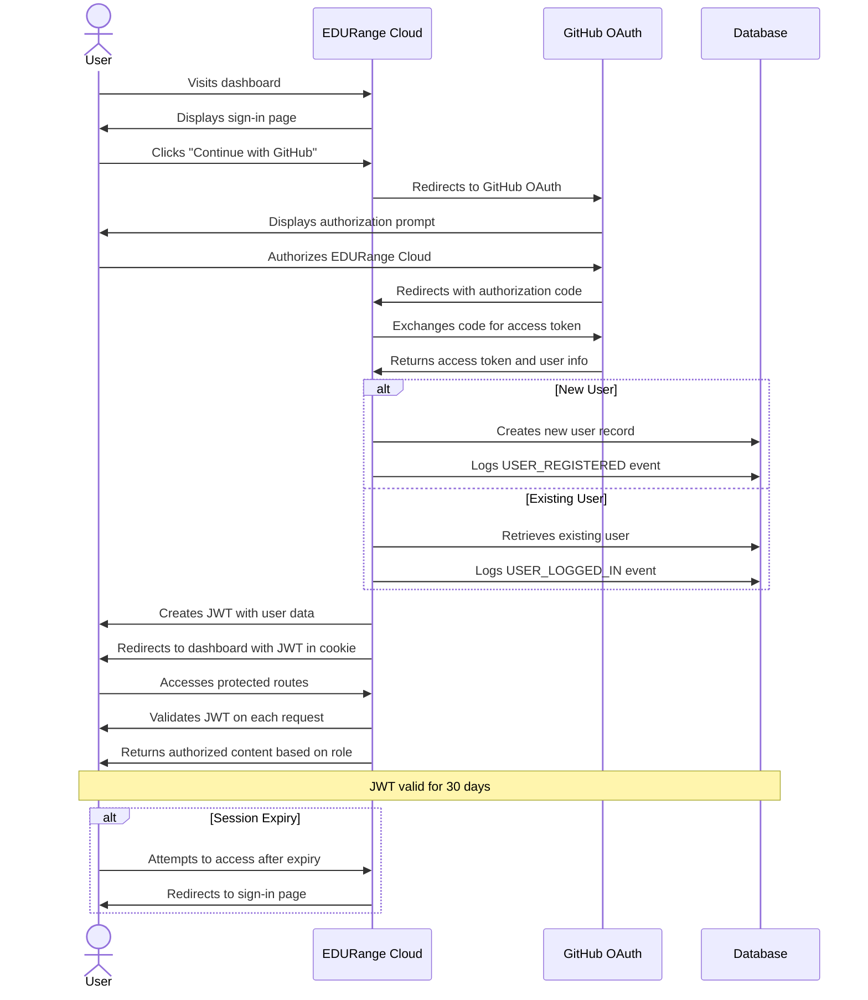
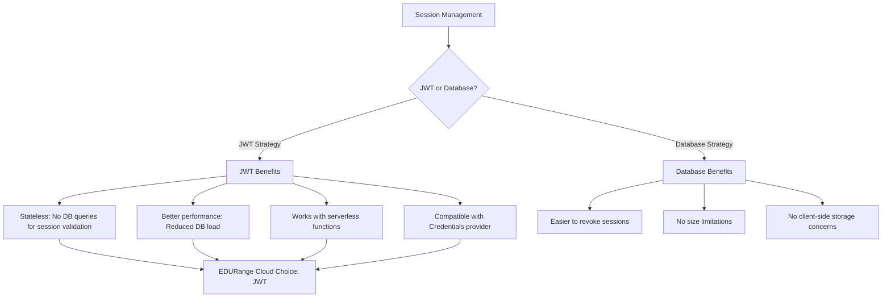
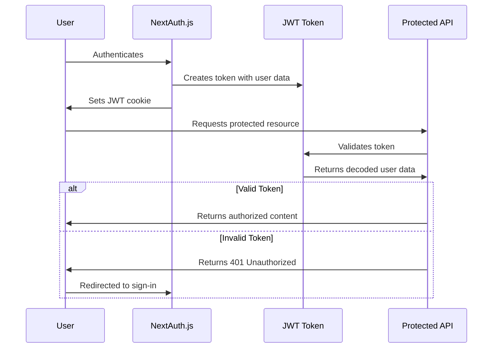
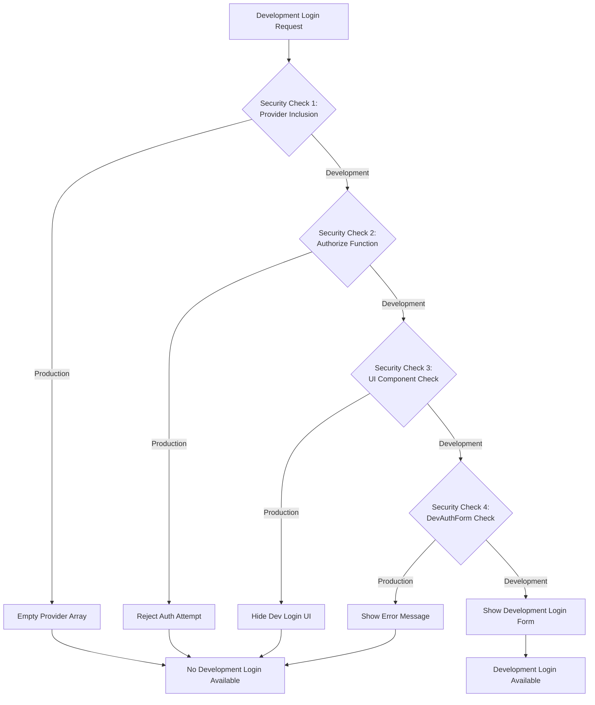

# Authentication System

## Overview

The EDURange Cloud dashboard uses [NextAuth.js](https://next-auth.js.org/) (now known as Auth.js) as its authentication library. NextAuth.js is a complete open-source authentication solution for Next.js applications that supports various authentication methods including OAuth providers, email/password, and more.

The authentication system in EDURange Cloud provides:

- Secure user authentication with GitHub OAuth
- Session management using JWT strategy
- Development login for testing with multiple user roles
- Role-based access control (STUDENT, INSTRUCTOR, ADMIN)
- Integration with the [Prisma database adapter](../Database/structure)
- [Activity logging](./activity_logging) for authentication events

While the platform primarily uses GitHub OAuth for production, it also includes a development login feature for testing with different user roles.

## Authentication Strategy

EDURange Cloud uses two authentication strategies:

1. **OAuth Authentication**: For production use, we use GitHub OAuth provider for authentication rather than traditional email/password authentication. This strategic decision was made for several important reasons:

   - **Security**: By using OAuth, we avoid the security risks associated with storing and managing password information.
   - **Reduced Development Overhead**: OAuth providers handle the complex security aspects of authentication.
   - **Modern User Experience**: OAuth provides a streamlined sign-in experience that many users are already familiar with.
   - **Account Verification**: OAuth providers have already verified user emails and identities.
   - **Maintenance**: We don't need to implement and maintain password reset flows or account recovery.

2. **Development Login**: For development and testing purposes, we provide a credentials-based login that allows creating and logging in as users with different roles. This is only available in development mode and helps with testing role-based functionality without needing multiple GitHub accounts.

## User Authentication Flow

The following sequence diagram illustrates the authentication flow from a user's perspective, showing the interactions between the user, EDURange Cloud, and GitHub OAuth:



This diagram shows the complete authentication journey, including:

1. Initial sign-in process
2. OAuth authorization with GitHub
3. User creation or retrieval
4. JWT-based session management
5. Access to protected resources
6. Session expiration handling

### Detailed Authentication Flow Explanation

#### Initial Authentication

1. **User Visits Dashboard**: When a user navigates to the EDURange Cloud dashboard, the application checks if they have a valid session.

2. **Sign-in Page Display**: If no valid session exists, the user is redirected to the sign-in page located at `/signin`.

3. **GitHub Authentication Initiation**: When the user clicks "Continue with GitHub", the application calls `signIn('github')` from NextAuth.js, which initiates the OAuth flow.

4. **Redirection to GitHub**: The user is redirected to GitHub's authorization page with EDURange Cloud's client ID and requested scopes.

#### OAuth Authorization Process

5. **Authorization Prompt**: GitHub displays a permission prompt asking the user to authorize EDURange Cloud to access their basic profile information.

6. **User Authorization**: When the user approves the request, GitHub generates an authorization code.

7. **Code Return**: GitHub redirects back to EDURange Cloud's callback URL (`/api/auth/callback/github`) with the authorization code.

8. **Token Exchange**: EDURange Cloud's server exchanges this code for an access token by making a server-to-server request to GitHub.

9. **User Information**: GitHub returns the access token along with basic user information (name, email, profile picture).

#### User Processing

10. **User Determination**: NextAuth.js checks if the user already exists in the database by looking for matching OAuth account records.

11. **New User Creation**: For first-time users, a new user record is created in the database with default role 'STUDENT', and a USER_REGISTERED event is logged.

12. **Existing User Retrieval**: For returning users, their existing record is retrieved, and a USER_LOGGED_IN event is logged.

#### Session Management with JWT

13. **JWT Creation**: A JWT (JSON Web Token) is created containing the user's ID, role, and other essential information.

14. **Cookie Setting**: The JWT is stored in an HTTP-only cookie in the user's browser.

15. **Protected Route Access**: When the user accesses protected routes, the JWT from the cookie is used to identify them.

16. **JWT Validation**: On each request to a protected route, NextAuth.js validates the JWT signature and expiration.

17. **Role-Based Content**: Content is served based on the user's role (STUDENT, INSTRUCTOR, or ADMIN) as stored in the JWT.

#### Session Lifecycle

18. **Session Duration**: JWTs remain valid for 30 days from creation, as configured in `auth.ts`.

19. **Session Expiry**: When a JWT expires, any attempt to access protected routes will fail validation.

20. **Re-authentication**: Users with expired sessions are redirected back to the sign-in page to authenticate again.

## JWT vs Database Sessions

EDURange Cloud uses JWT (JSON Web Token) for session management instead of database sessions. Here's why:



### Why JWT?

1. **Performance**: JWT sessions don't require a database query on each request to validate the session, reducing database load.

2. **Statelessness**: JWTs are self-contained and include all necessary user information, making them ideal for serverless environments.

3. **Compatibility**: The Credentials provider (used for development login) requires JWT sessions to function properly.

4. **Scalability**: JWT sessions scale better in distributed systems as they don't require shared session storage.

### JWT Flow in EDURange Cloud



The JWT contains essential user information including:
- User ID (`sub` claim)
- User role (custom `role` claim)
- Expiration time (`exp` claim)

This information is used to authorize access to protected resources without needing additional database queries.

## Configuration

The authentication configuration is defined in `dashboard/lib/auth.ts` and used in `dashboard/auth.ts`. The API routes are defined in `dashboard/app/api/auth/[...nextauth]/route.ts`, which imports and exports the handler from `auth.ts`.

### Basic Configuration

The authentication configuration consists of several key parts:

#### 1. Imports and Adapter Setup

```typescript
// dashboard/lib/auth.ts
import { NextAuthOptions } from "next-auth";
import { PrismaAdapter } from "@auth/prisma-adapter";
import { db } from "@/lib/db";
import GitHubProvider from "next-auth/providers/github";
import { getDevAuthProvider } from "./dev-auth-provider";
```

We import the necessary dependencies, including the PrismaAdapter to connect NextAuth.js with our database.

#### 2. Session Configuration

```typescript
export const authOptions: NextAuthOptions = {
  adapter: PrismaAdapter(db) as any,
  session: {
    strategy: "jwt", // Using JWT for sessions
    maxAge: 30 * 24 * 60 * 60, // 30 days
  },
  pages: {
    signIn: "/signin", // Sign-in page
  },
  // ...
};
```

This section configures:
- The database adapter (Prisma)
- The session strategy (JWT)
- The session lifetime (30 days)
- Custom pages for authentication flows

#### 3. Session Callback

```typescript
callbacks: {
  async session({ session, token }) {
    // Add user data from the JWT token to the session
    if (token.sub && session.user) {
      session.user.id = token.sub;
    }
    if (token.role && session.user) {
      session.user.role = token.role as "ADMIN" | "INSTRUCTOR" | "STUDENT";
    }
    return session;
  },
  // ...
}
```

The session callback runs whenever a session is accessed. It adds the user ID and role from the JWT token to the session object, making this information available to the application.

#### 4. JWT Callback

```typescript
async jwt({ token, user }) {
  // Add user role to the JWT token
  if (user) {
    token.role = user.role;
  }
  return token;
},
```

The JWT callback runs when a JWT is created or updated. It adds the user's role to the token, which will later be added to the session via the session callback.

#### 5. Redirect Callback

```typescript
async redirect({ url, baseUrl }) {
  // Redirect to home instead of dashboard
  if (url.includes('/dashboard')) {
    return `${baseUrl}/home`;
  }

  // Allow relative URLs
  if (url.startsWith('/')) {
    return `${baseUrl}${url}`;
  }

  // Allow callback URLs on the same origin
  if (new URL(url).origin === baseUrl) {
    return url;
  }

  return baseUrl;
},
```

The redirect callback customizes the redirection behavior after authentication. It ensures users are redirected to the appropriate page based on the URL.

#### 6. Authentication Providers

```typescript
providers: [
  GitHubProvider({
    clientId: process.env.AUTH_GITHUB_ID!,
    clientSecret: process.env.AUTH_GITHUB_SECRET!,
  }),
  // Development login provider (only in non-production)
  // Added via getDevAuthProvider()
],
```

This section configures the authentication providers. In production, only GitHub OAuth is available. In development, additional providers are added via the `getDevAuthProvider()` function.

## Authentication Providers

EDURange Cloud supports two types of authentication providers:

### GitHub OAuth

The GitHub provider is configured in `lib/auth.ts`:

```typescript
GitHubProvider({
  clientId: process.env.AUTH_GITHUB_ID!,
  clientSecret: process.env.AUTH_GITHUB_SECRET!,
}),
```

This allows users to sign in with their GitHub accounts. The implementation uses environment variables to store the GitHub OAuth credentials.

### Development Login Provider

For development and testing purposes, a Credentials provider is available in non-production environments. This provider is implemented in a separate module (`lib/dev-auth-provider.ts`) to keep production code clean:

```typescript
// dashboard/lib/dev-auth-provider.ts
export const getDevAuthProvider = () => {
  // First security check: Only return the provider in development
  if (process.env.NODE_ENV === 'production') {
    return [];
  }

  return [
    CredentialsProvider({
      id: "credentials",
      name: 'Development Login',
      credentials: {
        name: { label: "Name", type: "text" },
        email: { label: "Email", type: "email" },
        role: { label: "Role", type: "text" }, // Kept for backward compatibility but ignored
        existingUser: { label: "Existing User", type: "text" }
      },
      async authorize(credentials) {
        // Second security check: Reject all requests in production
        if (process.env.NODE_ENV === 'production') {
          console.error("Development login attempted in production environment");
          return null;
        }

        // Logic to find or create users for development
        // ...
      }
    })
  ];
};
```

This provider allows developers to:
- Create new test users with STUDENT role (for security reasons)
- Log in to existing test accounts using just their email address
- Test role-based functionality without needing multiple GitHub accounts

## Development Login Security

The development login feature is designed with multiple layers of security to ensure it's never available in production:



### Security Layers

1. **Provider Inclusion Check**:
   - In `lib/dev-auth-provider.ts`, the function only returns the provider in non-production environments
   - Production environments receive an empty array, so no development provider is registered

2. **Authorization Function Check**:
   - Even if the provider somehow gets included, the `authorize` function has a secondary check
   - It rejects all authentication attempts in production environments
   - This provides defense in depth against accidental exposure

3. **UI Component Check**:
   - The `UserAuthForm` component checks `process.env.NODE_ENV` before rendering the development login UI
   - In production, only the GitHub login option is displayed

4. **DevAuthForm Component Check**:
   - The `DevAuthForm` component has its own check that prevents rendering in production
   - If somehow rendered in production, it displays an error message instead of the login form

### Role Security

For additional security, the development login enforces these restrictions:

- All new development accounts are created with STUDENT role by default
- The role selection has been removed from the UI
- The backend ignores any role parameter and always sets STUDENT role for new accounts
- This prevents privilege escalation in development environments

## Authentication Utilities

EDURange Cloud provides several utility functions for working with authentication in the `lib/auth-utils.ts` file:

### 1. Check Admin Status

```typescript
// Check if a user is an admin
export async function checkIsAdmin(): Promise<{ isAdmin: boolean; user: User | null }> {
  const session = await getServerSession(authOptions);
  if (!session?.user) {
    return { isAdmin: false, user: null };
  }

  return {
    isAdmin: session.user.role === 'ADMIN',
    user: session.user as User
  };
}
```

This function checks if the current user is an admin by:
- Getting the current session using `getServerSession`
- Checking if the user exists in the session
- Returning an object with `isAdmin` boolean and the user data

### 2. API Route Admin Middleware

```typescript
// Middleware for API routes to require admin access
export async function requireAdmin(req: NextRequest): Promise<Response | null> {
  const { isAdmin } = await checkIsAdmin();

  if (!isAdmin) {
    return new NextResponse('Unauthorized', { status: 403 });
  }

  return null;
}
```

This middleware function is used in API routes to:
- Check if the current user is an admin using the `checkIsAdmin` function
- Return a 403 Forbidden response if the user is not an admin
- Return null if the user is an admin, allowing the route handler to continue

### 3. Server Component Admin Check

```typescript
// Server component function to redirect non-admins
export async function requireAdminAccess() {
  const { isAdmin } = await checkIsAdmin();

  if (!isAdmin) {
    redirect('/invalid-permission');
  }
}
```

This function is used in server components to:
- Check if the current user is an admin
- Redirect to an invalid permission page if the user is not an admin
- Allow the component to render if the user is an admin

These utility functions simplify implementing admin-only features throughout the application by providing consistent authentication and authorization checks.

## Conclusion

EDURange Cloud's authentication system provides a secure, flexible foundation for user authentication and authorization. By leveraging NextAuth.js with JWT sessions and GitHub OAuth, it offers a modern authentication experience while maintaining detailed user records in the database.

The development login feature enhances the developer experience by allowing easy testing with different user roles, while multiple security layers ensure this feature is never exposed in production environments.

