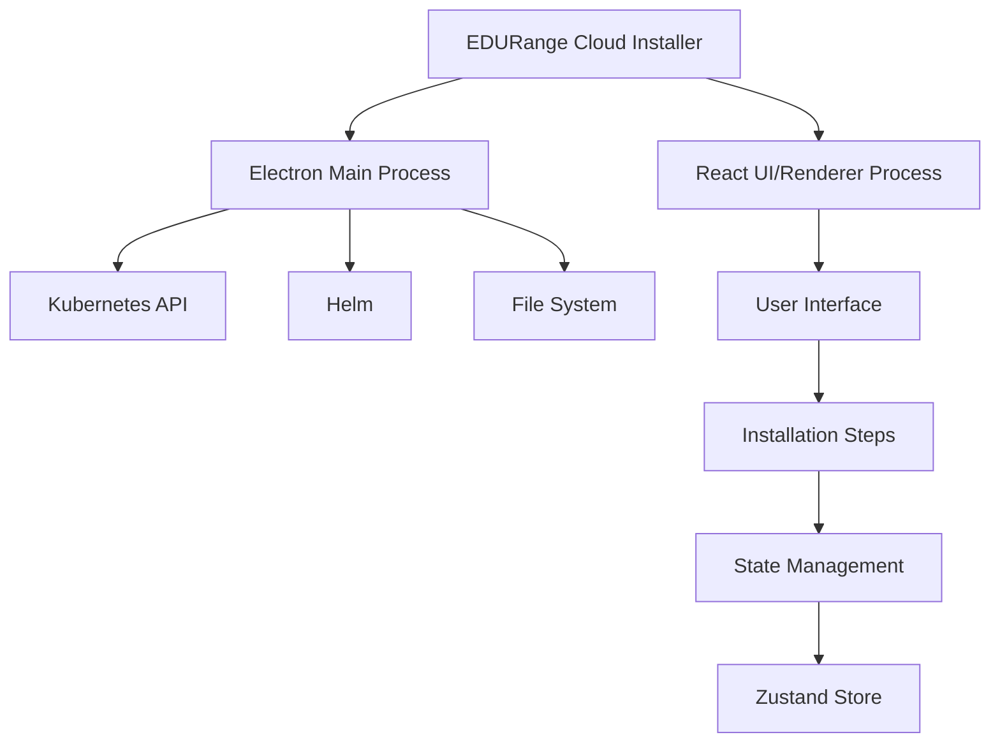
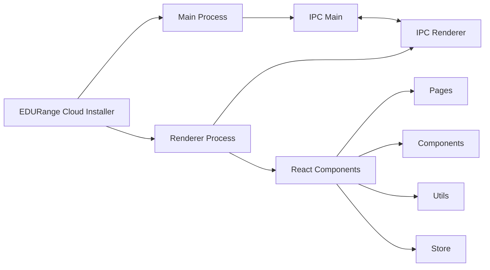
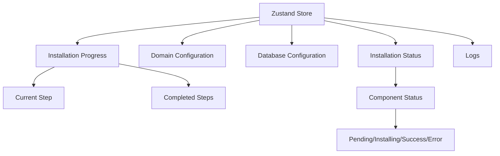

# EDURange Cloud Installer: Technical Guide

This document provides a technical overview of the EDURange Cloud Installer, explaining its architecture, components, and how they work together to deploy the EDURange Cloud platform.

## Architecture Overview

The EDURange Cloud Installer is a desktop application built using Electron and React. It provides a user-friendly interface for deploying and configuring the EDURange Cloud platform on a Kubernetes cluster.



### Diagram Explanation

This architecture diagram illustrates the high-level structure of the EDURange Cloud Installer:

- **EDURange Cloud Installer**: The main application that consists of two primary processes.

- **Electron Main Process**: The backend of the application that runs with Node.js privileges.
  - It communicates with the **Kubernetes API** to deploy and manage resources.
  - It interacts with **Helm** to install packages like cert-manager, metrics-server, and Kubernetes Dashboard.
  - It accesses the **File System** to read and write configuration files.

- **React UI/Renderer Process**: The frontend of the application built with React.
  - It renders the **User Interface** that users interact with.
  - It organizes the UI into **Installation Steps** (Welcome, Prerequisites, Domain Setup, etc.).
  - It uses **State Management** to track installation progress and configuration.
  - All state is managed through the **Zustand Store**, which provides a simple and efficient state management solution with persistence.

The separation between the main and renderer processes is a key security feature of Electron, preventing the UI from directly accessing system resources.

## Technology Stack

### Core Technologies

- **Electron**: Cross-platform desktop application framework
- **React**: UI library for building the installer interface
- **Tailwind CSS**: Utility-first CSS framework for styling
- **Zustand**: State management library with persistence middleware
- **Node.js**: JavaScript runtime for the main process
- **Framer Motion**: Animation library for enhanced UI interactions

### Development Tools

- **Electron Builder**: Packaging and distribution tool for Electron applications
- **React Scripts**: Build toolchain for the React application
- **Concurrently**: Run multiple commands concurrently
- **Wait-on**: Wait for resources to become available

## Application Structure

The installer follows a standard Electron application structure with main and renderer processes:



### Diagram Explanation

This diagram shows the internal structure of the application and how its components communicate:

- **Main Process**: The Node.js process that has access to system APIs.
  - It registers **IPC Main** handlers to receive requests from the renderer.
  - These handlers execute system commands and return results.

- **Renderer Process**: The Chromium-based process that renders the UI.
  - It uses **IPC Renderer** to send requests to the main process.
  - It contains the React application with various components.

- **React Components**: The UI building blocks organized into:
  - **Pages**: Individual screens for each installation step (e.g., DomainSetup.js, DatabaseSetup.js).
  - **Components**: Reusable UI elements like buttons, cards, and status indicators.
  - **Utils**: Helper functions for common tasks like template processing.
  - **Store**: State management using Zustand to track installation progress and configuration.

- **IPC Communication**: The bidirectional arrow between IPC Main and IPC Renderer represents the secure communication channel between the two processes. This is how the UI requests actions like executing kubectl commands and receives the results.

This architecture ensures that the UI cannot directly access system resources, enhancing security while providing a seamless user experience.

### Directory Structure

```
edurange-installer/
├── assets/                  # Application icons and resources
├── dist/                    # Build output
├── node_modules/            # Dependencies
├── src/
│   ├── main/                # Electron main process
│   │   ├── main.js          # Main entry point
│   │   └── preload.js       # Preload script for IPC
│   └── renderer/            # React application
│       ├── build/           # Production build output
│       ├── node_modules/    # Renderer dependencies
│       ├── public/          # Static assets
│       └── src/             # React source code
│           ├── components/  # Reusable UI components
│           ├── pages/       # Installation step pages
│           ├── store/       # Zustand state management
│           ├── utils/       # Utility functions
│           ├── App.js       # Main React component
│           └── index.js     # React entry point
└── package.json             # Project configuration
```

## Main Process

The main process is responsible for:

1. Creating and managing the application window
2. Handling IPC (Inter-Process Communication) with the renderer process
3. Executing system commands (kubectl, helm, etc.)
4. Managing file system operations
5. Providing a secure bridge between the renderer and the system
6. Saving and loading installation state

### Key Files

- **main.js**: The entry point for the Electron application
- **preload.js**: Exposes a secure API to the renderer process

## Renderer Process

The renderer process contains the React application that provides the user interface. It's organized into:

1. **Pages**: Each installation step has its own page component
2. **Components**: Reusable UI components like buttons, cards, etc.
3. **Store**: State management using Zustand with persistence
4. **Utils**: Utility functions for common operations

## Installation Steps

The installer guides users through a series of steps to set up the EDURange Cloud platform:

1. **Welcome**: Introduction to the installer and overview of the process
2. **Kubectl Setup**: Configure kubectl to connect to the Kubernetes cluster
3. **Prerequisites**: Check for required tools (kubectl, helm, docker)
4. **Domain Setup**: Configure domain name and Cloudflare API credentials
5. **Ingress Setup**: Install NGINX Ingress Controller
6. **Certificate Setup**: Install cert-manager and configure SSL certificates
7. **Database Setup**: Deploy PostgreSQL database
8. **Components Setup**: Install core components (database-controller, instance-manager, monitoring-service)
9. **OAuth Setup**: Configure GitHub OAuth for authentication
10. **Dashboard Setup**: Deploy the EDURange Cloud dashboard
11. **User Management**: Grant admin privileges to users
12. **Verification**: Verify installation and access additional tools (Prisma Studio, Kubernetes Dashboard)
13. **Completion**: Final steps and access information

Each step has its own React component in the `pages` directory, and the navigation between steps is managed by the Layout component.

## State Management

The installer uses Zustand for state management, with persistent storage for certain state values.



### Diagram Explanation

This diagram illustrates the state management structure using Zustand:

- **Zustand Store**: The central state container for the entire application.
  - It's organized into several key sections to manage different aspects of the installation.

- **Installation Progress**: Tracks where the user is in the installation process.
  - **Current Step**: The active step being displayed to the user.
  - **Completed Steps**: An array of step IDs that have been successfully completed, used to enable/disable navigation.

- **Domain Configuration**: Stores user-provided domain settings.
  - Includes domain name, Cloudflare API token, and subdomain preferences.
  - This information is used across multiple installation steps.

- **Database Configuration**: Contains database connection details.
  - Includes host, name, user, password, and whether to use an existing database.
  - Used when deploying the database and connecting components to it.

- **Installation Status**: Tracks the status of each component's installation.
  - **Component Status**: Each component (database, instance-manager, etc.) has a status.
  - Status values include **Pending** (not started), **Installing** (in progress), **Success** (completed), and **Error** (failed).

- **Logs**: Stores installation logs for each component.
  - These logs are displayed to the user and help with troubleshooting.

The state is partially persisted to localStorage, allowing users to resume the installation process if they close and reopen the application. The persistence is configured to only store essential data like domain configuration, completed steps, and installation status.

### Key State Properties

- **currentStep**: The current installation step
- **completedSteps**: Array of completed step IDs
- **domain**: Domain configuration (name, subdomains, API tokens)
- **database**: Database configuration
- **installationStatus**: Status of each component installation
- **logs**: Installation logs for each component

## IPC Communication

The installer uses Electron's IPC (Inter-Process Communication) mechanism to securely communicate between the renderer and main processes.

### Exposed API Methods

The main process exposes the following API methods to the renderer:

- **checkCommand**: Check if a command exists on the system
- **executeCommand**: Execute a shell command
- **waitForPod**: Wait for a Kubernetes pod to be ready
- **applyManifestFromString**: Apply a Kubernetes manifest from a string
- **executeStep**: Mark an installation step as completed
- **getTempFile**: Get a path to a temporary file
- **writeFile**: Write data to a file
- **deleteFile**: Delete a file


## Component Deployment

The installer deploys several components to the Kubernetes cluster:

1. **NGINX Ingress Controller**: Manages external access to services
2. **cert-manager**: Automates SSL certificate management
3. **PostgreSQL**: Database for storing application data
4. **Database Controller**: Manages database operations with connection retry logic and health checks
5. **Instance Manager**: Creates and manages challenge instances
6. **Monitoring Service**:
   - Collects metrics from Prometheus and Kubernetes API
   - Integrates with metrics-server for pod and node resource usage
   - Provides network traffic metrics and system health information
   - Exposes metrics through a REST API for the dashboard
7. **Dashboard**: Web interface for users
8. **Prisma Studio**: Optional database management interface
9. **Kubernetes Dashboard**: Optional Kubernetes management interface

Each component is deployed using Kubernetes manifests or Helm charts, with configuration values from the application state.

## Error Handling and Recovery

The installer includes robust error handling and recovery mechanisms:

1. **Component Status Tracking**: Each component's installation status is tracked and displayed.
2. **Detailed Logging**: Comprehensive logs are displayed for each installation step.
3. **Delete and Reinstall**: Components can be deleted and reinstalled if needed.
4. **Verification**: The verification step checks that all components are working correctly.
5. **Step Completion Tracking**: The installer tracks which steps have been completed.

## Security Considerations

The installer implements several security measures:

1. **Process Isolation**: The Electron main and renderer processes are isolated.
2. **Secure IPC**: Communication between processes is secured through the preload script.
3. **Secret Management**: Sensitive data like database passwords and API tokens are stored as Kubernetes secrets.
4. **TLS Configuration**: All ingress resources are configured with TLS.
5. **RBAC Configuration**: Proper role-based access control is set up for components.

## Conclusion

The EDURange Cloud Installer provides a user-friendly way to deploy and configure the EDURange Cloud platform on a Kubernetes cluster. Its architecture ensures security, reliability, and ease of use, making it accessible to users with varying levels of Kubernetes expertise.
