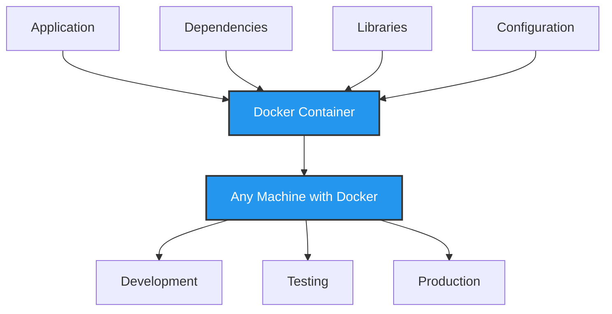
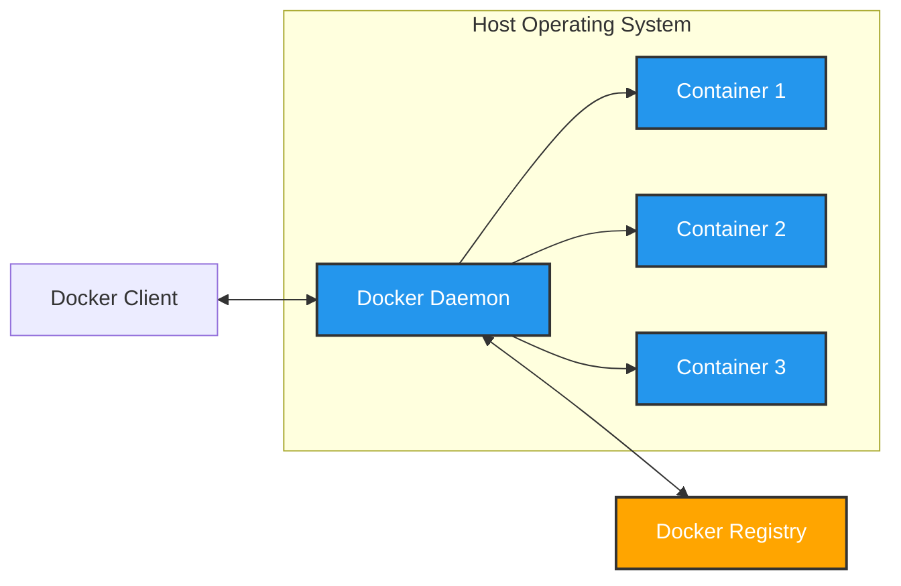
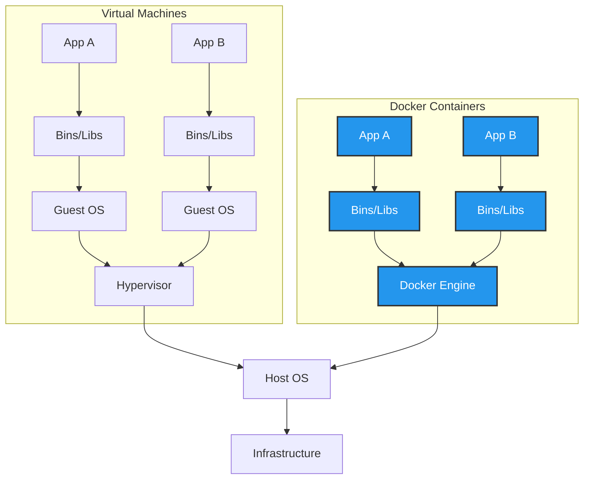
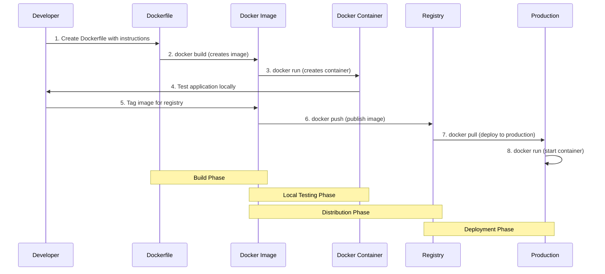

# What is Docker?
Docker is a platform for developing, shipping, and running applications inside containers. Containers allow a developer to package up an application with all the parts it needs, such as libraries and other dependencies, and ship it all out as one package. By doing so, the application will run on any other machine regardless of any customized settings that the machine might have that could differ from the machine used for writing and testing the code.



**Diagram Explanation: Docker Container Concept**

This diagram illustrates the core concept of Docker containerization:

1. **Application Packaging**: At the top, we see how an application and all its requirements (dependencies, libraries, and configuration) are bundled together into a Docker container.

2. **Container as a Complete Unit**: The Docker container (shown in blue) acts as a self-contained package that includes everything needed to run the application. This encapsulation ensures consistency across environments.

3. **Universal Deployment**: The container can then be deployed to any machine that has Docker installed, regardless of the underlying operating system or hardware configuration.

4. **Environment Consistency**: The bottom part shows how the same container can be used across different environments (development, testing, production) without any changes, eliminating the "it works on my machine" problem.

This containerization approach solves one of the biggest challenges in software development: ensuring that applications behave the same way regardless of where they're deployed.

# Docker Architecture

Docker uses a client-server architecture where several components work together to create, manage, and run containers. Understanding this architecture helps explain how Docker achieves its magic of lightweight, portable containers.



## Key Components

### 1. Docker Client
The Docker Client is what you interact with when you type Docker commands in your terminal:

- **User Interface**: It's the command-line tool (`docker`) that accepts commands like `docker build`, `docker run`, etc.
- **Communication**: The client doesn't actually perform the operations itself; it sends your commands to the Docker Daemon.
- **Think of it as**: The remote control that sends instructions to the actual Docker system.

### 2. Docker Daemon (dockerd)
The Docker Daemon is the brain of the operation:

- **Background Service**: It runs continuously on your host machine, listening for API requests.
- **Container Management**: It handles building, running, and distributing your containers.
- **Resource Control**: It manages system resources allocated to containers.
- **Think of it as**: The manager that receives instructions and makes sure they get carried out.

### 3. Docker Registry
The Docker Registry is where container images are stored and shared:

- **Image Storage**: It's a repository for Docker images (like Docker Hub).
- **Distribution**: It allows you to push (upload) and pull (download) container images.
- **Public or Private**: Can be public (like Docker Hub) or private (for your organization).
- **Think of it as**: A library where pre-built container templates are stored.

### 4. Containers
Containers are the isolated environments where applications run:

- **Isolated Processes**: Each container runs as an isolated process on the host OS.
- **Shared Kernel**: All containers share the host's kernel but have their own filesystem, network, and process space.
- **Think of them as**: Lightweight, portable packages that contain everything needed to run an application.

## How Docker Works Behind the Scenes

When you run a Docker command, several things happen behind the scenes:

1. **Container Creation**:
   - When you run `docker run`, the daemon first checks if the requested image exists locally.
   - If not, it pulls the image from a registry (like Docker Hub).
   - The daemon then creates a new container by using the image as a read-only template.

2. **Container Isolation**:
   - Docker uses several Linux kernel features to create isolated environments:
     - **Namespaces**: Provide isolated workspaces called containers. Each container has its own view of the system.
     - **Control Groups (cgroups)**: Limit and account for resource usage (CPU, memory, disk I/O, network, etc.).
     - **Union File Systems**: Layer file systems to efficiently store images and containers.

3. **Container Execution**:
   - The container runs as an isolated process on the host OS.
   - It can only see the resources that have been allocated to it.
   - From inside the container, it appears to be running on its own dedicated machine.

### The Container Runtime

At an even deeper level, Docker uses a container runtime called **containerd**:

- **containerd**: Manages the complete container lifecycle - from image transfer/storage to container execution and supervision.
- **runc**: A lightweight tool that runs containers according to the industry standard (OCI - Open Container Initiative).

This architecture allows Docker to be:

- **Lightweight**: Containers share the host OS kernel instead of each needing its own OS.
- **Fast**: Containers can start in seconds because they don't need to boot an OS.
- **Portable**: The same container will run identically across any system with Docker installed.
- **Isolated**: Applications in containers can't interfere with each other or the host system.

Understanding this architecture helps explain why Docker containers are so much more efficient than virtual machines, which we'll explore in the next section.

## Docker vs. Virtual Machines

One of the most significant advantages of Docker is its efficiency compared to traditional virtual machines. Understanding this difference is key to appreciating why containers have revolutionized application deployment.



### Architectural Differences

#### Virtual Machines
Virtual machines create complete, isolated environments by simulating entire computer systems:

- **Full OS Stack**: Each VM runs a complete guest operating system with its own kernel, drivers, and system libraries.
- **Hypervisor Layer**: VMs rely on a hypervisor (like VMware, VirtualBox, or Hyper-V) to manage and allocate physical resources.
- **Resource Allocation**: Each VM is allocated a fixed amount of CPU, memory, and storage resources.
- **Isolation**: VMs provide strong isolation since each has its own kernel and virtualized hardware.

#### Docker Containers
Containers take a fundamentally different approach:

- **Shared Kernel**: All containers on a host share the host's operating system kernel, eliminating the need for multiple OS instances.
- **Containerization**: Instead of virtualizing hardware, Docker containerizes the application layer.
- **Resource Efficiency**: Containers share the host OS resources and only include application-specific binaries and libraries.
- **Docker Engine**: The Docker Engine manages containers, handling resource allocation and isolation.

## Key Benefits of Docker Over VMs

### 1. Performance and Resource Efficiency

**Startup Time**:
- VMs: Minutes to boot a full operating system
- Containers: Seconds or milliseconds to start
- **Real-world impact**: CI/CD pipelines using containers can run tests in seconds rather than minutes

**Resource Consumption**:
- VMs: Gigabytes of memory for each instance
- Containers: Megabytes of memory for each instance
- **Example**: A server that might run 4-5 VMs could potentially run dozens or hundreds of containers

**Disk Space**:
- VMs: Each VM requires a full OS installation (several GB)
- Containers: Container images are typically much smaller (tens to hundreds of MB)
- **Case study**: A microservices architecture with 20 services might require 100+ GB for VMs but only 2-3 GB for containers

### 2. Development Workflow Improvements

**Consistency**:
- Docker eliminates "works on my machine" problems by packaging the application with its dependencies
- Developers, QA, and operations all use identical environments
- **Example**: A Node.js application with specific npm package versions will behave identically across all environments

**Speed**:
- Containers can be built, started, and stopped in seconds
- Enables rapid iteration and testing
- **Real-world benefit**: Developers can test changes almost instantly instead of waiting for VM provisioning

**Version Control**:
- Container images can be versioned and stored in registries
- Rollbacks are as simple as deploying a previous image version
- **Example**: If a deployment causes issues, you can revert to the previous container image in seconds

### 3. Operational Advantages

**Density**:
- Higher application density per server means better hardware utilization
- **Cost impact**: Organizations can reduce infrastructure costs by 50-70% when moving from VMs to containers

**Scalability**:
- Containers can be scaled horizontally with orchestration tools like Kubernetes
- **Example**: A web application can automatically scale from 3 to 30 containers during traffic spikes in seconds

**Portability**:
- Containers run consistently across different cloud providers and on-premises
- **Business benefit**: Avoid vendor lock-in and maintain flexibility in infrastructure choices

## Real-World Example: Web Application Deployment

Consider deploying a web application with a database:

**VM Approach**:
- VM 1: Web server + application code (2GB RAM, 20GB disk)
- VM 2: Database server (4GB RAM, 50GB disk)
- Total: 2 VMs, 6GB RAM, 70GB disk, ~5 minutes to start

**Docker Approach**:
- Container 1: Web server + application code (200MB RAM, 500MB image)
- Container 2: Database server (500MB RAM, 1GB image)
- Total: 2 containers, 700MB RAM, 1.5GB disk, ~5 seconds to start

The Docker approach uses approximately 10% of the resources and starts 60x faster.

This efficiency is why containers have become the preferred method for deploying applications in modern cloud environments, especially for microservices architectures where dozens or hundreds of services need to be deployed and managed efficiently.


# Dockerizing an Application
Dockerizing an application involves creating a Docker image that contains everything needed to run the application. Below are the steps to dockerize a simple Node.js application as an example:



**Diagram Explanation: Docker Workflow**

This sequence diagram illustrates the complete Docker workflow from development to production:

1. **Development Phase** (Steps 1-2):
   - The developer creates a Dockerfile that defines how to build the application
   - The Dockerfile contains instructions for the base image, dependencies, and how to run the app
   - The `docker build` command processes these instructions to create a Docker image

2. **Local Testing Phase** (Steps 3-4):
   - The developer runs the image locally using `docker run`, creating a container
   - This allows testing the application in an environment identical to production
   - Any issues can be fixed and the image rebuilt before distribution

3. **Distribution Phase** (Steps 5-6):
   - The image is tagged with a version and repository name
   - The image is pushed to a registry (like Docker Hub or a private registry)
   - The registry stores the image and makes it available to other environments

4. **Deployment Phase** (Steps 7-8):
   - Production servers pull the image from the registry
   - The same image that was tested locally is now run in production
   - Because the container includes all dependencies, it runs exactly the same way

This workflow ensures consistency across environments and simplifies deployment. The same container that works in development will work in production, eliminating environment-specific bugs and reducing deployment complexity.

**1. Create a Dockerfile**

A Dockerfile is a script that contains a series of instructions on how to build a Docker image for your application.

```dockerfile filename="dockerfile"
# Use the official Node.js image from the Docker Hub
FROM node:14

# Create and set the working directory
WORKDIR /app

# Copy the package.json and package-lock.json files
COPY package*.json ./

# Install the dependencies
RUN npm install

# Copy the rest of the application files
COPY . .

# Expose the port the application runs on
EXPOSE 3000

# Command to run the application
CMD ["node", "app.js"]
```

**2. Build the Docker Image**

Once the Dockerfile is created, you can build the Docker image using the Docker build command.

```
docker build -t my-node-app .
```

This command builds an image named my-node-app based on the instructions in the Dockerfile.

**3. Run the Docker Container**

After building the image, you can run it as a container using the docker run command.

```
docker run -p 3000:3000 my-node-app
```

This command runs the container and maps port 3000 of the host to port 3000 of the container.

# Pushing Docker Images to a Repository
Once you have built your Docker image, you can push it to a Docker registry, such as Docker Hub, to share it with others or deploy it to a production environment.

**1. Log in to Docker Hub**

First, log in to your Docker Hub account.

```
docker login
```

You will be prompted to enter your Docker Hub username and password.

**2. Tag the Docker Image**

```
docker tag my-node-app your-dockerhub-username/my-node-app
```

**3. Push the Docker Image**

Push the tagged image to Docker Hub.

```
docker push your-dockerhub-username/my-node-app
```

This command uploads your image to Docker Hub, making it available in your repository.

**4. Pull the Docker Image**

You can pull the image from Docker Hub to run it on another machine.

```
docker pull your-dockerhub-username/my-node-app
```

Then, you can run the pulled image as a container.

```
docker run -p 3000:3000 your-dockerhub-username/my-node-app
```

# Conclusion
Docker is a powerful tool that simplifies the process of developing, shipping, and running applications. By containerizing applications, developers can ensure consistency across different environments, achieve greater portability, and scale their applications efficiently. Dockerizing an application involves creating a Dockerfile, building an image, and running it as a container. Pushing Docker images to a registry like Docker Hub allows for easy sharing and deployment of applications.

This was just a brief overview/refresher on the basics of Docker. If Docker is completely new to you, we recommend taking a look at the following resources:

[Docker Documentation](https://docs.docker.com/) - The official Docker documentation provides comprehensive guides and tutorials to help you get started with Docker.

[Docker Hub](https://hub.docker.com/) - Explore and share container images and find many pre-built images that can help you understand how Docker works.

[Docker for Beginners - A Full Free Course](https://www.youtube.com/watch?v=3c-iBn73dDE) - An in-depth video tutorial that offers a step-by-step guide to learning Docker from scratch.

[Learn Docker in 7 Easy Steps - Full Beginner's Tutorial](https://www.youtube.com/watch?v=gAkwW2tuIqE) - Great tutorial if you do not have time for the entire Docker for Beginners Course

[Play with Docker](https://labs.play-with-docker.com/) - An online playground for Docker where you can experiment with Docker commands and create containers in a matter of minutes.

These resources will provide you with a deeper understanding of Docker and how to use it effectively in your development workflow.
